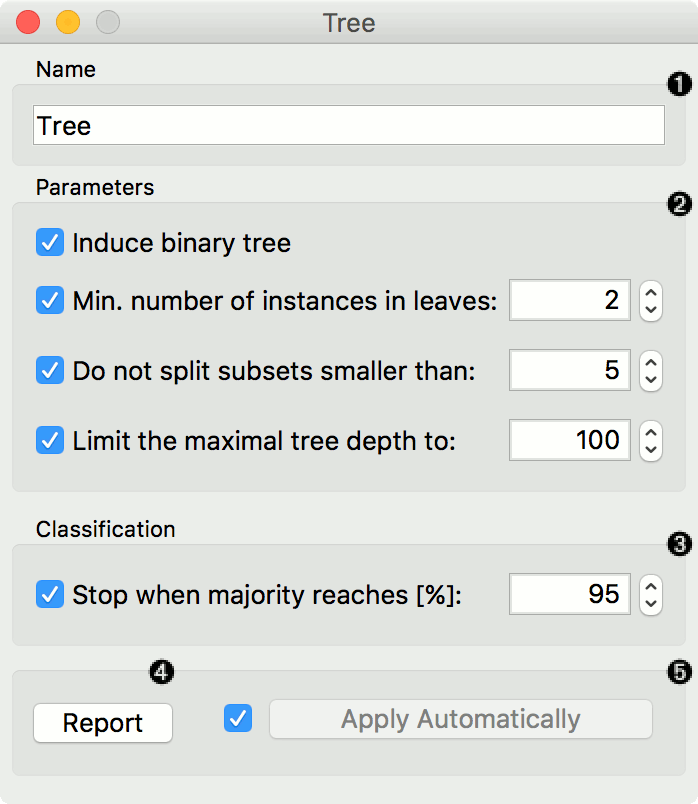
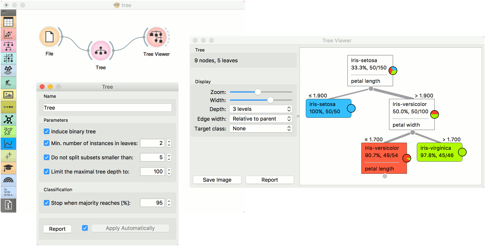
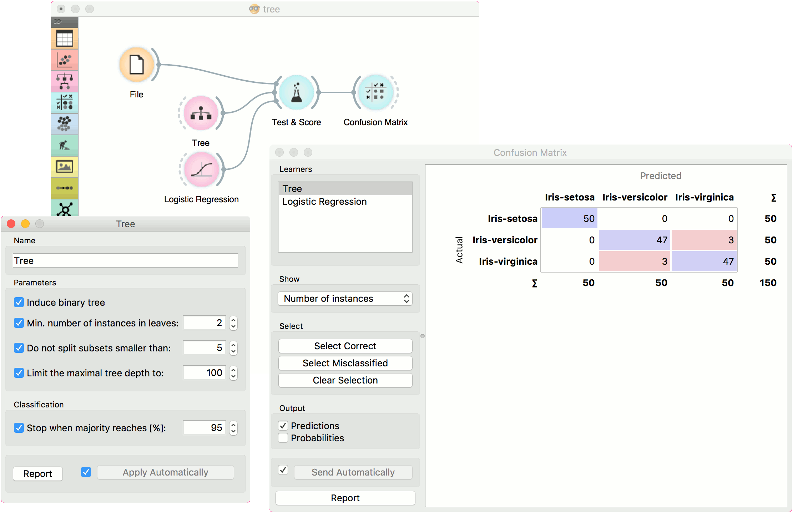
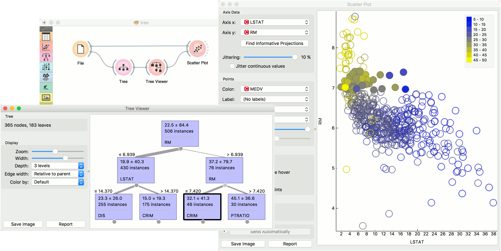

Tree
====

A tree algorithm with forward pruning.

Signals
-------

**Inputs**:

-  **Data**

   A data set

-  **Preprocessor**

   Preprocessing method(s)

**Outputs**:

-  **Learner**

   A decision tree learning algorithm with settings as specified in the dialog.

-  **Model**

   A subset of data instances from the training set that were used as support vectors in the trained model.

Description
-----------

**Tree** is a simple algorithm that splits the data into nodes by class purity. It is a precursor to :doc:`Random Forest <randomforest>`. Tree in Orange is designed in-house and can handle both discrete and continuous data sets.

It can also be used for both classification and regression tasks.

1. The learner can be given a name under which it will appear in other
   widgets. The default name is "Tree".

2. Tree parameters:
   - **Induce binary tree**: build a binary tree (split into two child nodes)
   - **Min. number of instances in leaves**: if checked, the algorithm will never construct a split which would put less than the specified number of training examples into any of the branches.
   - **Do not split subsets smaller than**: forbids the algorithm to split the nodes with less than the given number of instances.
   - **Limit the maximal tree depth**: limits the depth of the classification tree to the specified number of node levels.

3. **Stop when majority reaches [%]**: stop splitting the nodes after a specified majority threshold is reached

4. Produce a report. After changing the settings, you need to click *Apply*, which will put the new learner on the output and, if the training examples are given, construct a new classifier and output it as well. Alternatively, tick the box on the left and changes will be communicated automatically. 

Examples
--------

There are two typical uses for this widget. First, you may want to induce a model and check what it looks like in :doc:`Tree Viewer <../visualize/treeviewer>`.

The second schema trains a model and evaluates its performance against :doc:`Logistic Regression <../model/logisticregression>`.

We used the *iris* data set in both examples. However, **Tree** works for regression tasks as well. Use *housing* data set and pass it to **Tree**. The selected tree node from :doc:`Tree Viewer <../visualize/treeviewer>` is presented in the :doc:`Scatter Plot <../visualize/scatterplot>` and we can see that the selected examples exhibit the same features. 

