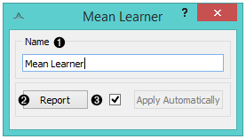
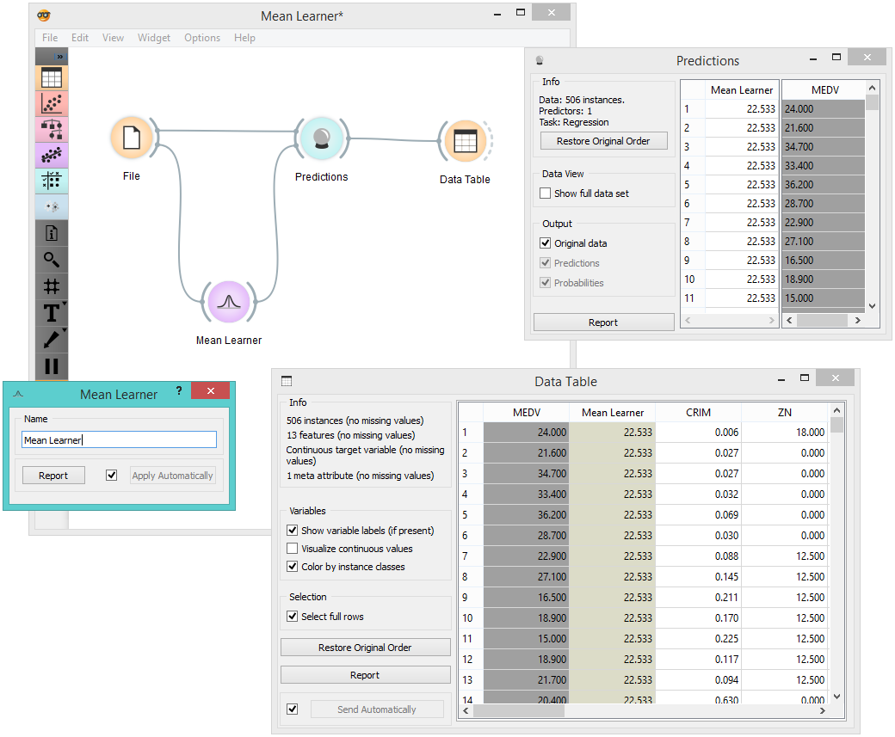
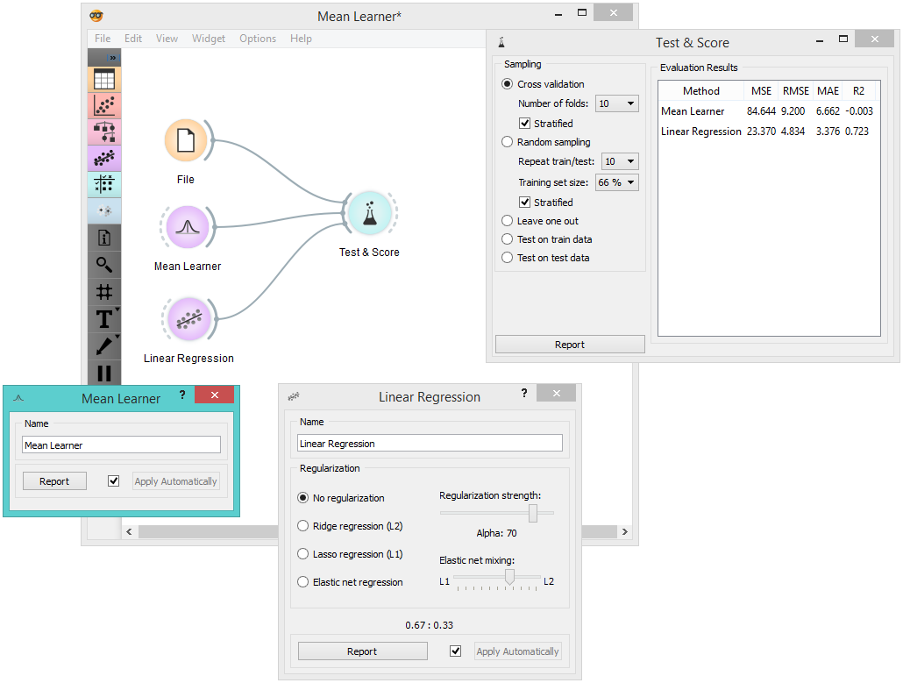

Mean Learner
============

.. figure:: icons/mean-learner.png

Learns the mean of its input data.

Signals
-------

**Inputs**:

-  **Data**

   A data set.

-  **Preprocessor**

   Preprocessed data.

**Outputs**:

-  **Learner**

A mean learning algorithm.

-  **Predictor**

   A trained regressor. Signal *Predictor* sends the regressor only if signal *Data* is present.

Description
-----------

This is the simplest learner widget for regression problems. It *learns*
the mean of the class variable and returns a predictor with the same
`mean value <https://en.wikipedia.org/wiki/Mean>`_. Due to its accuracy, this widget can
serve as a baseline for other regression models. 

1. Learner/predictor name
2. Produce a report. 
3. The *Apply* button commits changes to the output. Alternatively, tick the box on the left side of the button to apply changes automatically. 

Examples
--------

In the first example, we use **Mean Learner** to construct a predictor
and input it into the :doc:`Data Table<../data/datatable>`. We used the *housing* data set. In the table, you can see an extra
column *Mean Learner* with one (mean) value for all instances.

Another way to use **Mean Learner** is to compare it to other learners
in the :doc:`Test&Score<../evaluation/testlearners>` widget. 

