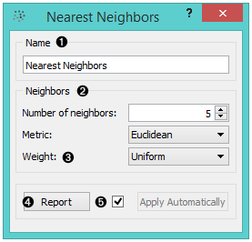
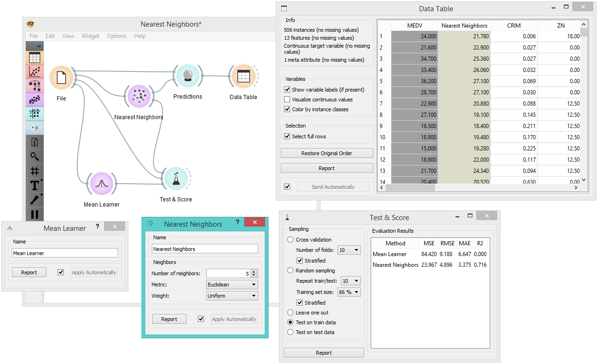

Nearest Neighbors
=================

.. figure:: icons/k-nearest-neighbors-regression.png

Predicts according to the nearest training instances.

Signals
-------

**Inputs**:

-  **Data**

Data set.

-  **Preprocessor**

Preprocessed data.

**Outputs**:

-  **Learner**

The learning algorithm with the supplied parameters

-  **Predictor**

Trained regressor. Signal *Predictor* sends the output signal only if
input *Data* is present.

Description
-----------

**Nearest Neighbors** widget uses `kNN
algorithm <https://en.wikipedia.org/wiki/K-nearest_neighbors_algorithm>`__
that searches for k closest training examples in feature space and uses
their average as prediction.

1. Learner/predictor name.
2. Set the number of nearest neighbors and the distance parameter
   (metric) as regression criteria. Metric can be:

   -  `Euclidean <https://en.wikipedia.org/wiki/Euclidean_distance>`__
      ("straight line", distance between two points)
   -  `Manhattan <https://en.wikipedia.org/wiki/Taxicab_geometry>`__
      (sum of absolute differences of all attributes)
   -  `Maximal <https://en.wikipedia.org/wiki/Chebyshev_distance>`__
      (greatest of absolute differences between attributes)
   -  `Mahalanobis <https://en.wikipedia.org/wiki/Mahalanobis_distance>`__
      (distance between point and distribution).

3. Press *Apply* to commit changes.

Example
-------

Below is a workflow showing how to use both the *Predictor* and the
*Learner* output. For the *Predictor* we input the prediction model into
:doc:`Predictions<../evaluation/predictions>` widget and view the results in :doc:`Data Table<../data/datatable>`. For
*Learner* we can compare different learners in :doc:`Test&Score<../evaluation/testlearners>` widget.

