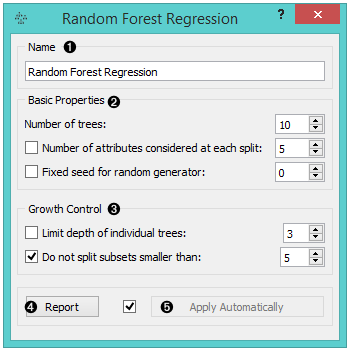
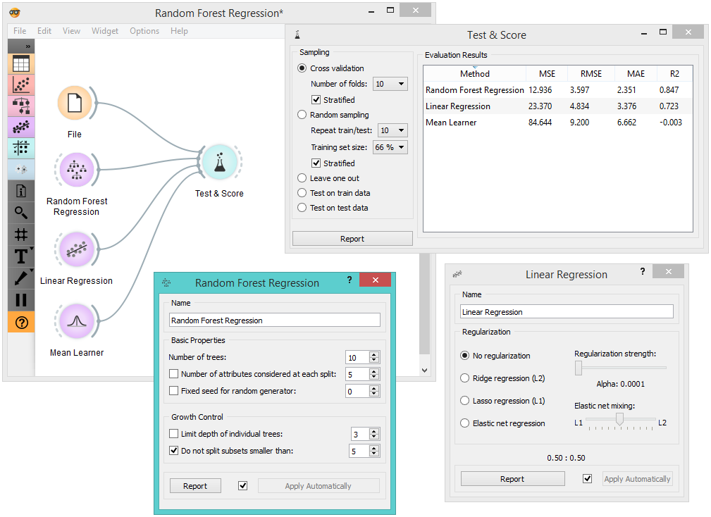
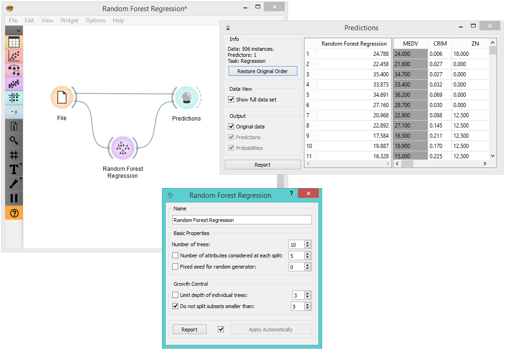

Random Forest Regression
========================

Random forest regression

Signals
-------

**Inputs**:

-  **Data**

Data set

-  **Preprocessor**

Preprocessed data.

**Outputs**:

-  **Learner**

Random forest learning algorithm with settings as specified in the
dialog.

-  **Predictor**

Trained regressor.

Description
-----------

`Random forest <https://en.wikipedia.org/wiki/Random_forest>`__ is an ensemble learning method used for classification, regression and other tasks. It was first proposed by Tin Kam Ho and further developed by Leo Breiman and Adele Cutler. 
When given a data set, **Random Forest** builds a set of regression trees. Each tree is developed from a bootstrap sample from the training data. When developing individual trees, an arbitrary subset of attributes is drawn (hence the term "Random") from which the best attribute for the split is selected. 

1. Specify the name of the learner or predictor. The default name is *Random Forest Regression*.
2. Specify how many regression trees will be included in the forest (*Number of trees in the forest*), and how many attributes will be arbitrarily drawn for consideration at each node. If the latter is not specified (option *Number of attributes...* left unchecked), this number is equal to the square root of the number of attributes in the data. You can also choose to control the random number generator (*Fixed seed for random generator*). 
3. Original Brieman's proposal is to grow the trees without any pre-prunning, but since pre-pruning often works quite well and is faster, the user can set the depth to which the trees will be grown (*Limit depth of individual trees*). Another pre-pruning option is stop splitting nodes when the maximal depth is reached (*Do not split subsets smaller than*).
4. Produce a report. 
5. Click *Apply* to communicate the changes to other widgets. Alternatively, tick *Apply Automatically* and changes will be communicated automatically. 

Example
-------

The example below compares different learnes, namely **Random Forest Regression**, :doc:`Linear Regression<../regression/linearregression>` and :doc:`Mean Learner<../regression/meanlearner>`, in the :doc:`Test&Score<../evaluation/testlearners>`widget. 

In order to demonstrate how to use the *Predictor* output, we used the *Housing* data set and connected the *Random Forest Regression* widget with the :doc:`Predictions<../evaluation/predictions>` widget. The results are displayed in the appended data table. 

