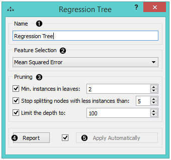
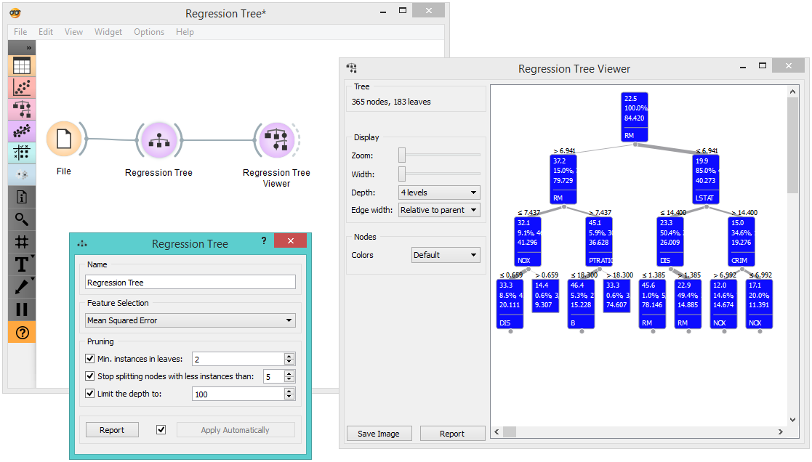
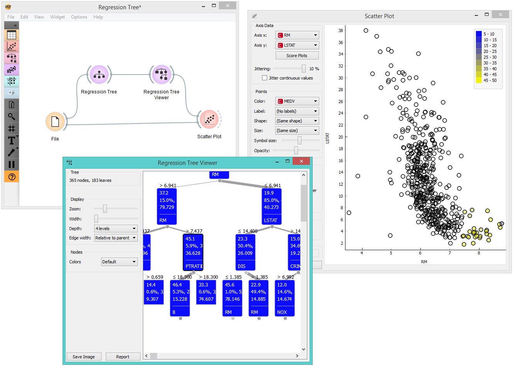

Regression Tree
===================

Regression Tree

Signals
-------

**Inputs**:

-  **Data**

A data set

-  **Preprocessor**

Preprocessed data.

**Outputs**:

-  **Learner**

A regression tree learning algorithm with settings as specified in the dialog.

-  **Predictor**

Trained regressor. 

Description
-----------

1. The learner can be given a name under which it will appear in other widgets. The default name is "Regression Tree".

2. In *Feature selection*, there is just one option, namely `Mean Squared Error <https://en.wikipedia.org/wiki/Mean_squared_error>`_, which measures the average of the squares of the errors or deviations (the difference between the estimator and what is estimated).

3. *Pruning* criteria:

   -  **Minimal instances in leaves**; if checked, the algorithm will
      never construct a split which would put less than the specified
      number of training examples into any of the branches.
   -  **Stop splitting nodes with less instances than** forbids the
      algorithm to split the nodes with less than the given number of
      instances.
   -  **Limit the depth** of the regression tree.

3. Produce a report. 
4. After changing the settings, you need to click *Apply*, which will
   put the new learner in the output and, if the training examples are
   given, construct a new regressor and output it as well.

Examples
--------

There are two typical uses for this widget. First, you may want to
induce a model and check what it looks like. You do it with the workflow
below. To learn more about it, see the documentation on :doc:`Regression Tree Viewer<../regression/regressiontreeviewer>`.

The second schema checks the accuracy of the algorithm. The selected tree node is presented in the :doc:`Scatter Plot<../visualize/scatterplot>` and we can see that the selected examples exhibit the same features. 

