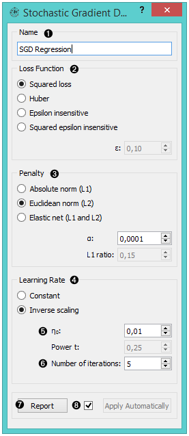
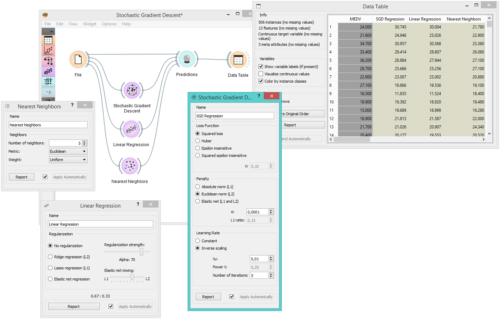

Stochastic Gradient Descent
===========================

.. figure:: icons/stochastic-gradient-descent.png

Learns a linear classifier by minimizing a chosen loss function.

Signals
-------

**Inputs**:

-  **Data**

   A data set.

-  **Preprocessor**

   Preprocessed data.

**Outputs**:

-  **Learner**

   A learning algorithm with supplied parameters

-  **Predictor**

   A trained regressor. Signal *Predictor* sends the output signal only if
   input *Data* is present.

Description
-----------

The **Stochastic Gradient Descent** widget uses `stochastic gradient descent <https://en.wikipedia.org/wiki/Stochastic_gradient_descent>`_
that minimizes a chosen loss function with a linear function. The
algorithm approximates a true gradient by considering one sample at a time,
and simultaneously updates the model based on the gradient of the loss
function. This regression returns predictors as minimizers of the sum,
i.e. M-estimators, and is especially useful for large-scale and sparse
data sets.

1. Learner/predictor name
2. Loss functions:

   -  `Squared Loss <https://en.wikipedia.org/wiki/Mean_squared_error#Regression>`_
      (fitted to ordinary least-squares)
   -  `Huber <https://en.wikipedia.org/wiki/Huber_loss>`_ (switches to
      linear loss beyond ε)
   -  `Epsilon insensitive <http://kernelsvm.tripod.com/>`_ (ignores
      errors within ε, linear beyond it)
   -  *Squared epsilon insensitive* (loss is squared beyond ε-region).

3. Regularization norms to prevent overfitting:

   -  `Absolute norm <https://en.wikipedia.org/wiki/Taxicab_geometry>`_ (L1,
      leading to sparse solutions)
   -  `Euclidean norm <https://en.wikipedia.org/wiki/Norm_(mathematics)#p-norm>`_
      (L2, standard regularizer)
   -  `Elastic net <https://en.wikipedia.org/wiki/Elastic_net_regularization>`_
      (mixing both penalty norms).

4. Use the default `Inverse scaling <http://users.ics.aalto.fi/jhollmen/dippa/node22.html>`_ for the learning rate to be inversely related to the number of iterations or select *Constant* for LR to stay the same through all epochs (passes).
5. Set the constants for the `regression algorithm <https://en.wikipedia.org/wiki/Regression_analysis>`_:

   -  **Eta0**: initial learning rate
   -  **Power t**: exponent for inverse scaling learning rate; t is time
      step 6, which relates to the number of passes through the training data.

7. Produce a report. 
8. Press *Apply* to commit changes. Alternatively, tick the box on the left side of the *Apply* button and changes will be communicated automatically. 

Example
-------

Below, we compare three different regression models to see which predict what kind of results. For the purpose of this example, the *Housing* data set is used. We connect the :doc:`File <../data/file>` widget to **Stochastic
Gradient Descent**, :doc:`Linear Regression <../regression/linear>` and :doc:`Nearest Neighbors <../regression/nearestneighbors>`
widget and all four to the :doc:`Predictions <../evaluation/predictions>` widget. Then we use the :doc:`Data
Table <../data/datatable>` to see what predictions each model makes.

