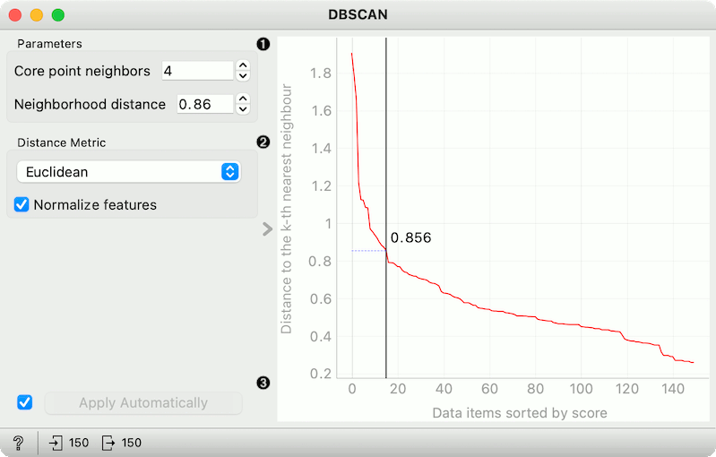

DBSCAN
======

Groups items using the DBSCAN clustering algorithm.

**Inputs**

- Data: input dataset

**Outputs**

- Data: dataset with cluster label as a meta attribute

The widget applies the [DBSCAN clustering](https://en.wikipedia.org/wiki/DBSCAN) algorithm to the data and outputs a new dataset with cluster labels as a meta attribute. The widget also shows the sorted graph with distances to k-th nearest neighbors. With k values set to **Core point neighbors** as suggested in the [methods article](https://www.aaai.org/Papers/KDD/1996/KDD96-037.pdf). This gives the user the idea of an ideal selection for **Neighborhood distance** setting. As suggested by the authors, this parameter should be set to the first value in the first "valley" in the graph.

1. **Parameters**:
   - *Core point neighbors*: The number of neighbors for a point to be considered as a core point.
   - *Neighborhood distance*: The maximum distance between two samples for one to be considered as in the neighborhood of the other.
2. Distance metric used in grouping the items (Euclidean, Manhattan, or Cosine). If *Normalize features* is selected, the data will be standardized column-wise (centered to mean and scaled to standard deviation of 1).
3. If *Apply Automatically* is ticked, the widget will commit changes
automatically. Alternatively, click *Apply*.

The graph shows the distance to the k-th nearest neighbor. *k* is
set by the **Core point neighbor** option. With moving the black slider
left and right you can select the right **Neighborhood distance**.

Example
-------

In the following example, we connected the [File](../data/file.md) widget with the Iris dataset to the DBSCAN widget. In the DBSCAN widget, we set **Core points neighbors** parameter to 5. And select the **Neighborhood distance** to the value in the first "valley" in the graph. We show clusters in the [Scatter Plot](../visualize/scatterplot.md) widget.

