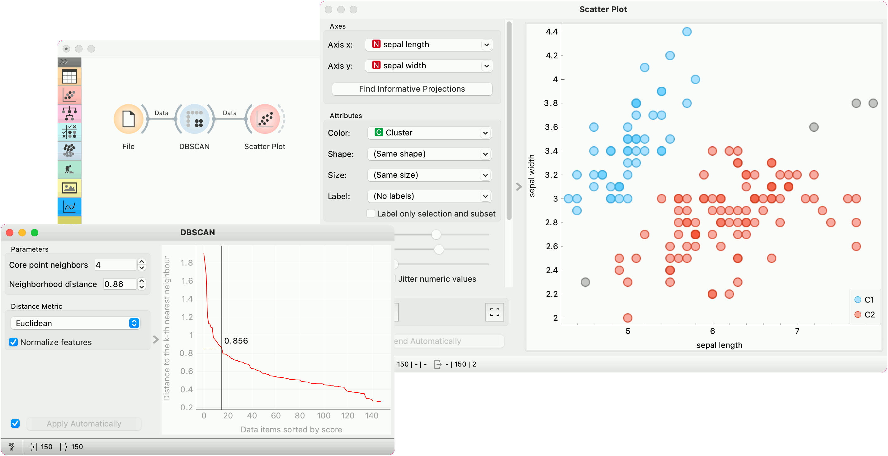

DBSCAN
======

Groups items using the DBSCAN clustering algorithm.

**Inputs**

- Data: input dataset

**Outputs**

- Data: dataset with cluster index as a class attribute

The widget applies the
[DBSCAN clustering](https://en.wikipedia.org/wiki/DBSCAN) algorithm to
the data and outputs a new dataset with cluster indices as a meta
attribute. The widget also shows the sorted graph with distances to
k-th nearest neighbors. With k values set to **Core point neighbors**
as suggested in the
[methods article](https://www.aaai.org/Papers/KDD/1996/KDD96-037.pdf).
This gives the user the idea of an
ideal selection for **Neighborhood distance** setting. As suggested by
authors this parameter should be set to the first value in the first
"valley" in the graph.

1. Set *minimal number of core neighbors* for a cluster and *maximal
neighborhood distance.
2. Set the distance metric that is used in grouping the items.
3. If *Apply Automatically* is ticked, the widget will commit changes
automatically. Alternatively, click *Apply*.
4. The graph shows the distance to the k-th nearest neighbor. *k* is
set by the **Core point neighbor** option. With moving the black slider
left and right you can select the right **Neighbourhood distance**.

Example
-------

In the following example, we connected the File widget with selected
Iris dataset to the DBSCAN widget. In the DBSCAN widget, we set
**Core points neighbors** parameter to 5. And select the
**Neighbourhood distance** to the value in the first "valley" in the
graph. We show clusters in the Scatter Plot widget.

