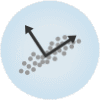
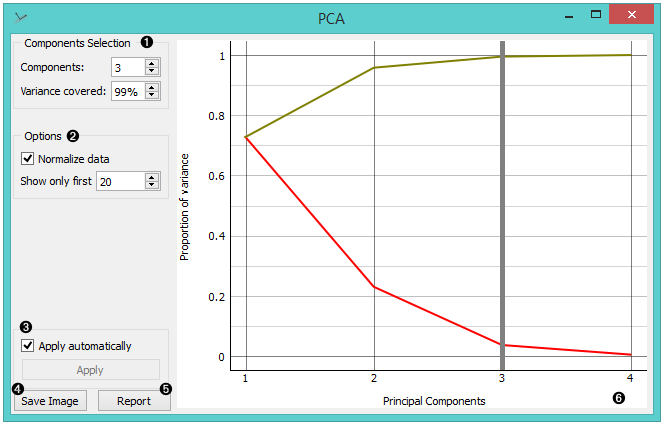
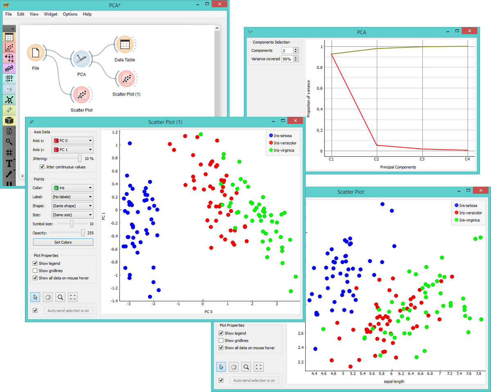
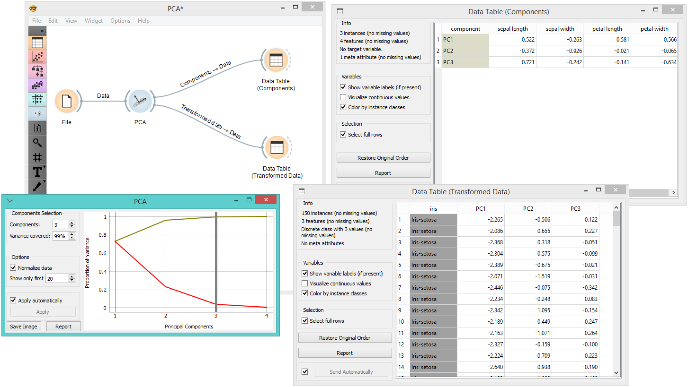

PCA
===

PCA linear transformation of input data.

Signals
-------

**Inputs**:

-  **Data**

   A data set.

**Outputs**:

-  **Transformed Data**

   PCA transformed input data.

-  **Components**

   `Eigenvectors <https://en.wikipedia.org/wiki/Eigenvalues_and_eigenvectors>`_.

Description
-----------

`Principal Component Analysis <https://en.wikipedia.org/wiki/Principal_component_analysis>`_
(PCA) computes the PCA linear transformation of the input data. It
outputs either a transformed data set with weights of individual
instances or weights of principal components.

1. Select how many principal components you wish in your output. It is
   best to choose as few as possible with variance covered as high as possible. You can also set how much variance you
   wish to cover with your principal components.
2. You can normalize data to adjust the values to common scale.
3. When *Apply Automatically* is ticked, the widget will automatically
   communicate all changes. Alternatively, click *Apply*.
4. Press *Save Image* if you want to save the created image to your computer. 
5. Produce a report. 
6. Principal components graph, where the red (lower) line is the
   variance covered per component and the green (upper) line is
   cumulative variance covered by components.

The number of components of the transformation can be selected either in
the *Components Selection* input box or by dragging the vertical cutoff
line in the graph.

Examples
--------

**PCA** can be used to simplify visualizations of large data sets. Below,
we used the *Iris* data set to show how we can improve the visualization of
the data set with PCA. The transformed data in the :doc:`Scatter Plot <../visualize/scatterplot>` show a
much clearer distinction between classes than the default settings.

The widget provides two outputs: transformed data and principal
components. Transformed data are weights for individual instances in the
new coordinate system, while components are the system descriptors
(weights for princial components). When fed into the :doc:`Data Table <../data/datatable>`, we
can see both outputs in numerical form. We used two data tables in order to provide a more clean visualization of the workflow, 
but you can also choose to edit the links in such a way that you display the data in just one data table. 
You only need to create two links and connect the *Transformed data* and *Components* inputs to the *Data* output. 

