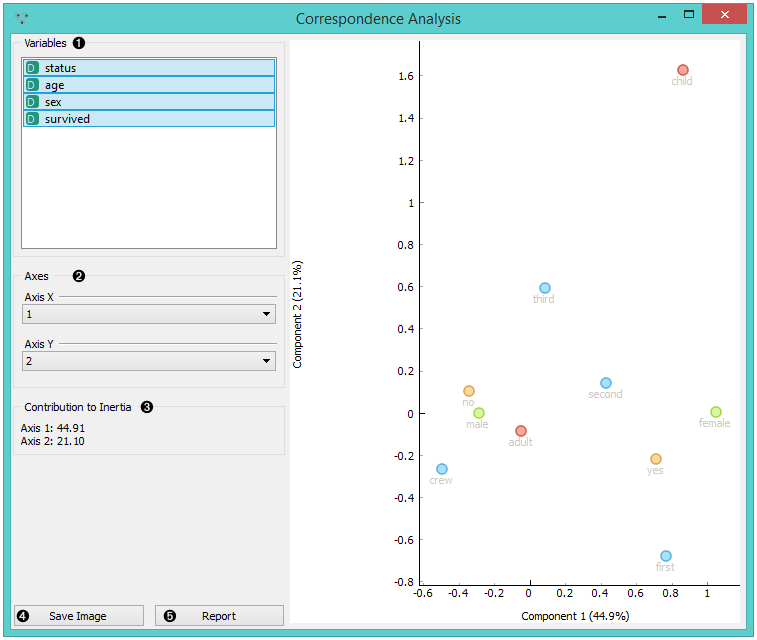
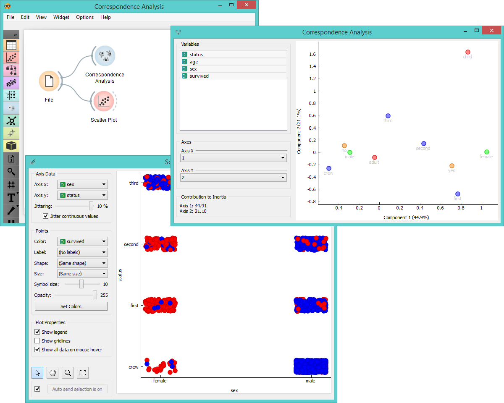

Correspondence Analysis
=======================

Correspondence analysis for categorical multivariate data.

Inputs
    Data
        input dataset

`Correspondence Analysis <https://en.wikipedia.org/wiki/Correspondence_analysis>`_ (CA)
computes the CA linear transformation of the input data. While it is
similar to PCA, CA computes linear transformation on discrete rather
than on continuous data.

1. Select the variables you want to see plotted.
2. Select the component for each axis.
3. `Inertia <https://en.wikipedia.org/wiki/Sylvester%27s_law_of_inertia>`_
   values (percentage of independence from transformation, i.e.
   variables are in the same dimension).
4. Produce a report. 

Example
-------

Below, is a simple comparison between the **Correspondence Analysis** and
:doc:`Scatter plot <../visualize/scatterplot>` widgets on the *Titanic* dataset. While the :doc:`Scatter plot <../visualize/scatterplot>` shows
fairly well which class and sex had a good survival rate and which one
didn't, **Correspondence Analysis** can plot several variables in a 2-D
graph, thus making it easy to see the relations between variable values.
It is clear from the graph that "no", "male" and "crew" are related to
each other. The same goes for "yes", "female" and "first".

