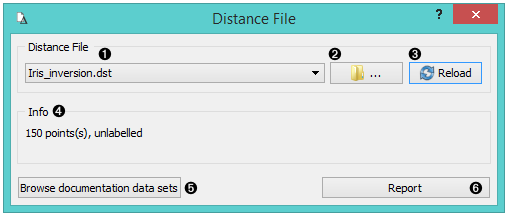
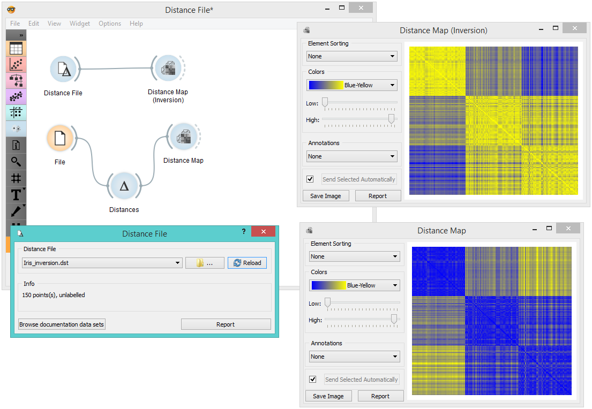

Distance File
=============

Loads an existing distance file.

**Outputs**

- Distance File: distance matrix

1. Choose from a list of previously saved distance files.
2. Browse for saved distance files.
3. Reload the selected distance file.
4. Information about the distance file (number of points,
    labelled/unlabelled).
5. Browse documentation datasets.
6. Produce a report.

Example
-------

When you want to use a custom-set distance file that you've saved before, open the **Distance File** widget and select the desired file with the *Browse* icon. This widget loads the existing distance file. In the snapshot below, we loaded the transformed *Iris* distance matrix from the [Save Distance Matrix](../unsupervised/savedistancematrix.md) example. We displayed the transformed data matrix in the [Distance Map](../unsupervised/distancemap.md) widget. We also decided to display a distance map of the original *Iris* dataset for comparison.

