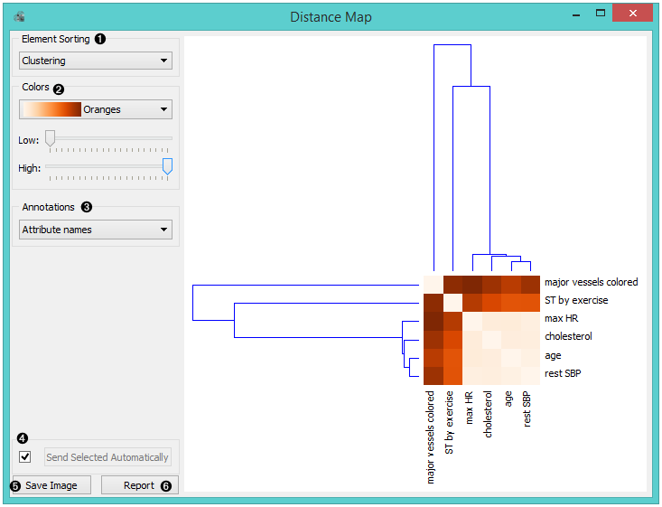
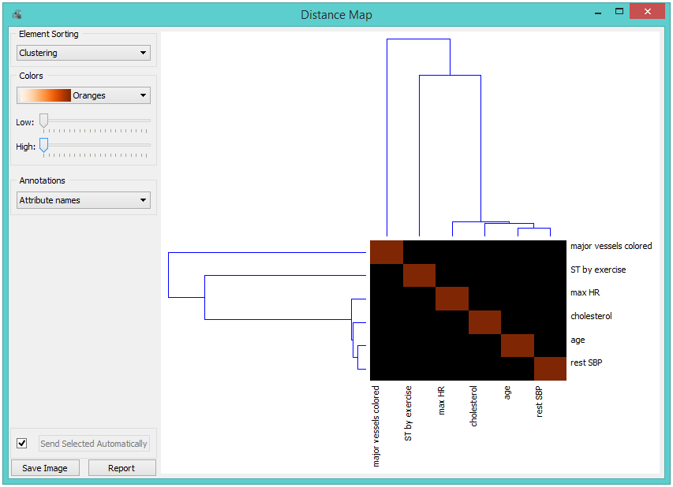
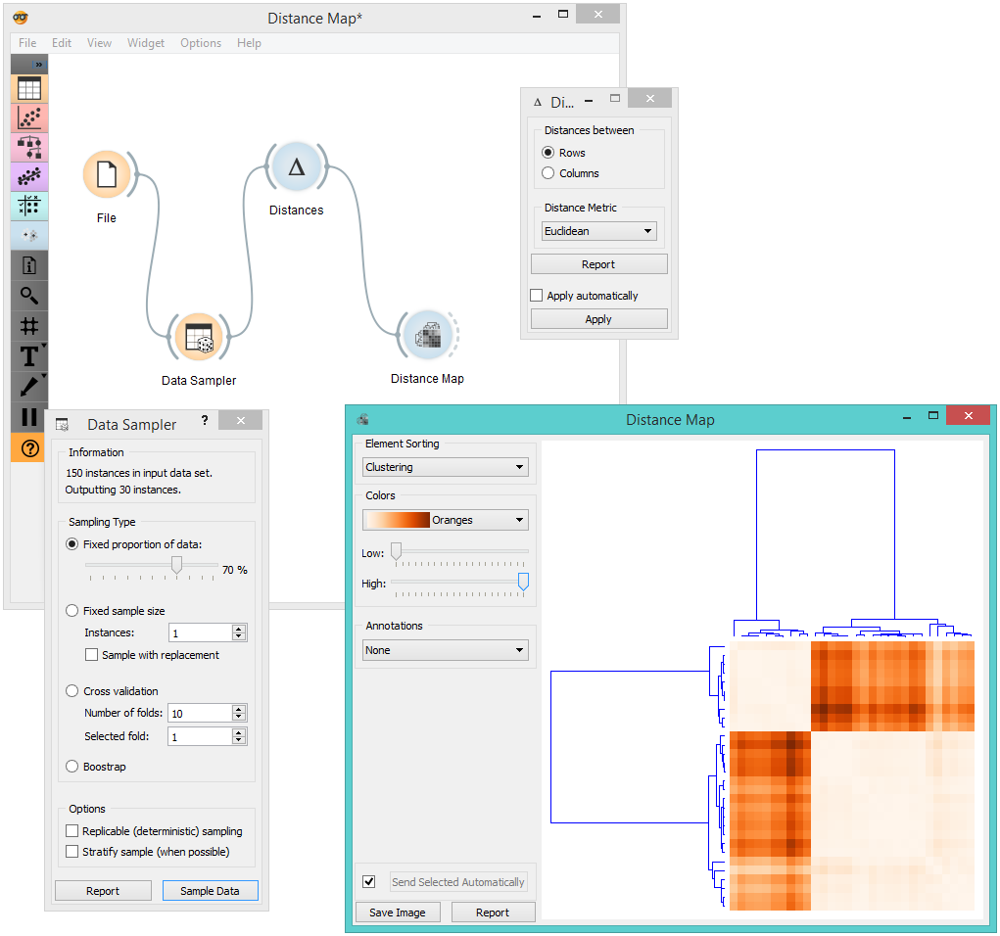
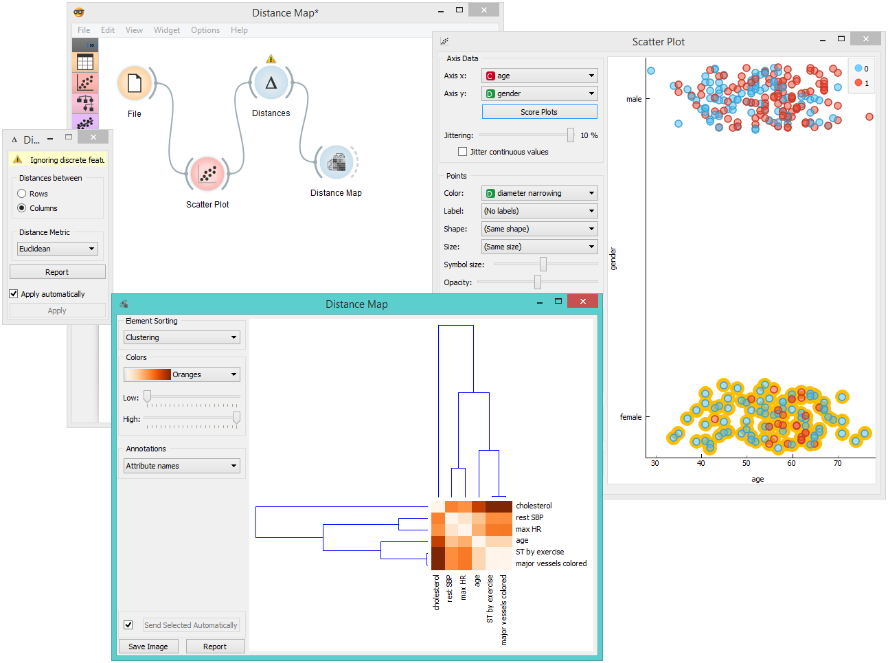

Distance Map
============

Visualizes distances between items.

Inputs
    Distances
        distance matrix

Outputs
    Data
        instances selected from the matrix
    Features
        attributes selected from the matrix

The **Distance Map** visualizes distances between objects. The visualization
is the same as if we printed out a table of numbers, except that the
numbers are replaced by colored spots.

Distances are most often those between instances ("*rows*" in the
:doc:`Distances <../unsupervised/distances>` widget) or attributes ("*columns*" in :doc:`Distances <../unsupervised/distances>`
widget). The only suitable input for **Distance Map** is the :doc:`Distances <../unsupervised/distances>`
widget. For the output, the user can select a region of the map and the
widget will output the corresponding instances or attributes. Also note
that the **Distances** widget ignores discrete values and calculates
distances only for continuous data, thus it can only display distance map
for discrete data if you :doc:`Continuize <../data/continuize>` them first.

The snapshot shows distances between columns in the *heart disease*
data, where smaller distances are represented with light and larger with
dark orange. The matrix is symmetric and the diagonal is a light shade of orange - no
attribute is different from itself. Symmetricity is always assumed,
while the diagonal may also be non-zero.

1. *Element sorting* arranges elements in the map by

   -  None (lists instances as found in the dataset)
   -  **Clustering** (clusters data by similarity)
   -  **Clustering with ordered leaves** (maximizes the sum of
      similarities of adjacent elements)

2. *Colors*

   -  **Colors** (select the color palette for your distance map)
   -  **Low** and **High** are thresholds for the color palette (low for
      instances or attributes with low distances and high for instances
      or attributes with high distances).

3. Select *Annotations*.
4. If *Send Selected Automatically* is on, the data subset is communicated automatically,
   otherwise you need to press *Send Selected*.
5. Press *Save Image* if you want to save the created image to your computer. 
6. Produce a report. 

Normally, a color palette is used to visualize the entire range of
distances appearing in the matrix. This can be changed by setting the
low and high threshold. In this way we ignore the differences in
distances outside this interval and visualize the interesting part of
the distribution.

Below, we visualized the most correlated attributes (distances by
columns) in the *heart disease* dataset by setting the color threshold
for high distances to the minimum. We get a predominantly black square,
where attributes with the lowest distance scores are represented by
a lighter shade of the selected color schema (in our case: orange). Beside the diagonal line, we see that in our example *ST by
exercise* and *major vessels colored* are the two attributes closest
together.

The user can select a region in the map with the usual click-and-drag of
the cursor. When a part of the map is selected, the widget outputs all
items from the selected cells.

Examples
--------

The first workflow shows a very standard use of the **Distance Map**
widget. We select 70% of the original *Iris* data as our sample and view
the distances between rows in **Distance Map**.

In the second example, we use the *heart disease* data again and select a
subset of women only from the :doc:`Scatter Plot <../visualize/scatterplot>`. Then, we visualize
distances between columns in the **Distance Map**. Since the subset also contains some discrete data, the :doc:`Distances <../unsupervised/distances>` widget warns us it will
ignore the discrete features, thus we will see only continuous
instances/attributes in the map.

