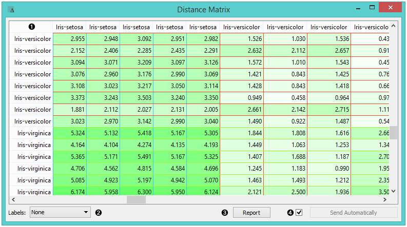
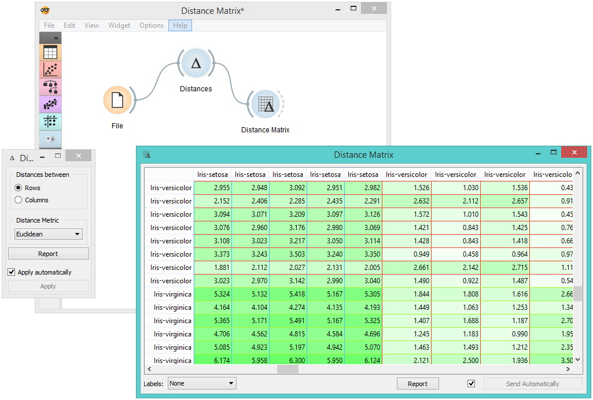

Distance Matrix
===============

Visualizes distance measures in a distance matrix.

**Inputs**

- Distances: distance matrix

**Outputs**

- Distances: distance matrix
- Table: distance measures in a distance matrix

The **Distance Matrix** widget creates a distance matrix, which is a two-dimensional array containing the distances, taken pairwise, between the elements of a set. The number of elements in the dataset defines the size of the matrix. Data matrices are essential for hierarchical clustering and they are extremely useful in bioinformatics as well, where they are used to represent protein structures in a coordinate-independent manner.

1. Elements in the dataset and the distances between them.
2. Label the table. The options are: *none*, *enumeration*, *according to variables*.
3. Produce a report.
4. Click *Send* to communicate changes to other widgets. Alternatively, tick the box in front of the *Send* button and changes will be communicated automatically (*Send Automatically*).

The only two suitable inputs for **Distance Matrix** are the [Distances](../unsupervised/distances.md) widget and the [Distance Transformation](../unsupervised/distancetransformation.md) widget. The output of the widget is a data table containing the distance matrix. The user can decide how to label the table and the distance matrix (or instances in the distance matrix) can then be visualized or displayed in a separate data table.

Example
-------

The example below displays a very standard use of the **Distance Matrix** widget. We compute the distances between rows in the sample from the *Iris* dataset and output them in the **Distance Matrix**. It comes as no surprise that Iris Virginica and Iris Setosa are the furthest apart.

