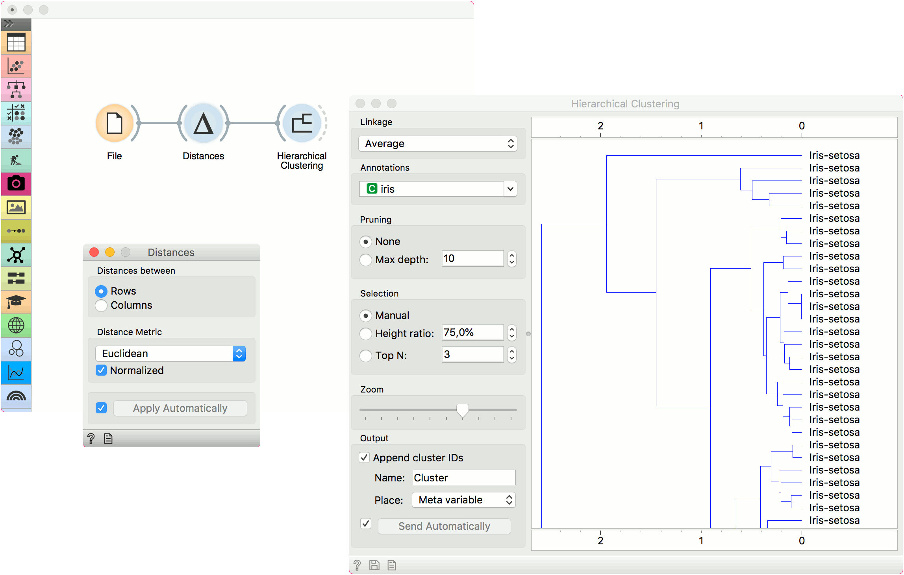
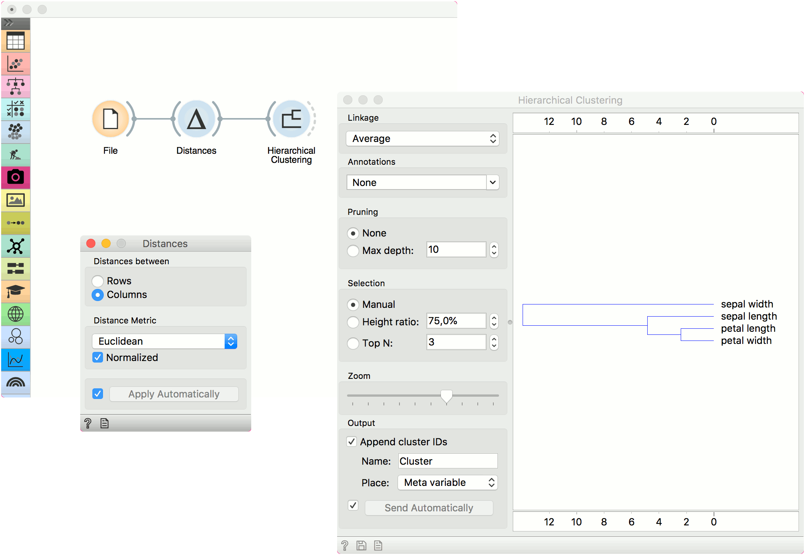
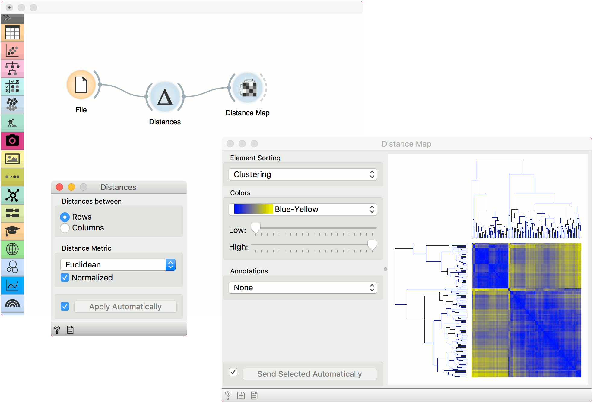

Distances
=========

Computes distances between rows/columns in a dataset.

**Inputs**

- Data: input dataset

**Outputs**

- Distances: distance matrix

The **Distances** widget computes distances between rows or columns in a dataset. By default, the data will be normalized to ensure equal treatment of individual features. Normalization is always done column-wise.

Sparse data can only be used with Euclidean, Manhattan and Cosine metric.

The resulting distance matrix can be fed further to [Hierarchical Clustering](hierarchicalclustering.md) for uncovering groups in the data, to [Distance Map](distancemap.md) or [Distance Matrix](distancematrix.md) for visualizing the distances (Distance Matrix can be quite slow for larger data sets), to [MDS](mds.md) for mapping the data instances using the distance matrix and finally, saved with [Save Distance Matrix](savedistancematrix.md). Distance file can be loaded with [Distance File](distancefile.md).

Distances work well with Orange add-ons, too. The distance matrix can be fed to Network from Distances (Network add-on) to convert the matrix into a graph and to Duplicate Detection (Text add-on) to find duplicate documents in the corpus.

1. Choose whether to measure distances between rows or columns.
2. Choose the *Distance Metric*:
   - [Euclidean](https://en.wikipedia.org/wiki/Euclidean_distance) ("straight line", distance between two points)
   - [Manhattan](https://en.wiktionary.org/wiki/Manhattan_distance) (the sum of absolute differences for all attributes)
   - [Cosine](https://en.wikipedia.org/wiki/Cosine_similarity) (the cosine of the angle between two vectors of an inner product space)
   - [Jaccard](https://en.wikipedia.org/wiki/Jaccard_index) (the size of the intersection divided by the size of the union of the sample sets)
   - [Spearman](https://en.wikipedia.org/wiki/Spearman's_rank_correlation_coefficient)(linear correlation between the rank of the values, remapped as a distance in a [0, 1] interval)
   - [Spearman absolute](https://en.wikipedia.org/wiki/Spearman's_rank_correlation_coefficient)(linear correlation between the rank of the absolute values, remapped as a distance in a [0, 1] interval)
   - [Pearson](https://en.wikipedia.org/wiki/Pearson_product-moment_correlation_coefficient) (linear correlation between the values, remapped as a distance in a [0, 1] interval)
   - [Pearson absolute](https://en.wikipedia.org/wiki/Pearson_product-moment_correlation_coefficient) (linear correlation between the absolute values, remapped as a distance in a [0, 1] interval)
   - [Hamming](https://en.wikipedia.org/wiki/Hamming_distance) (the number of features at which the corresponding values are different)

   Normalize the features. Normalization is always done column-wise.
   In case of missing values, the widget automatically imputes the average value of the row or the column.
   The widget works for both numeric and categorical data. In case of categorical data, the distance is 0 if the two values are the same ('green' and 'green') and 1 if they are not ('green' and 'blue').
3. Tick *Apply Automatically* to automatically commit changes to other widgets. Alternatively, press '*Apply*'.

Examples
--------

The first example shows a typical use of the **Distances** widget. We are using the *iris.tab* data from the [File](../data/file.md) widget. We compute distances between data instances (rows) and pass the result to the [Hierarchical Clustering](hierarchicalclustering.md). This is a simple workflow to find groups of data instances.

Alternatively, we can compute distance between columns and find how similar our features are.

The second example shows how to visualize the resulting distance matrix. A nice way to observe data similarity is in a [Distance Map](distancemap.md) or in [MDS](mds.md).

