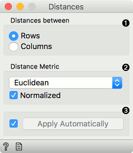
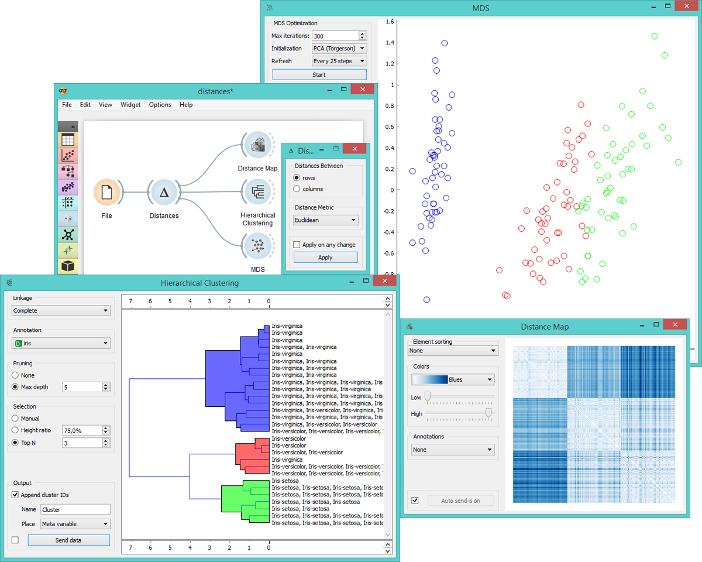

Distances
=========

Computes distances between rows/columns in a data set.

Signals
-------

**Inputs**:

-  **Data**

   A data set

**Outputs**:

-  **Distances**

   A distance matrix

Description
-----------

The **Distances** widget computes distances between rows or
columns in a data set.

1. Choose whether to measure distances between rows or columns.

2. Choose the *Distance Metric*:

   -  `Euclidean <https://en.wikipedia.org/wiki/Euclidean_distance>`_
      ("straight line", distance between two points)
   -  `Manhattan <https://en.wiktionary.org/wiki/Manhattan_distance>`_
      (the sum of absolute differences for all attributes)
   -  `Cosine <https://en.wikipedia.org/wiki/Cosine_similarity>`_
      (the cosine of the angle between two vectors of an inner product
      space)
   -  `Jaccard <https://en.wikipedia.org/wiki/Jaccard_index>`__ (the
      size of the intersection divided by the size of the union of the
      sample sets)
   -  `Spearman <https://en.wikipedia.org/wiki/Spearman's_rank_correlation_coefficient>`_
      (linear correlation between the rank of the values, remapped as a
      distance in a [0, 1] interval)
   -  `Spearman
      absolute <https://en.wikipedia.org/wiki/Spearman's_rank_correlation_coefficient>`_
      (linear correlation between the rank of the absolute values,
      remapped as a distance in a [0, 1] interval)
   -  `Pearson <https://en.wikipedia.org/wiki/Pearson_product-moment_correlation_coefficient>`_
      (linear correlation between the values, remapped as a distance in
      a [0, 1] interval)
   -  `Pearson absolute <https://en.wikipedia.org/wiki/Pearson_product-moment_correlation_coefficient>`_
      (linear correlation between the absolute values, remapped as a
      distance in a [0, 1] interval)

   In case of missing values, the widget automatically imputes the average
   value of the row or the column.

   Since the widget cannot compute distances between discrete and
   continuous attributes, it only uses continuous attributes and ignores
   the discrete ones. If you want to use discrete attributes, continuize
   them with the :doc:`Continuize <../data/continuize>` widget first.

3. Produce a report. 
4. Tick *Apply Automatically* to automatically commit changes to other widgets. Alternatively, press '*Apply*'.

Example
-------

This widget needs to be connected to another widget to display results,
for instance to :doc:`Distance Map <../unsupervised/distancemap>` to visualize distances, :doc:`Hierarchical
Clustering <../unsupervised/hierarchicalclustering>` to cluster the attributes, or :doc:`MDS<../unsupervised/mds>` to visualize the
distances in a plane.

