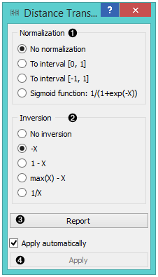
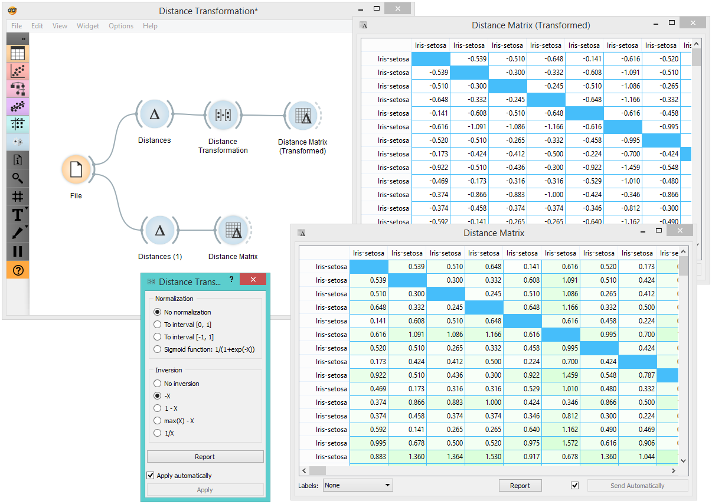

Distance Transformation
=======================

Transforms distances in a dataset.

Inputs
    Distances
        distance matrix

Outputs
    Distances
        transformed distance matrix

The **Distances Transformation** widget is used for the normalization and inversion of distance matrices. The normalization of data is necessary to bring all the variables into proportion with one another. 

1. Choose the type of `Normalization <https://en.wikipedia.org/wiki/Normalization_(statistics)>`_:

   - **No normalization**
   - **To interval [0, 1]**
   - **To interval [-1, 1]**
   - `Sigmoid function <https://en.wikipedia.org/wiki/Sigmoid_function>`_: 1/(1+exp(-X)) 

2. Choose the type of Inversion: 

   - **No inversion**
   - **-X**
   - **1 - X**
   - **max(X) - X**
   - **1/X**

3. Produce a report. 
4. After changing the settings, you need to click *Apply* to commit changes to other widgets. Alternatively, tick *Apply automatically*.

Example
-------

In the snapshot below, you can see how transformation affects the distance matrix. We loaded the *Iris* dataset and calculated the distances between rows with the help of the :doc:`Distances <../unsupervised/distances>` widget. In order to demonstrate how **Distance Transformation** affects the :doc:`Distance Matrix <../unsupervised/distancematrix>`, we created the worflow below and compared the transformed distance matrix with the "original" one. 

