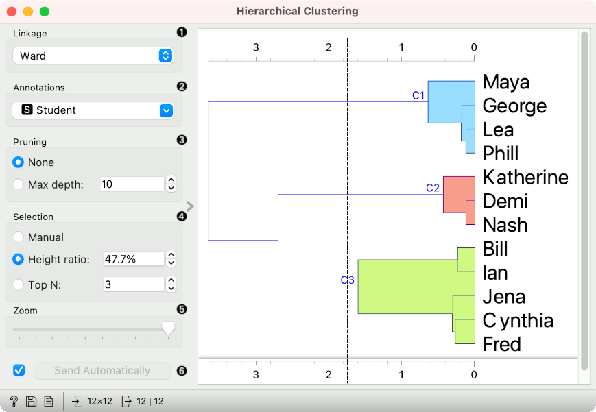
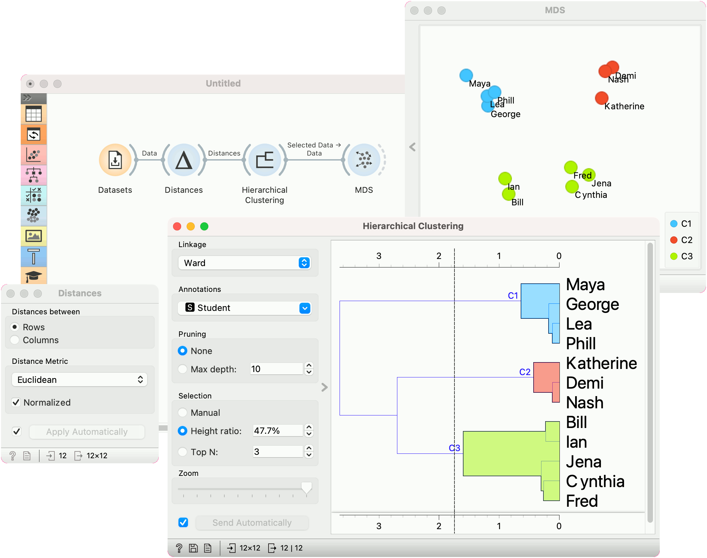
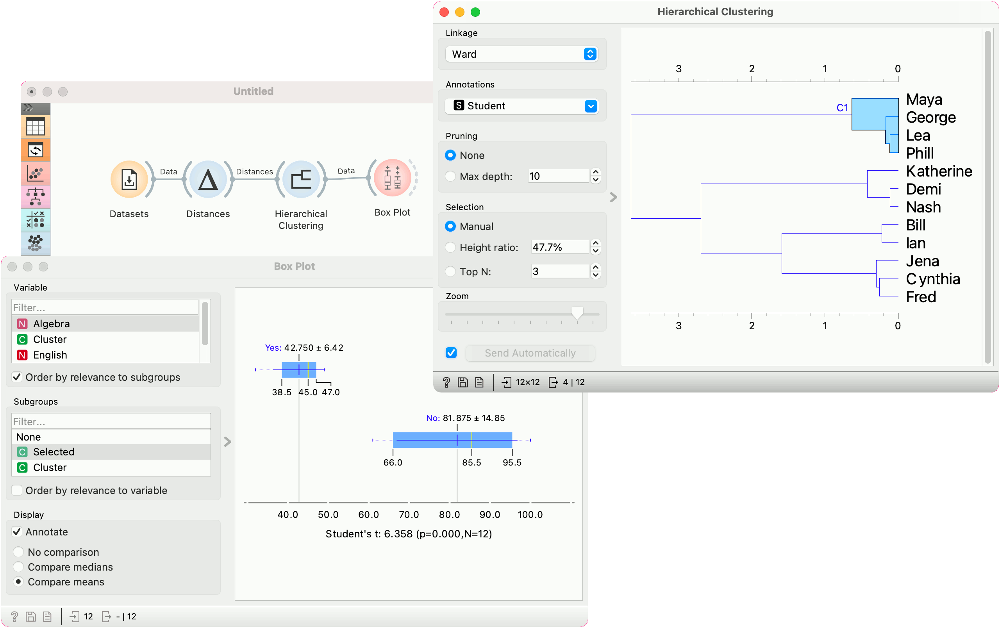

Hierarchical Clustering
=======================

Groups items using a hierarchical clustering algorithm.

**Inputs**

- Distances: distance matrix

**Outputs**

- Selected Data: instances selected from the plot
- Data: data with an additional column showing whether an instance is selected

The widget computes [hierarchical clustering](https://en.wikipedia.org/wiki/Hierarchical_clustering) of arbitrary types of objects from a matrix of distances and shows a corresponding [dendrogram](https://en.wikipedia.org/wiki/Dendrogram). Distances can be computed with the [Distances](../unsupervised/distances.md) widget

1. The widget supports the following ways of measuring distances between clusters:
   - **Single linkage** computes the distance between the closest elements of the two clusters
   - **Average linkage** computes the average distance between elements of the two clusters
   - **Weighted linkage** uses the [WPGMA](http://research.amnh.org/~siddall/methods/day1.html) method
   - **Complete linkage** computes the distance between the clusters' most distant elements
   - **Ward linkage** computes the increase of the error sum of squares. In other words, the [Ward's minimum variance criterion](https://en.wikipedia.org/wiki/Ward%27s_method) minimizes the total within-cluster variance.
2. Labels of nodes in the dendrogram can be chosen in the **Annotation** box.
3. Huge dendrograms can be pruned in the *Pruning* box by selecting the maximum depth of the dendrogram. This only affects the display, not the actual clustering.
4. The widget offers three different selection methods:
   - **Manual** (Clicking inside the dendrogram will select a cluster. Multiple clusters can be selected by holding Ctrl/Cmd. Each selected cluster is shown in a different color and is treated as a separate cluster in the output.)
   - **Height ratio** (Clicking on the bottom or top ruler of the dendrogram places a cutoff line in the graph. Items to the right of the line are selected.)
   - **Top N** (Selects the number of top nodes.)
5. Use *Zoom* and scroll to zoom in or out.
6. The data can be automatically output on any change (*Send Automatically*) or, if the box isn't ticked, by pushing *Send Selection*.

To output the cluster, click on the ruler at the top or the bottom of the visualization. This will create a cut-off for the clusters.

Examples
--------

#### Cluster selection and projections

We start with the *Grades for English and Math* data set from the [Datasets](../data/datasets.md) widget. The data contains two numeric variables, grades for English and for Algebra.

**Hierarchical Clustering** requires distance matrix on the input. We compute it with [Distances](../unsupervised/distances.md), where we use the *Euclidean* distance metric.

Once the data is passed to the hierarchical clustering, the widget displays a dendrogram, a tree-like clustering structure. Each node represents an instance in the data set, in our case a student. Tree nodes are labelled with student names.

To create the clusters, we click on the ruler at the desired threshold. In this case, we chose three clusters. We pass those clusters to [MDS](../unsupervised/mds.md), which shows a 2D projection of data instances, colored by cluster label.

#### Cluster explanation

In the second example, we continue the *Grades for English and Math* data. Say we wish to explain what characterizes the cluster with Maya, George, Lea, and Phill.

We select the cluster in the dendrogram and pass the entire data set to [Box Plot](../visualize/boxplot.md). Note that the connection here is *Data*, not *Selected Data*. To rewire the connection, double-click on it.

In **Box Plot**, we set *Selected* variable as the Subgroup. This will split the plot into selected data instances (our cluster) and the remaining data. Next, we use *Order by relevance to subgroup* option, which sorts the variables according to how well they distinguish between subgroups. It turns out, that our cluster contains students who are bad at math (they have low values of the Algebra variable).

