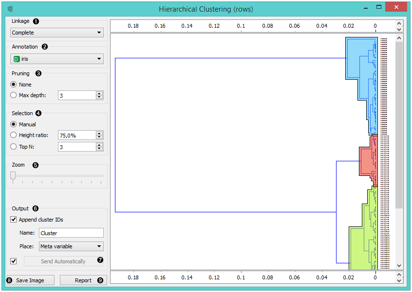
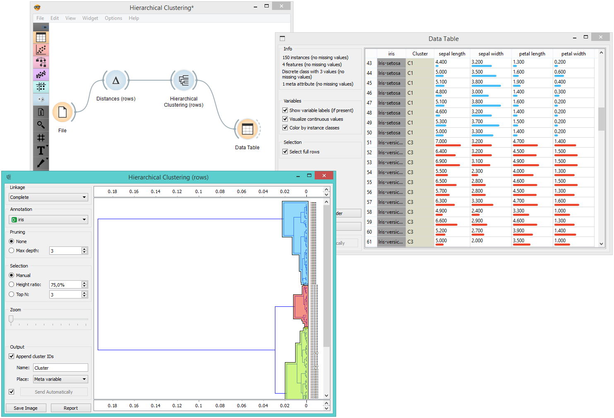
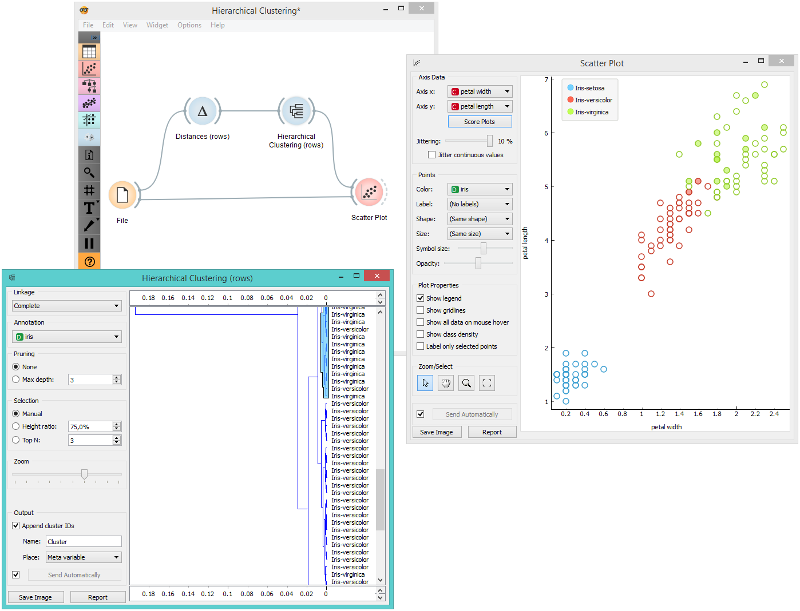

Hierarchical Clustering
=======================

Groups items using a hierarchical clustering algorithm.

Signals
-------

**Inputs**:

-  **Distances**

   A distance matrix

**Outputs**:

-  **Selected Data**

   A data subset

-  **Other Data**

   Remaining data

Description
-----------

The widget computes `hierarchical clustering <https://en.wikipedia.org/wiki/Hierarchical_clustering>`_ of
arbitrary types of objects from a matrix of distances and shows a
corresponding `dendrogram <https://en.wikipedia.org/wiki/Dendrogram>`_.

1. The widget supports four ways of measuring distances between
   clusters:

   -  **Single linkage** computes the distance between the closest
      elements of the two clusters
   -  **Average linkage** computes the average distance between elements
      of the two clusters
   -  **Weighted linkage** uses the
      `WPGMA <http://research.amnh.org/~siddall/methods/day1.html>`_
      method
   -  **Complete linkage** computes the distance between the clusters' most
      distant elements

2. Labels of nodes in the dendrogram can be chosen in the **Annotation**
   box.
3. Huge dendrograms can be pruned in the *Pruning* box by selecting the
   maximum depth of the dendrogram. This only affects the display, not
   the actual clustering.
4. The widget offers three different selection methods:

   -  **Manual** (Clicking inside the dendrogram will select a cluster.
      Multiple clusters can be selected by holding Ctrl/Cmd. Each
      selected cluster is shown in a different color and is treated as a
      separate cluster in the output.)
   -  **Height ratio** (Clicking on the bottom or top ruler of the
      dendrogram places a cutoff line in the graph. Items to the right
      of the line are selected.)
   -  **Top N** (Selects the number of top nodes.)

5. Use *Zoom* and scroll to zoom in or out.
6. If the items being clustered are instances, they can be added a
   cluster index (*Append cluster IDs*). The ID can appear as an
   ordinary **Attribute**, **Class attribute** or a **Meta attribute**.
   In the second case, if the data already has a class attribute, the
   original class is placed among meta attributes.

7. The data can be automatically output on any change (*Auto send is
   on*) or, if the box isn't ticked, by pushing *Send Data*.

8. Clicking this button produces an image that can be saved. 
9. Produce a report. 

Examples
--------

The workflow below shows the output of **Hierarchical Clustering** for the *Iris* data set in :doc:`Data Table <../data/datatable>` widget. We see that if we choose
*Append cluster IDs* in hierarchical clustering, we can see an
additional column in the :doc:`Data Table <../data/datatable>` named *Cluster*. This is a way
to check how hierarchical clustering clustered individual instances.

In the second example, we loaded the *Iris* data set again, but this time
we added the :doc:`Scatter Plot <../visualize/scatterplot>`, showing all the instances from the
:doc:`File<../data/file>` widget, while at the same time receiving the selected instances
signal from **Hierarchical Clustering**. This way we can observe the
position of the selected cluster(s) in the projection.

