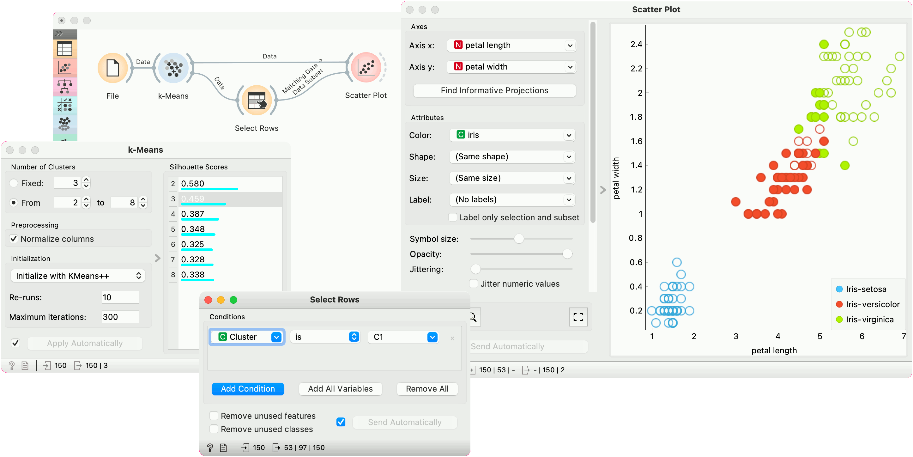
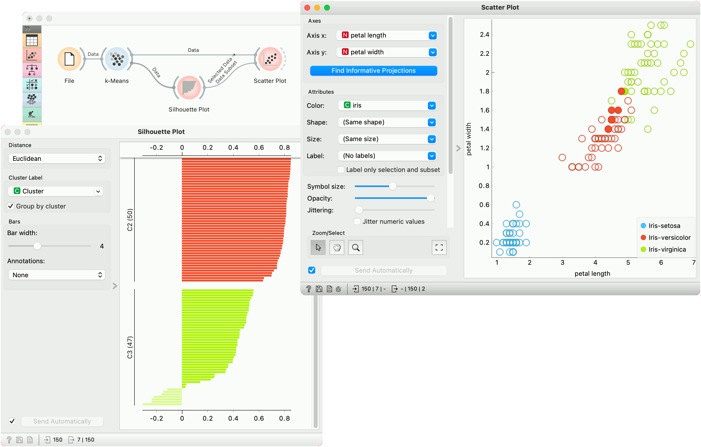

k-Means
=======

Groups items using the k-Means clustering algorithm.

**Inputs**

- Data: input dataset

**Outputs**

- Data: dataset with cluster label as a meta attribute
- Centroids: table with initial centroid coordinates

The widget applies the [k-Means clustering](https://en.wikipedia.org/wiki/K-means_clustering) algorithm to the data and outputs a new dataset in which the cluster label is added as a meta attribute. Silhouette scores of clustering results for various k are also shown in the widget. When using the silhouette score option, the higher the silhouette score, the better the clustering.

1. Select the number of clusters.
   - **Fixed**: algorithm clusters data to a specified number of clusters.
   - **From X to Y**: widget shows clustering scores for the selected cluster range using the [Silhouette](https://en.wikipedia.org/wiki/Silhouette_\(clustering\)) score (contrasts average distance to elements in the same cluster with the average distance to elements in other clusters).
2. **Preprocessing**: If the option is selected, columns are normalized (mean centered to 0 and standard deviation scaled to 1).
3. Initialization method (the way the algorithm begins clustering):
   - [k-Means++](https://en.wikipedia.org/wiki/K-means%2B%2B) (first center is selected randomly, subsequent are chosen from the remaining points with probability proportioned to squared distance from the closest center)
   - **Random initialization** (clusters are assigned randomly at first and then updated with further iterations)

    **Re-runs** (how many times the algorithm is run from random initial positions; the result with the lowest within-cluster sum of squares will be used) and **Maximum iterations** (the maximum number of iterations within each algorithm run) can be set manually.

Preprocessing
-------------

k-Means uses default preprocessing if necessary. It executes it in the following order:

- continuizes categorical variables (with one feature per value)
- imputes missing values with mean values

To override default preprocessing, preprocess the data beforehand with [Preprocess](../data/preprocess.md) widget.

Examples
--------

First, we load the *Iris* dataset, run k-Means with three clusters, and show it in the [Scatter Plot](../visualize/scatterplot.md). To interactively explore the clusters, we can use [Select Rows](../data/selectrows.md) to select the cluster of interest (say, C1) and plot it in the scatter plot using interactive data analysis. That means if we pass a subset to the scatter plot, the subset will be exposed in the plot.

Try the same procedure for 2 or 4 clusters or explore different clusters in the plot (C2, C3).

But as we used silhouette score to estimate our cluster quality, we can plot the clusters in the [Silhouette Plot](../visualize/silhouetteplot.md) to observe inliers and outliers. Place Silhouette Plot in place of Select Rows.

Silhouette Plot shows silhouette scores for individual data instances. High, positive scores represent instances that are highly representative of the clusters, while negative scores represent instances that are outliers (don't fit well with the cluster). Select negative scores from the green cluster C3 and plot them in a scatter plot as a subset.

It seems like these are mostly iris versicolors, which are bordering the iris virginica region. Note that the green color of the cluster C3 doesn't coincide with the green color of the iris labels - these are two different things.

