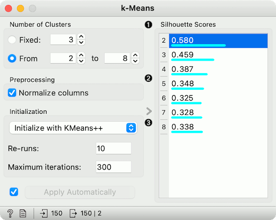
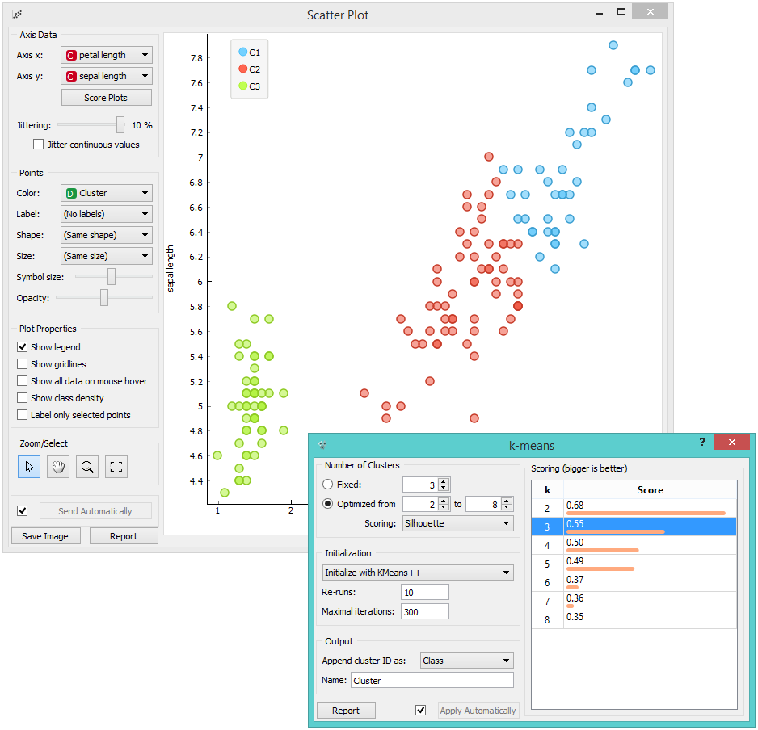
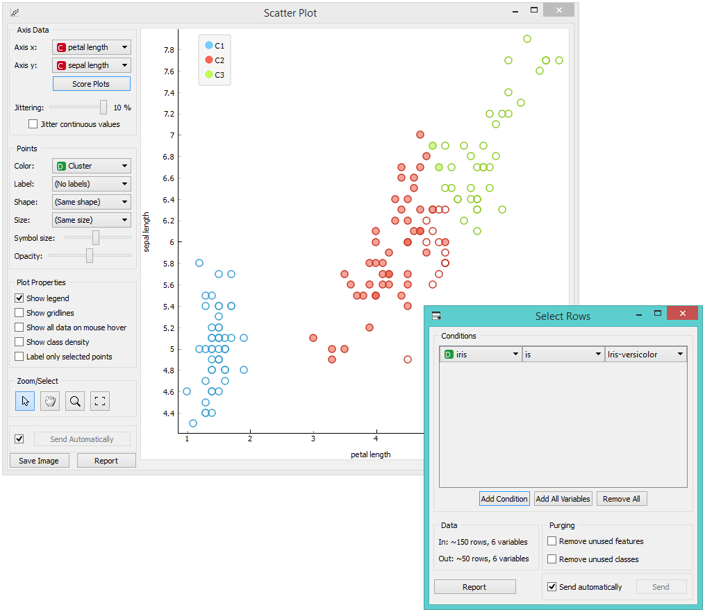
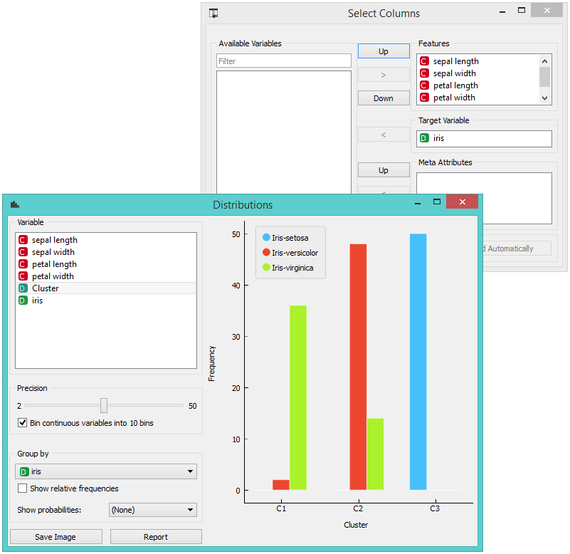

k-Means
=======

.. figure:: icons/k-means.png

Groups items using the k-Means clustering algorithm.

Signals
-------

**Inputs**:

-  **Data**

   A data set.

**Outputs**:

-  **Data**

   A data set with cluster index as a class attribute.

Description
-----------

The widget applies the `k-Means clustering <https://en.wikipedia.org/wiki/K-means_clustering>`_
algorithm to the data and outputs a new data set in which the cluster
index is used as a class attribute. The original class attribute, if it
exists, is moved to meta attributes. Scores of clustering results for
various k are also shown in the widget.

1. Select the number of clusters.

   -  **Fixed**: algorithm clusters data in a specified number of
      clusters.
   -  **Optimized**: widget shows clustering scores for the selected
      cluster range.
   -  `Silhouette <https://en.wikipedia.org/wiki/Silhouette_(clustering)>`_
      (contrasts average distance to elements in the same cluster with
      the average distance to elements in other clusters)
   -  **Inter-cluster distance** (measures distances between clusters,
      normally between centroids)
   -  **Distance to**
      `centroids <https://en.wikipedia.org/wiki/Centroid>`_ (measures
      distances to the arithmetic means of clusters)

2. Select the initialization method (the way the algorithm begins
   clustering):

   -  `k-Means++ <https://en.wikipedia.org/wiki/K-means%2B%2B>`_
      (first center is selected randomly, subsequent are chosen from the
      remaining points with probability proportioned to squared distance
      from the closest center)
   -  **Random initialization** (clusters are assigned randomly at first
      and then updated with further iterations)

   **Re-runs** (how many times the algorithm is run) and **maximal
   iterations** (the maximum number of iteration within each algorithm
   run) can be set manually.
3. The widget outputs a new data set with appended cluster information.
   Select how to append cluster information (as class, feature or meta
   attribute) and name the column.
4. If *Apply Automatically* is ticked, the widget will commit changes
   automatically. Alternatively, click *Apply*.
5. Produce a report.
6. Check scores of clustering results for various k. 

Examples
--------

We are going to explore the widget with the following schema.

.. figure:: images/K-MeansClustering-Schema.png

First, we load the *Iris* data set, divide it into three clusters and
show it in the :doc:`Data Table <../data/datatable>`, where we can observe which instance went into
which cluster. The interesting parts are the :doc:`Scatter Plot <../visualize/scatterplot>` and
:doc:`Select Rows <../data/selectrows>`.

Since **k-Means** added the cluster index as a class attribute, the scatter plot
will color the points according to the clusters they are in.

What we are really interested in is how well the clusters induced by the
(unsupervised) clustering algorithm match the actual classes in the
data. We thus take :doc:`Select Rows <../data/selectrows>` widget, in which we can select
individual classes and have the corresponding points marked in the
scatter plot. The match is perfect for *setosa*, and pretty good for the
other two classes.

You may have noticed that we left the **Remove unused
values/attributes** and **Remove unused classes** in :doc:`Select Rows <../data/selectrows>`
unchecked. This is important: if the widget modifies the attributes, it
outputs a list of modified instances and the scatter plot cannot compare
them to the original data.

Perhaps a simpler way to test the match between clusters and the
original classes is to use the  :doc:`Distributions <../visualize/distributions>` widget.

.. figure:: images/K-MeansClustering-Schema2.png

The only (minor) problem here is that this widget only visualizes
normal (and not meta) attributes. We solve this by using
:doc:`Select Columns <../data/selectcolumns>`: we reinstate the original class *Iris* as the class
and put the cluster index among the attributes.

The match is perfect for *setosa*: all instances of setosa are in the
third cluster (blue). 48 *versicolors* are in the second cluster (red),
while two ended up in the first. For *virginicae*, 36 are in the first
cluster and 14 in the second.

