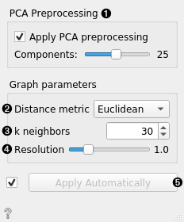
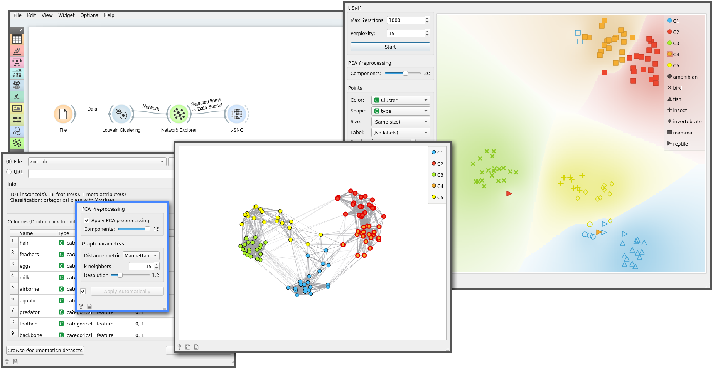

Louvain Clustering
==================

Groups items using the Louvain clustering algorithm.

**Inputs**

- Data: input dataset

**Outputs**

- Data: dataset with cluster index as a class attribute
- Graph (with the Network addon): the weighted k-nearest neighbor graph

The widget first converts the input data into a k-nearest neighbor graph. To preserve the notions of distance, the Jaccard index for the number of shared neighbors is used to weight the edges. Finally, a [modularity optimization](https://en.wikipedia.org/wiki/Louvain_Modularity) community detection algorithm is applied to the graph to retrieve clusters of highly interconnected nodes. The widget outputs a new dataset in which the cluster index is used as a meta attribute.

1. PCA processing is typically applied to the original data to remove noise.
2. The distance metric is used for finding specified number of nearest neighbors.
3. The number of nearest neighbors to use to form the KNN graph.
4. Resolution is a parameter for the Louvain community detection algorithm that affects the size of the recovered clusters. Smaller resolutions recover smaller, and therefore a larger number of clusters, and conversely, larger values recover clusters containing more data points.
5. When *Apply Automatically* is ticked, the widget will automatically communicate all changes. Alternatively, click *Apply*.

Example
-------

*Louvain Clustering* converts the dataset into a graph, where it finds highly interconnected nodes. We can visualize the graph itself using the **Network Explorer** from the Network addon.

References
----------

Blondel, Vincent D., et al. "Fast unfolding of communities in large networks." Journal of statistical mechanics: theory and experiment 2008.10 (2008): P10008.

Lambiotte, Renaud, J-C. Delvenne, and Mauricio Barahona. "Laplacian dynamics and multiscale modular structure in networks." arXiv preprint, arXiv:0812.1770 (2008).
