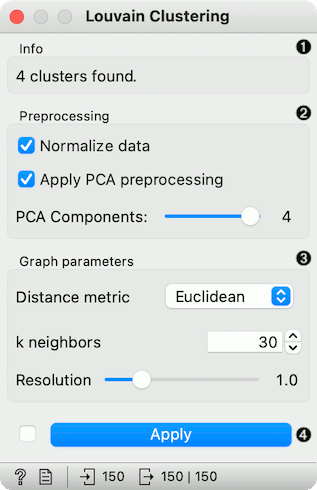
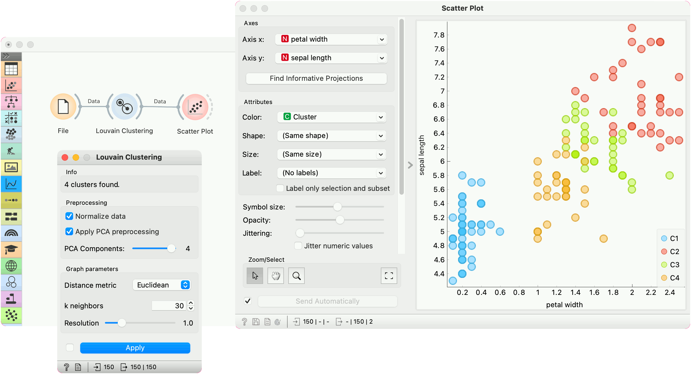

Louvain Clustering
==================

Groups items using the Louvain clustering algorithm.

**Inputs**

- Data: input dataset

**Outputs**

- Data: dataset with cluster label as a meta attribute
- Graph (with the Network addon): the weighted k-nearest neighbor graph

The widget first converts the input data into a k-nearest neighbor graph. To preserve the notions of distance, the Jaccard index for the number of shared neighbors is used to weight the edges. Finally, a [modularity optimization](https://en.wikipedia.org/wiki/Louvain_Modularity) community detection algorithm is applied to the graph to retrieve clusters of highly interconnected nodes. The widget outputs a new dataset in which the cluster label is used as a meta attribute.

1. Information on the number of clusters found.
2. **Preprocessing**:
   - *Normalize data*: Center to mean and scale to standard deviation of 1.
   - *Apply PCA preprocessing*: PCA processing is typically applied to the original data to remove noise (see [PCA](PCA.md) widget).
   - *PCA Components*: number of principal components used.
3. **Graph parameters**:
   - *Distance metric*: The distance metric is used for finding specified number of nearest neighbors (Euclidean, Manhattan, Cosine).
   - *k neighbors*: The number of nearest neighbors to use to form the KNN graph.
   - *Resolution* is a parameter for the Louvain community detection algorithm that affects the size of the recovered clusters. Smaller resolutions recover smaller clusters and therefore a larger number of them, while, conversely, larger values recover clusters containing more data points.
4. When *Apply Automatically* is ticked, the widget will automatically communicate all changes. Alternatively, click *Apply*.

Preprocessing
-------------

Louvain Clustering uses default preprocessing if necessary. It executes it in the following order:

- continuizes categorical variables (with one feature per value)
- imputes missing values with mean values

To override default preprocessing, preprocess the data beforehand with [Preprocess](../data/preprocess.md) widget.

Example
-------

*Louvain Clustering* converts the dataset into a graph, where it finds highly interconnected nodes. In the example below, we used the iris data set from the [File](../data/file.md) widget, then passed it to **Louvain Clustering**, which found 4 clusters. We plotted the data with [Scatter Plot](../visualize/scatterplot.md), where we colored the data points according to clusters labels.

We can visualize the graph itself using the **Network Explorer** from the Network addon.

References
----------

Blondel, Vincent D., et al. "[Fast unfolding of communities in large networks.](https://arxiv.org/abs/0803.0476)" Journal of statistical mechanics: theory and experiment 2008.10 (2008): P10008.

Lambiotte, Renaud, J-C. Delvenne, and Mauricio Barahona. "Laplacian dynamics and multiscale modular structure in networks." arXiv preprint, [arXiv:0812](https://arxiv.org/abs/0812.1770).1770 (2008).
