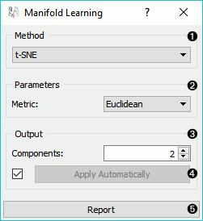
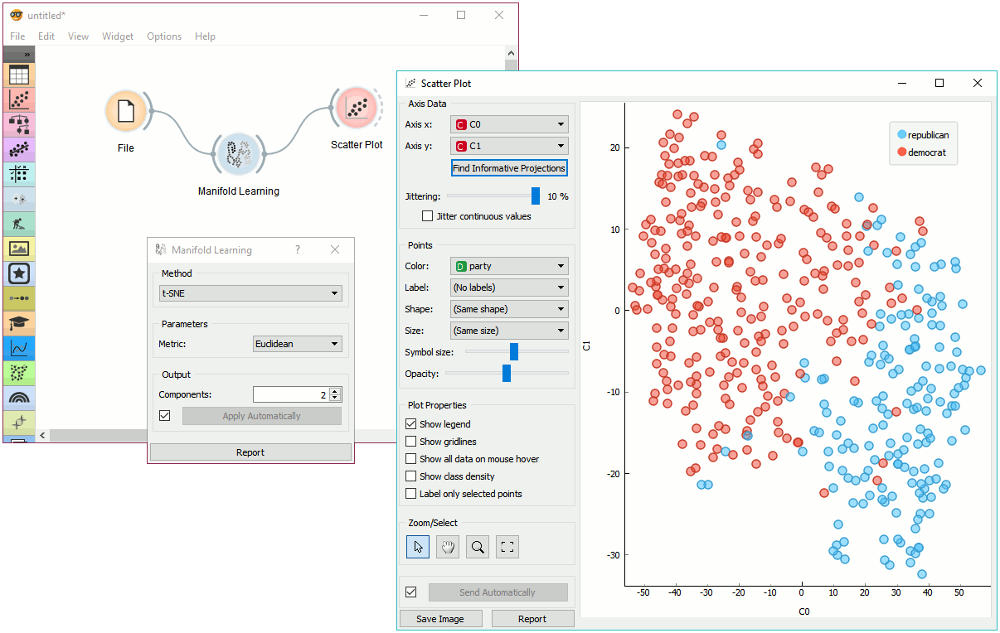

Manifold Learning
=================

Nonlinear dimensionality reduction.

Inputs
    Data
        input dataset

Outputs
    Transformed Data
        dataset with reduced coordinates

`Manifold Learning <https://en.wikipedia.org/wiki/Nonlinear_dimensionality_reduction>`_ is a
technique which finds a non-linear manifold within the higher-dimensional space. The widget then
outputs new coordinates which correspond to a two-dimensional space. Such data can be later
visualized with :doc:`Scatter Plot <../visualize/scatterplot>` or other visualization widgets.

1. Method for manifold learning:

   - `t-SNE <http://scikit-learn.org/stable/modules/manifold.html#t-distributed-stochastic-neighbor-embedding-t-sne>`_
   - `MDS <http://scikit-learn.org/stable/modules/manifold.html#multi-dimensional-scaling-mds>`_, see also :doc:`MDS widget <../unsupervised/mds>`
   - `Isomap <http://scikit-learn.org/stable/modules/manifold.html#isomap>`_
   - `Locally Linear Embedding <http://scikit-learn.org/stable/modules/manifold.html#locally-linear-embedding>`_
   - `Spectral Embedding <http://scikit-learn.org/stable/modules/manifold.html#spectral-embedding>`_

2. Set parameters for the method:

   - t-SNE (distance measures):
      - *Euclidean* distance
      - *Manhattan*
      - *Chebyshev*
      - *Jaccard*
      - *Mahalanobis*
      - *Cosine*
   - MDS (iterations and initialization):
      - *max interations*: maximum number of optimization interations
      - *initialization*: method for initialization of the algorithm (PCA or random)
   - Isomap:
      - number of *neighbors*
   - Locally Linear Embedding:
      - *method*:
         - standard
         - modified
         - `hessian eigenmap <http://scikit-learn.org/stable/modules/manifold.html#hessian-eigenmapping>`_
         - local
      - number of *neighbors*
      - *max iterations*
   - Spectral Embedding:
      - *affinity*:
         - nearest neighbors
         - RFB kernel

3. Output: the number of reduced features (components).

4. If *Apply automatically* is ticked, changes will be propagated automatically. Alternatively, click *Apply*.

5. Produce a report.

**Manifold Learning** widget produces different embeddings for high-dimensional data.

... figure:: images/collage-manifold.png

From left to right, top to bottom: t-SNE, MDS, Isomap, Locally Linear Embedding and Spectral Embedding.

Example
-------

*Manifold Learning* widget transforms high-dimensional data into a lower dimensional approximation. This makes it great for visualizing datasets with many features. We used *voting.tab* to map 16-dimensional data onto a 2D graph. Then we used :doc:`Scatter Plot <../visualize/scatterplot>` to plot the embeddings.

