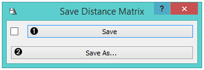
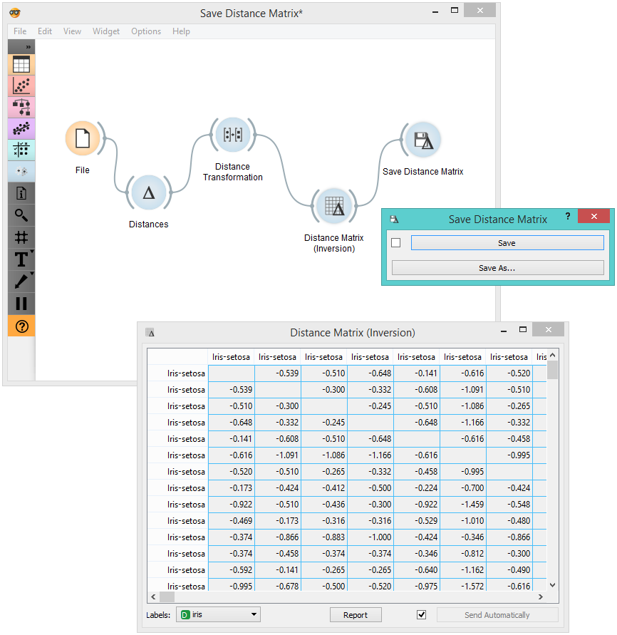

Save Distance Matrix
====================

Saves a distance matrix. 

Signals
-------

**Inputs**:

-  **Distances**

   A distance matrix. 

**Outputs**:

-  None

Description
-----------

1. By clicking *Save*, you choose from previously saved distance matrices. Alternatively, tick the box on the left side of the *Save* button and changes will be communicated automatically. 
2. By clicking *Save as*, you save the distance matrix to your computer, you only need to enter the name of the file and click *Save*. The distance matrix will be saved as type *.dst*.

Example
-------

In the snapshot below, we used the :doc:`Distance Transformation <../unsupervised/distancetransformation>` widget to transform the distances in the *Iris* data set. We then chose to save the transformed version to our computer, so we could use it later on. We decided to output all data instances. You can choose to output just a minor subset of the data matrix. Pairs are marked automatically. 
If you wish to know what happened to our changed file, go :doc:`here <../unsupervised/distancefile>`

