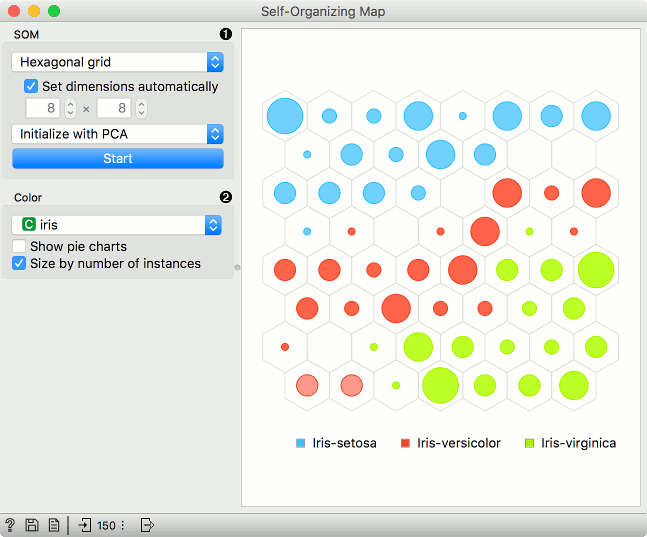
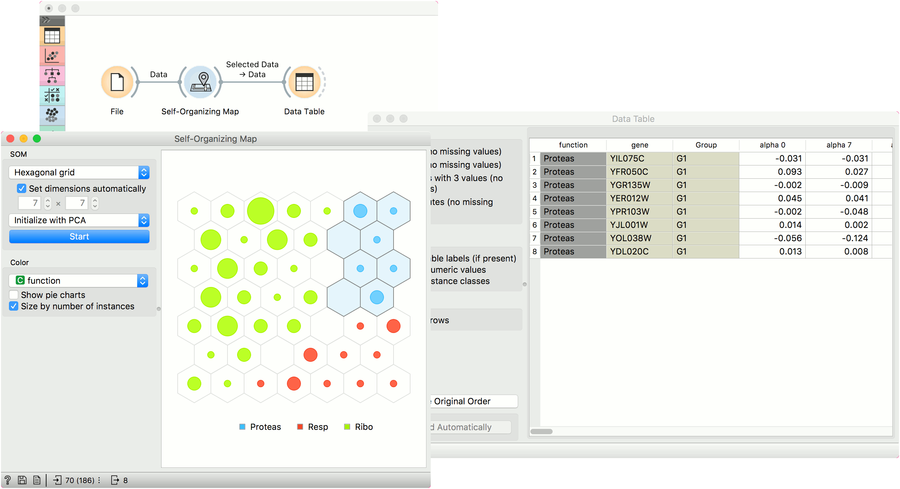

Self-Organizing Map
===================

Computation of a self-organizing map.

**Inputs**

- Data: input dataset

**Outputs**

- Selected Data: instances selected from the plot
- Data: data with an additional column showing whether a point is selected

A [self-organizing map (SOM)](https://en.wikipedia.org/wiki/Self-organizing_map) is a type of artificial neural network (ANN) that is trained using unsupervised learning to produce a two-dimensional, discretized representation of the data. It is a method to do dimensionality reduction. Self-organizing maps use a neighborhood function to preserve the topological properties of the input space.

The points in the grid represent data instances. By default, the size of the point corresponds to the number of instances represented by the point. The points are colored by majority class (if available), while the intensity of interior color shows the proportion of majority class. To see the class distribution, select *Show pie charts* option.

Just like other visualization widgets, **Self-Organizing Maps** also supports interactive selection of groups. Use Shift key to select a new group and Ctr+Shift to add to the existing group.

1. SOM properties:
   - Set the grid type. Options are hexagonal or square grid.
   - If *Set dimensions automatically* is checked, the size of the plot will be set automatically. Alternatively, set the size manually.
   - Set the initialization type for the SOM projection. Options are PCA initialization, random initialization and replicable random (random_seed = 0).
   - Once the parameters are set, press *Start* to re-run the optimization.
2. Set the color of the instances in the plot. The widget colors by class by default (if available).
   - *Show pie charts* turns points into pie-charts that show the distributions of the values used for coloring.
   - *Size by number of instances* scales the points according to the number of instances represented by the point.

Example
-------

Self-organizing maps are low-dimensional projections of the input data. We will use the *brown-selected* data and display the data instance in a 2-D projection. Seems like the three gene types are well-separated. We can select a subset from the grid and display it in a Data Table.

