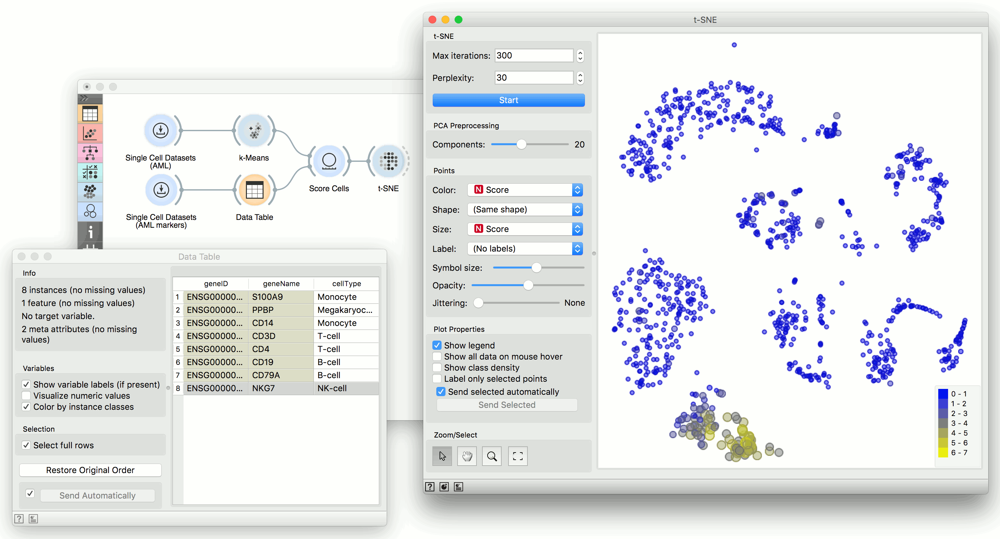

t-SNE
=====

Two-dimensional data projection with t-SNE.

**Inputs**

- Data: input dataset
- Data Subset: subset of instances

**Outputs**

- Selected Data: instances selected from the plot
- Data: data with an additional column showing whether a point is selected

The **t-SNE** widget plots the data with a t-distributed stochastic neighbor embedding method. [t-SNE](https://en.wikipedia.org/wiki/T-distributed_stochastic_neighbor_embedding) is a dimensionality reduction technique, similar to MDS, where points are mapped to 2-D space by their probability distribution.

1. Number of iterations for optimization and the measure of [perplexity](http://scikit-learn.org/stable/modules/generated/sklearn.manifold.TSNE.html). Press Start to (re-)run the optimization.
2. Select the number of PCA components used for projection.
3. Set the color of the displayed points (you will get colors for discrete values and grey-scale points for continuous). Set shape, size and label to differentiate between points. Set symbol size and opacity for all data points. Set jittering to randomly disperse data points.
4. Adjust *plot properties*:
   - *Show legend* displays a legend on the right. Click and drag the legend to move it.
   - *Show all data on mouse hover* enables information bubbles if the cursor is placed on a dot.
   - *Show class density* colors the graph by class.
   - *Label only selected points* allows you to select individual data instances and label them.
5. If *Send selected automatically* is ticked, changes are communicated automatically. Alternatively, press *Send Selected*.
6. *Select, zoom, pan and zoom to fit* are the options for exploring the graph. The manual selection of data instances works as an angular/square selection tool. Double click to move the projection. Scroll in or out for zoom.
7. Access help, save image or produce a report.

Example
-------

We will use **Single Cell Datasets** widget to load *Bone marrow mononuclear cells with AML (sample)* data. Then we will pass it through **k-Means** and select 2 clusters from Silhouette Scores. Ok, it looks like there might be two distinct clusters here.

But can we find subpopulations in these cells? Let us load *Bone marrow mononuclear cells with AML (markers)* with **Single Cell Datasets**. Now, pass the marker genes to **Data Table** and select, for example, natural killer cells from the list (NKG7).

Pass the markers and k-Means results to **Score Cells** widget and select *geneName* to match markers with genes. Finally, add **t-SNE** to visualize the results.

In **t-SNE**, use *Scores* attribute to color the points and set their size. We see that killer cells are nicely clustered together and that t-SNE indeed found subpopulations.

