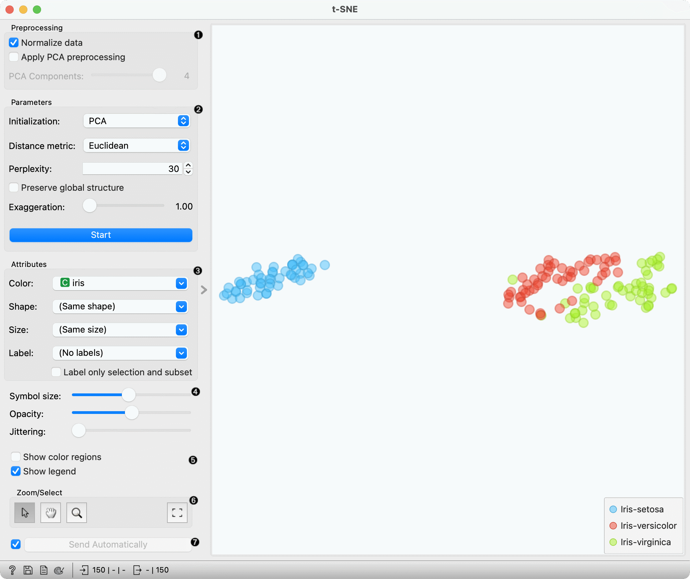
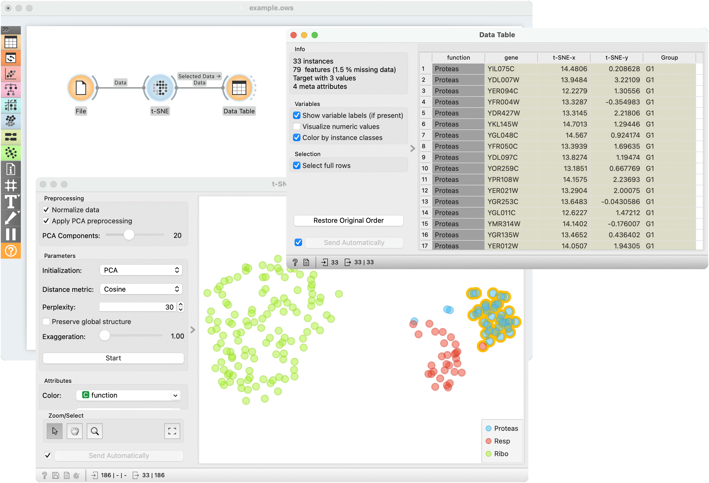
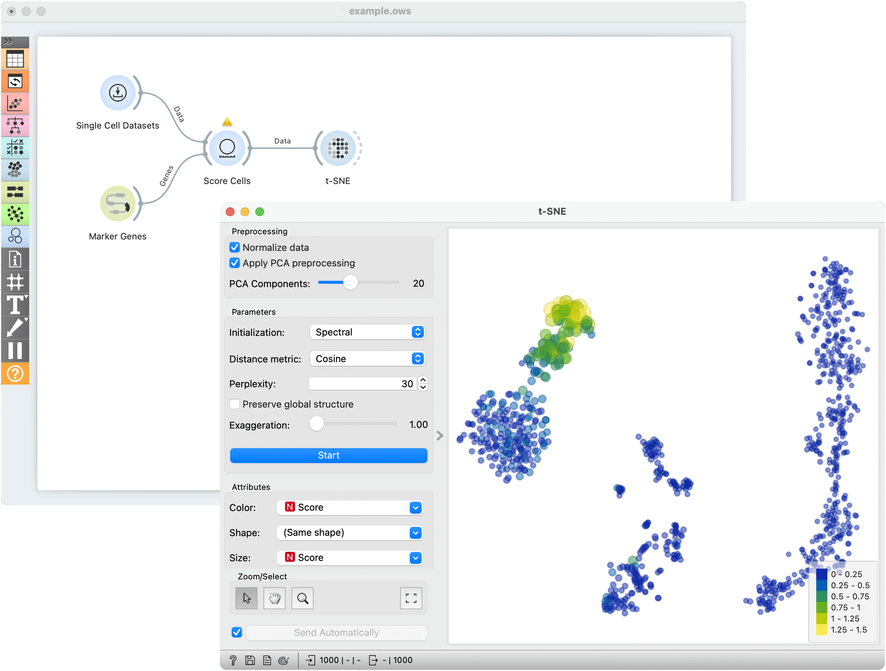

t-SNE
=====

Two-dimensional data projection with t-SNE.

**Inputs**

- Data: input dataset
- Data Subset: subset of instances

**Outputs**

- Selected Data: instances selected from the plot
- Data: data with an additional column showing whether a point is selected

The **t-SNE** widget plots the data with a t-distributed stochastic neighbor embedding method. [t-SNE](https://en.wikipedia.org/wiki/T-distributed_stochastic_neighbor_embedding) is a dimensionality reduction technique, similar to MDS, where points are mapped to 2-D space by their probability distribution.

1. [Parameters](https://opentsne.readthedocs.io/en/latest/parameters.html) for plot optimization:
   - measure of [perplexity](http://scikit-learn.org/stable/modules/generated/sklearn.manifold.TSNE.html). Roughly speaking, it can be interpreted as the number of nearest neighbors to distances will be preserved from each point. Using smaller values can reveal small, local clusters, while using large values tends to reveal the broader, global relationships between data points.
   - *Preserve global structure*: this option will combine two different perplexity values (50 and 500) to try preserve both the local and global structure.
   - *Exaggeration*: this parameter increases the attractive forces between points, and can directly be used to control the compactness of clusters. Increasing exaggeration may also better highlight the global structure of the data. t-SNE with exaggeration set to 4 is roughly equal to UMAP.
   - *PCA components*: in Orange, we always run t-SNE on the principal components of the input data. This parameter controls the number of principal components to use when calculating distances between data points.
   - *Normalize data*: We can apply standardization before running PCA. Standardization normalizes each column by subtracting the column mean and dividing by the standard deviation.
   - Press Start to (re-)run the optimization.
2. Set the color of the displayed points. Set shape, size and label to differentiate between points. If *Label only selection and subset* is ticked, only selected and/or highlighted points will be labelled.
3. Set symbol size and opacity for all data points. Set jittering to randomly disperse data points.
4. *Show color regions* colors the graph by class, while *Show legend* displays a legend on the right. Click and drag the legend to move it.
5. *Select, zoom, pan and zoom to fit* are the options for exploring the graph. The manual selection of data instances works as an angular/square selection tool. Double click to move the projection. Scroll in or out for zoom.
6. If *Send selected automatically* is ticked, changes are communicated automatically. Alternatively, press *Send Selected*.

Preprocessing
-------------

t-SNE uses default preprocessing if necessary. It executes it in the following order:

- continuizes categorical variables (with one feature per value)
- imputes missing values with mean values

To override default preprocessing, preprocess the data beforehand with [Preprocess](../data/preprocess.md) widget.

Examples
--------

The first example is a simple t-SNE plot of *brown-selected* data set. Load *brown-selected* with the [File](../data/file.md) widget. Then connect **t-SNE** to it. The widget will show a 2D map of yeast samples, where samples with similar gene expression profiles will be close together. Select the region, where the gene function is mixed and inspect it in a [Data Table](../data/datatable.md).

For the second example, use [Single Cell Datasets](https://orangedatamining.com/widget-catalog/single-cell/single_cell_datasets/) widget from the Single Cell add-on to load *Bone marrow mononuclear cells with AML (sample)* data. Then pass it through **k-Means** and select 2 clusters from Silhouette Scores. Ok, it looks like there might be two distinct clusters here.

But can we find subpopulations in these cells? Select a few marker genes with the [Marker Genes](https://orangedatamining.com/widget-catalog/bioinformatics/marker_genes/) widget, for example natural killer cells (NK cells). Pass the marker genes and k-Means results to [Score Cells](https://orangedatamining.com/widget-catalog/single-cell/score_cells/) widget. Finally, add **t-SNE** to visualize the results.

In **t-SNE**, use *Cluster* attribute to color the points and *Score* attribute to set their size. We see that killer cells are nicely clustered together and that t-SNE indeed found subpopulations.

