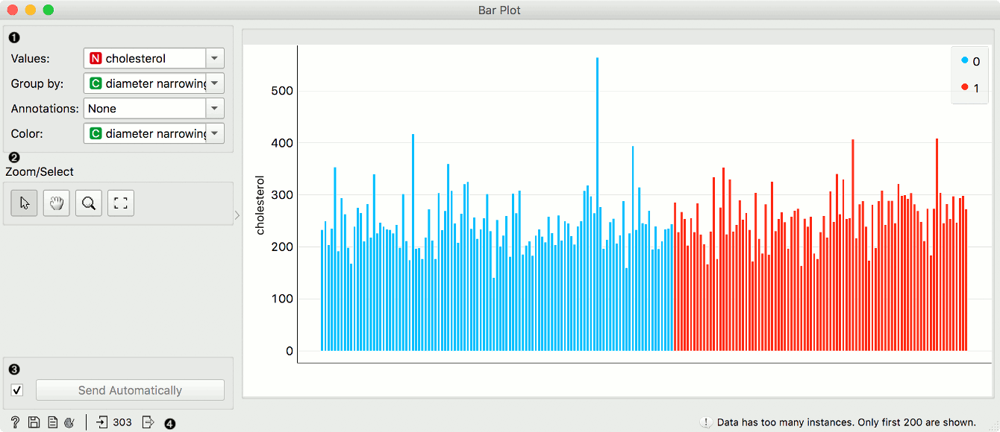
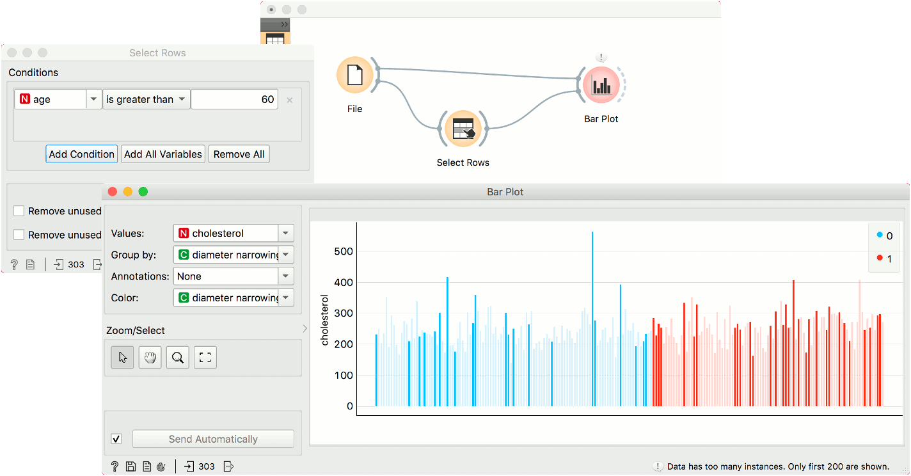

Bar Plot
========

Visualizes comparisons among discrete categories.

**Inputs**

- Data: input dataset
- Data Subset: subset of instances

**Outputs**

- Selected Data: instances selected from the plot
- Data: data with an additional column showing whether a point is selected

The **Bar Plot** widget visualizes numeric variables and compares them by a categorical variable. The widget is useful for observing outliers, distributions within groups, and comparing categories.

1. Parameters of the plot. Values are the numeric variable to plot. Group by is the variable for grouping the data. Annotations are categorical labels below the plot. Color is the categorical variable whose values are used for coloring the bars.
2. *Select, zoom, pan and zoom to fit* are the options for exploring the graph. The manual selection of data instances works as an angular/square selection tool. Double click to move the projection. Scroll in or out for zoom.
3. If *Send automatically* is ticked, changes are communicated automatically. Alternatively, press *Send*.
4. Access help, save image, produce a report, or adjust visual settings. On the right, the information on input and output are shown.

Example
-------

The **Bar Plot** widget is most commonly used immediately after the [File](../data/file.md) widget to compare categorical values. In this example, we have used *heart-disease* data to inspect our variables.

First, we have observed cholesterol values of patient from our data set. We grouped them by diameter narrowing, which defines patients with a heart disease (1) and those without (0). We use the same variable for coloring the bars.

Then, we selected patients over 60 years of age with [Select Rows](../data/selectrows.md). We sent the subset to **Bar Plot** to highlight these patients in the widget. The big outlier with a high cholesterol level is apparently over 60 years old.
