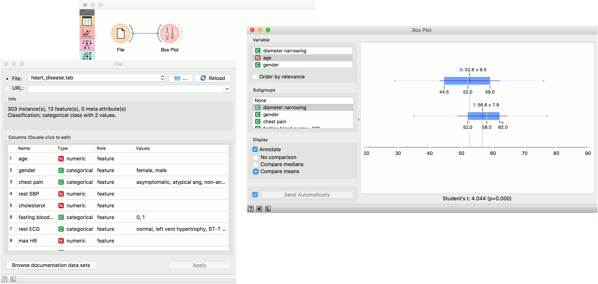
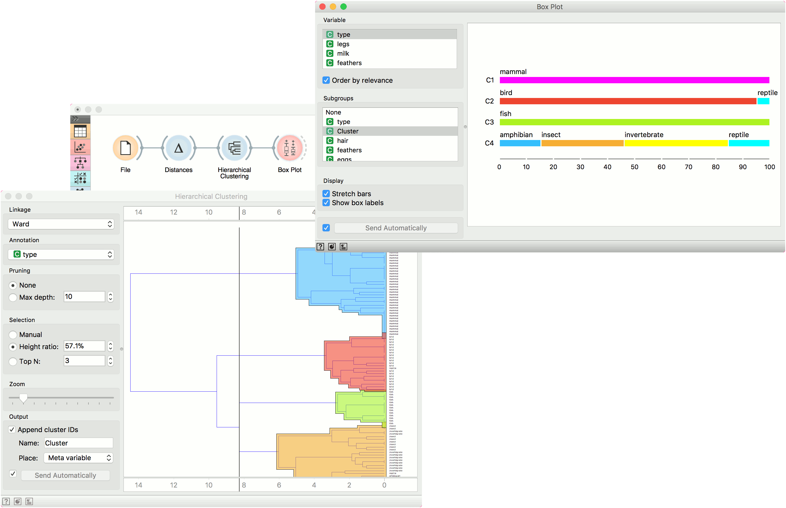

Box Plot
========

Shows distribution of attribute values.

**Inputs**

- Data: input dataset

**Outputs**

- Selected Data: instances selected from the plot
- Data: data with an additional column showing whether a point is selected

The **Box Plot** widget shows the distributions of attribute values. It is a good practice to check any new data with this widget to quickly discover any anomalies, such as duplicated values (e.g. gray and grey), outliers, and alike.

1. Select the variable you want to plot. Tick *Order by relevance* to order variables by Chi2 or ANOVA over the selected subgroup.
2. Choose *Subgroups* to see [box plots](https://en.wikipedia.org/wiki/Box_plot) displayed by a discrete subgroup.
3. When instances are grouped by a subgroup, you can change the display mode. Annotated boxes will display the end values, the mean and the median, while compare medians and compare means will, naturally, compare the selected value between subgroups.

4. The mean (the dark blue vertical line). The thin blue line represents the [standard deviation](http://mathworld.wolfram.com/StandardDeviation.html).
5. Values of the first (25%) and the third (75%) quantile. The blue  highlighted area represents the values between the first and the third quartile.
6. The median (yellow vertical line).
7. If *Send automatically* is ticked, changes are communicated automatically. Alternatively, press *Send*.
8. Access help, save image or produce a report.

For discrete attributes, the bars represent the number of instances with each particular attribute value. The plot shows the number of different animal types in the *Zoo* dataset: there are 41 mammals, 13 fish, 20 birds and so on.

Example
-------

The **Box Plot** widget is most commonly used immediately after the [File](../data/file.md) widget to observe the statistical properties of a dataset. In the first example, we have used *heart-disease* data to inspect our variables.

**Box Plot** is also useful for finding the properties of a specific dataset, for instance a set of instances manually defined in another widget (e.g. [Scatter Plot](../visualize/scatterplot.md) or instances belonging to some cluster or a classification tree node. Let us now use *zoo* data and create a typical clustering workflow with [Distances](../unsupervised/distances.md) and [Hierarchical Clustering](../unsupervised/hierarchicalclustering.md).

Now define the threshold for cluster selection (click on the ruler at the top). Connect **Box Plot** to **Hierarchical Clustering**, tick *Order by relevance* and select *Cluster* as a subgroup. This will order attributes by how well they define the selected subgroup, in our case a cluster. Seems like our clusters indeed correspond very well with the animal type!

