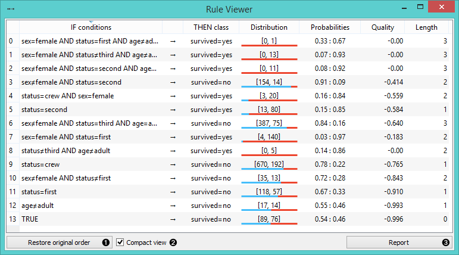
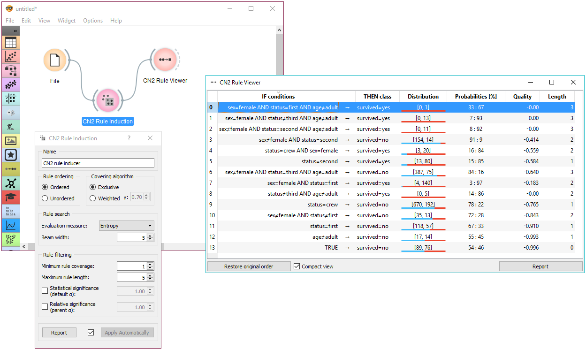

CN2 Rule Viewer
===============

CN2 Rule Viewer

Signals
-------

**Inputs**:

- **Data**

   Data set to filter.

- **CN2 Rule Classifier**

   CN2 Rule Classifier, including a list of induced rules.

**Outputs**:

- **Filtered Data**

   If data is connected, upon active selection (at least one rule is
   selected), filtered data is emitted. Output are data instances covered
   by all selected rules.

Description
-----------

A widget that displays `CN2 classification <https://en.wikipedia.org/wiki/CN2_algorithm>`_ rules.
If data is also connected, upon rule selection, one can analyze which instances abide to the conditions.

1. Original order of induced rules can be restored.

2. When rules are many and complex, the view can appear packed. For this
   reason, *compact view* was implemented, which allows a flat
   presentation and a cleaner inspection of rules.

3. Click *Report* to bring up a detailed description of the rule
   induction algorithm and its parameters, the data domain, and induced
   rules.

Additionally, upon selection, rules can be copied to clipboard by
pressing the default system shortcut (ctrl+C, cmd+C).

Examples
--------

In the schema below, the most common use of the widget is presented.
First, the data is read and a CN2 rule classifier is trained. We are using
*titanic* data set for the rule constrution. The rules
are then viewed using the :doc:`Rule Viewer <../visualize/cn2ruleviewer>`. To explore different CN2
algorithms and understand how adjusting parameters influences the
learning process, **Rule Viewer** should be kept open and in sight, while
setting the CN2 learning algorithm (the presentation will be updated
promptly).

Selecting a rule outputs filtered data instances. These can be viewed in
a :doc:`Data Table <../data/datatable>`.
