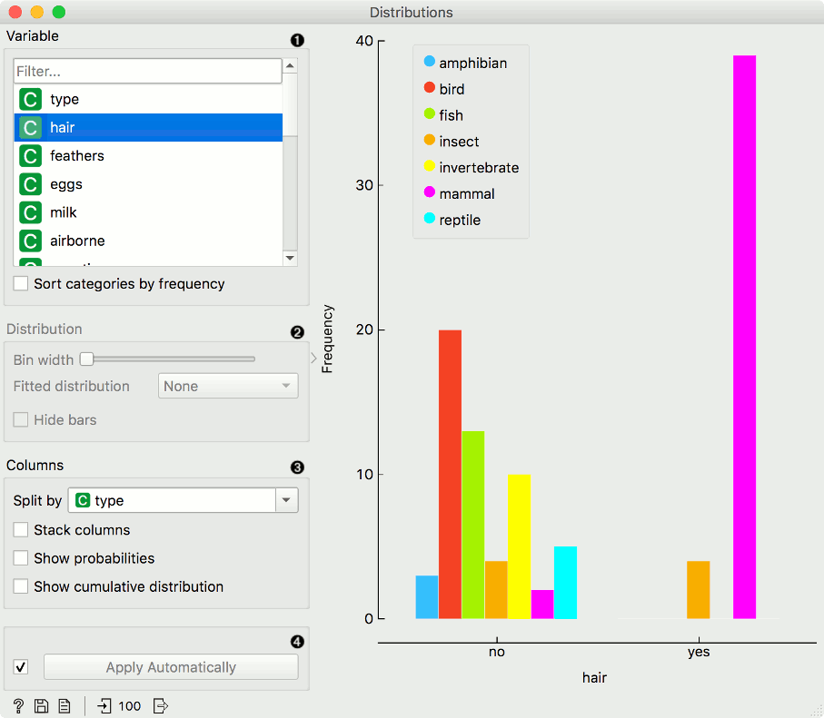
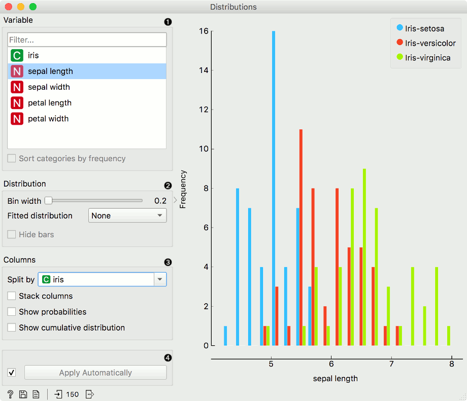

Distributions
=============

Displays value distributions for a single attribute.

**Inputs**

- Data: input dataset

**Outputs**

- Selected Data: instances selected from the plot
- Data: data with an additional column showing whether an instance is selected
- Histogram Data: bins and instance counts from the histogram

The **Distributions** widget displays the [value distribution](https://en.wikipedia.org/wiki/Frequency_distribution) of discrete or continuous attributes. If the data contains a class variable, distributions may be conditioned on the class.

The graph shows how many times (e.g., in how many instances) each attribute value appears in the data. If the data contains a class variable, class distributions for each of the attribute values will be displayed (like in the snapshot below). To create this graph, we used the *Zoo* dataset.

1. A list of variables for display. *Sort categories by frequency* orders displayed values by frequency.
2. Set *Bin width* with the slider. Precision scale is set to sensible intervals. *Fitted distribution* fits selected distribution to the plot. Options are [Normal](https://en.wikipedia.org/wiki/Normal_distribution), [Beta](https://en.wikipedia.org/wiki/Beta_distribution), [Gamma](https://en.wikipedia.org/wiki/Gamma_distribution), [Rayleigh](https://en.wikipedia.org/wiki/Rayleigh_distribution), [Pareto](https://en.wikipedia.org/wiki/Pareto_distribution), [Exponential](https://en.wikipedia.org/wiki/Exponential_distribution), [Kernel density](https://en.wikipedia.org/wiki/Kernel_density_estimation).
3. Columns:

- *Split by* displays value distributions for instances of a certain class.
- *Stack columns* displays one column per bin, colored by proportions of class values.
- *Show probabilities* shows probabilities of class values at selected variable.
- *Show cumulative distribution* cumulatively stacks frequencies.

4. If *Apply Automatically* is ticked, changes are communicated automatically. Alternatively, click *Apply*.

For continuous attributes, the attribute values are also displayed as a histogram. It is possible to fit various distributions to the data, for example, a Gaussian kernel density estimation. *Hide bars* hides histogram bars and shows only distribution (old behavior of Distributions).

For this example, we used the *Iris* dataset.

In class-less domains, the bars are displayed in blue. We used the *Housing* dataset.

