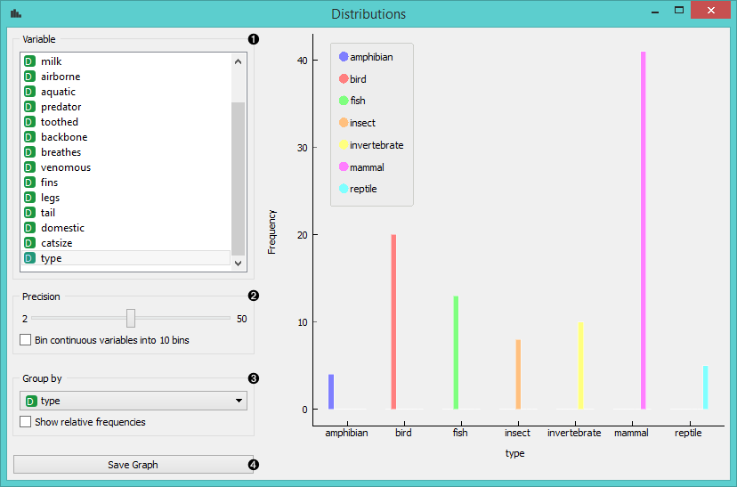
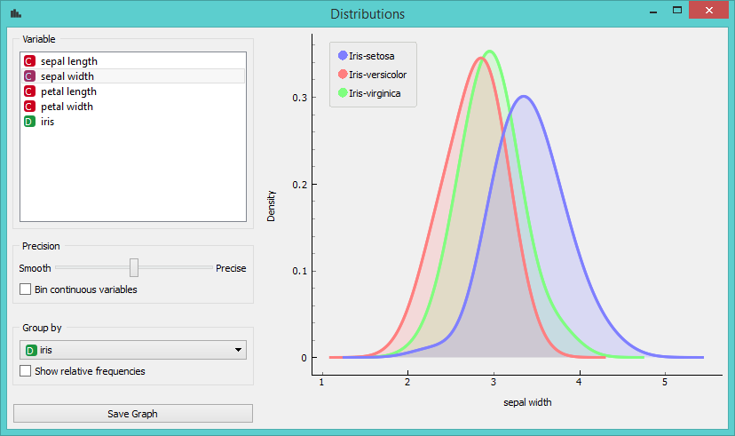
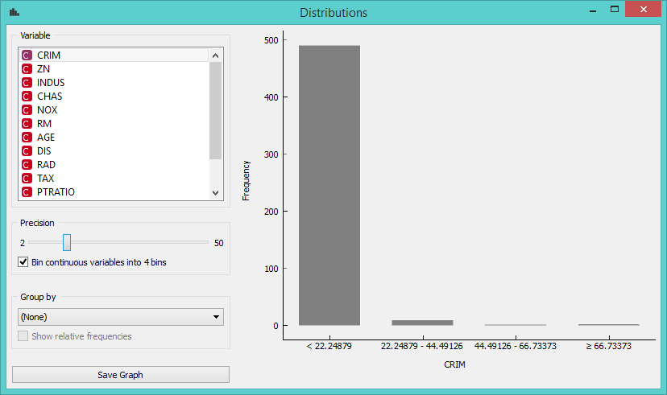

Distributions
=============

Displays value distributions for a single attribute.

Signals
-------

**Inputs**:

-  **Data**

   An input data set.

**Outputs**:

-  (None)

Description
-----------

The **Distributions** widget displays the `value distribution <https://en.wikipedia.org/wiki/Frequency_distribution>`_
of discrete or continuous attributes. If the data contains a class
variable, distributions may be conditioned on the class.

For discrete attributes, the graph displayed by the widget shows how
many times (e.g., in how many instances) each attribute value appears in
the data. If the data contains a class variable, class distributions for
each of the attribute values will be displayed as well (like in the
snapshot below). In order to create this graph, we used the *Zoo* data set. 

1. A list of variables for distributions display
2. If *Bin continuous variables* is ticked, the widget will discretize
   continuous variables by assigning them to intervals. The number of
   intervals is set by precision scale. Alternatively, you can set
   smoothness for the distribution curves of continuous variables.
3. The widget may be requested to display value distributions only for
   instances of certain class (*Group by*). *Show relative frequencies*
   will scale the data by percentage of the data set.
4. Show probabilities. 
5. *Save image* saves the graph to your computer in a .svg or .png
   format.
6. Produce a report. 

For continuous attributes, the attribute values are displayed as a
function graph. Class probabilities for continuous attributes are
obtained with gaussian kernel density estimation, while the appearance
of the curve is set with the *Precision* bar (smooth or precise). For the purpose
of this example, we used the *Iris* data set. 

In class-less domains, the bars are displayed in gray. Here we set *Bin
continuous variables into 10 bins*, which distributes variables into 10
intervals and displays averages of these intervals as histograms (see 2.
above). We used the *Housing* data set. 

