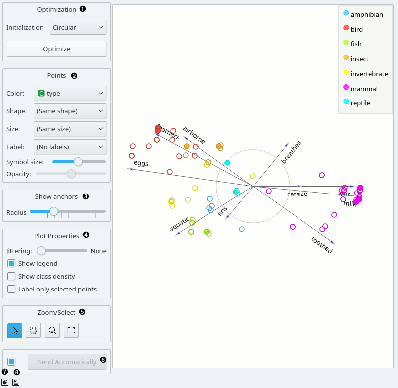
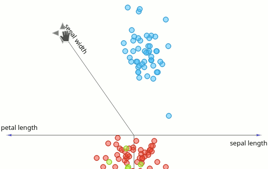
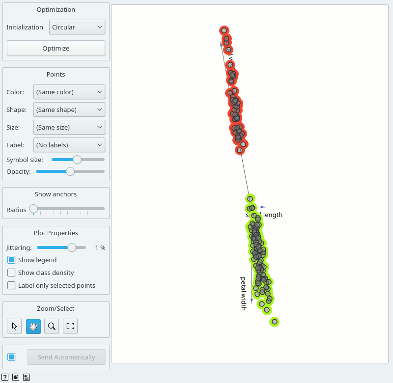
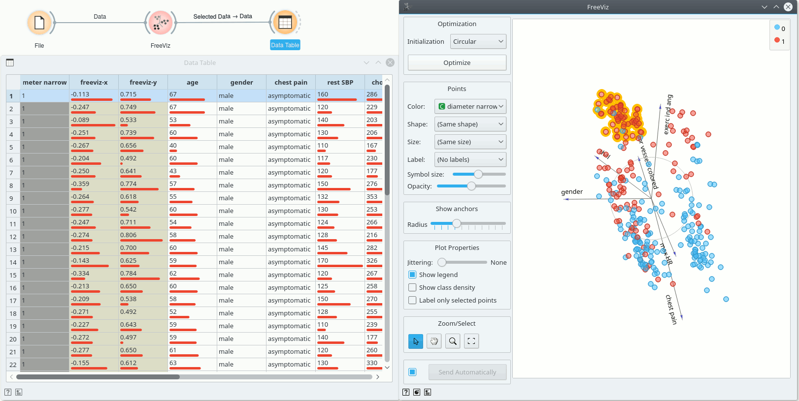

FreeViz
=======

Displays FreeViz projection.

Inputs
    Data
        input dataset
    Data Subset
        subset of instances

Outputs
    Selected Data
        instances selected from the plot
    Data
        data with an additional column showing whether a point is selected
    Components
        FreeViz vectors

**FreeViz** uses a paradigm borrowed from particle physics: points in the same class attract
each other, those from different class repel each other, and the resulting forces are exerted on
the anchors of the attributes, that is, on unit vectors of each of the dimensional axis. The points
cannot move (are projected in the projection space), but the attribute anchors can, so the
optimization process is a hill-climbing optimization where at the end the anchors are placed such
that forces are in equilibrium. The button Optimize is used to invoke the optimization process.
The result of the optimization may depend on the initial placement of the anchors, which can be set
in a circle, arbitrary or even manually. The later also works at any stage of optimization, and we
recommend to play with this option in order to understand how a change of one anchor affects the
positions of the data points. In any linear projection, projections of unit vector that are very
short compared to the others indicate that their associated attribute is not very informative for
particular classification task. Those vectors, that is, their corresponding anchors, may be hidden
from the visualization using Radius slider in Show anchors box.

1. Two initial positions of anchors are possible: random and circular. Optimization
   moves anchors in an optimal position.
2. Set the color of the displayed points (you will get colors for discrete
   values and grey-scale points for continuous). Set label, shape and
   size to differentiate between points. Set symbol size and opacity for
   all data points.
3. Anchors inside a circle are hidden. Circle radius can be be changed using a slider.
4. Adjust *plot properties*:

   -  Set `jittering <https://en.wikipedia.org/wiki/Jitter>`_ to prevent the dots from overlapping (especially for discrete attributes).

   -  *Show legend* displays a legend on the right. Click and drag the legend to move it.

   -  *Show class density* colors the graph by class (see the screenshot below).

   -  *Label only selected points* allows you to select individual data instances and label them.

5. *Select, zoom, pan and zoom to fit* are the options for exploring the graph.
   The manual selection of data instances works as an angular/square
   selection tool. Double click to move the projection. Scroll in or out
   for zoom.
6. If *Send automatically* is ticked, changes are communicated automatically.
   Alternatively, press *Send*.
7. *Save Image* saves the created image to your computer in a .svg or .png
   format.
8. Produce a report.

Manually move anchors
---------------------

One can manually move anchors. Use a mouse pointer and hover above the end of an anchor.
Click the left button and then you can move selected anchor where ever you want.

Selection
---------

Selection can be used to manually defined subgroups in the data. Use Shift
modifier when selecting data instances to put them into a new group.
Shift + Ctrl (or Shift + Cmd on macOs) appends instances to the last group.

Signal data outputs a data table with an additional column that contains group
indices.

Explorative Data Analysis
-------------------------

The **FreeViz**, as the rest of Orange widgets, supports zooming-in and
out of part of the plot and a manual selection of data instances.
These functions are available in the lower left corner of the widget.
The default tool is *Select*, which selects data instances within the
chosen rectangular area. *Pan* enables you to move the plot around the pane.
With *Zoom* you can zoom in and out of the pane with a mouse scroll,
while *Reset zoom* resets the visualization to its optimal size.
An example of a simple schema, where we selected data instances from a
rectangular region and sent them to the :doc:`Data Table <../data/datatable>`
widget, is shown below.

