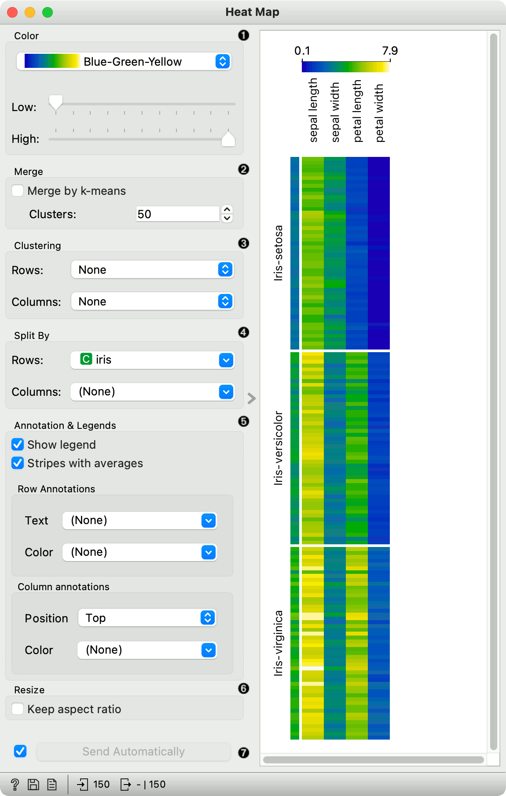
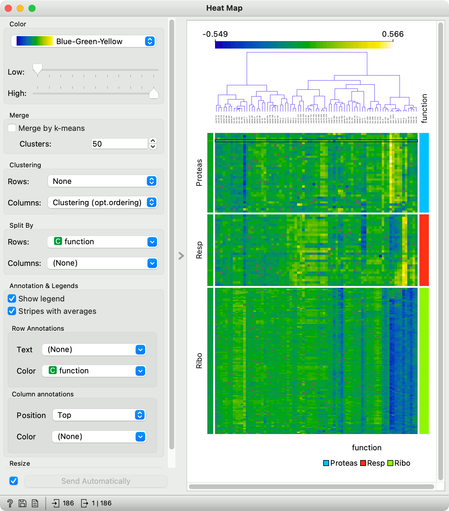
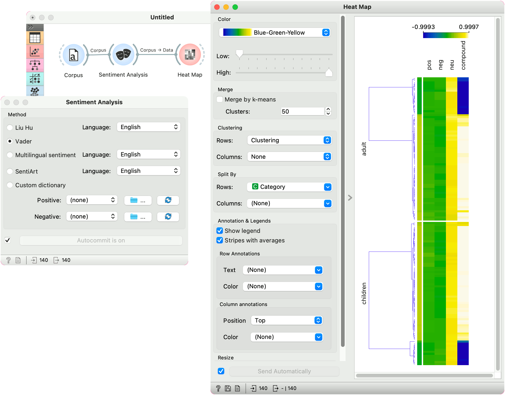

Heat Map
========

Plots a heat map for a pair of attributes.

**Inputs**

- Data: input dataset

**Outputs**

- Selected Data: instances selected from the plot
- Data: data with an additional column showing whether a point is selected

[Heat map](https://en.wikipedia.org/wiki/Heat_map) is a graphical method for visualizing attribute values in a two-way matrix. It only works on datasets containing numeric variables. The values are represented by color according to the selected color pallette. By combining class variable and attributes on x and y axes, we see where the attribute values are the strongest and where the weakest, thus enabling us to find typical features for each class.

The widget enables row selection with click and drag. One can zoom in with Ctrl++ (Cmd++) and zoom out with Ctrl+- (Cmd+-). Ctrl+0 (Cmd+0) resets zoom to the extended version, while Ctrl+9 (Cmd+9) reset it to the default.

1. The color pallette. Choose from linear, diverging, color-blind friendly, or other pallettes. **Low** and **High** are thresholds for the color palette (low for attributes with low values and high for attributes with high values). Selecting one of diverging palettes, which have two extreme colors and a neutral (black or white) color at the midpoint, enables an option to set a meaningful mid-point value (default is 0).
2. Merge rows. If there are too many rows in the visualization, one can merge them with k-means algorithm into N selected clusters (default 50).
3. Cluster columns and rows:
   - **None** (lists attributes and rows as found in the dataset)
   - **Clustering** (clusters data by similarity with hierarchical clustering on Euclidean distances and with average linkage)
   - **Clustering with ordered leaves** (same as clustering, but it additionally maximizes the sum of similarities of adjacent elements)
4. Split rows or columns by a categorical variable. If the data contains a class variable, rows will be automatically split by class.
5. Set what is displayed in the plot in **Annotation & Legend**.
   - If *Show legend* is ticked, a color chart will be displayed above the map.
   - If *Stripes with averages* is ticked, a new line with attribute averages will be displayed on the left.
   **Row Annotations** adds annotations to each instance on the right. Color colors the instances with the corresponding value of the selected categorical variable.
   **Column Annotations** adds annotation to each variable at the selected position (default is Top). Color colors the columns with the corresponding value of the selected column annotation.
6. If *Keep aspect ratio* is ticked, each value will be displayed with a square (proportionate to the map).
7. If *Send Automatically* is ticked, changes are communicated automatically. Alternatively, click *Send*.

### Advanced visualization

Heat map enables some neat plot enhancements. Such options are clustering of rows and/or columns for better data organization, row and column annotations, and splitting the data by categorical variables.

Row and column clustering is performed independently. Row clustering is computed from Euclidean distances, while column clustering uses Pearson correlation coefficients. Hierarchical clustering is based on the Ward linkage method. Clustering with optimal leaf ordering reorders left and right branches in the dendrogram to minimize the sum of distances between adjacent leaves (Bar-Joseph et al. 2001).

Examples
--------

### Gene expresssions

The **Heat Map** below displays attribute values for the *brown-selected* data set (Brown et al. 2000). Heat maps are particularly appropriate for showing gene expressions and the brown-selected data set contains yeast gene expressions at different conditions.

Heat map shows low expressions in blue and high expressions in yellow and white. For better organization, we added *Clustering (opt. ordering)* to the columns, which puts columns with similar profiles closer together. In this way we can see the conditions that result in low expressions for ribosomal genes in the lower right corner.

Additionally, the plot is enhanced with row color on the right, showing which class the rows belong to.

### Sentiment Analysis

Heat maps are great for visualizing any kind of comparable numeric variables, for example sentiment in a collection of documents. We will take *book-excerpts* corpus from the **Corpus** widget and pass it to the **Sentiment Analysis** widget, which computes sentiment scores for each document. The output of sentiment analysis are four columns, positive, negative, and neutral sentiment score, and a compound score that aggregates the previous scores into a single number. Positive compound values (white) represent positive documents, while negative (blue) represent negative documents.

We used row clustering to place similar rows closer together, resulting in clear negative and positive groups. Now we can select negative children's books and explore which are they.

References
----------

Bar-Joseph, Z., Gifford, D.K., Jaakkola, T.S. (2001) Fast optimal leaf ordering for hierarchical clustering, Bioinformatics, 17, 22-29.

Brown, M.P., Grundy, W.N., Lin, D., Cristianini, N., Sugnet, C., Furey, T.S., Ares, M., Haussler, D. (2000) Knowledge-based analysis of microarray gene expression data by using support vector machines, Proceedings of the National Academy of Sciences, 1, 262-267.
