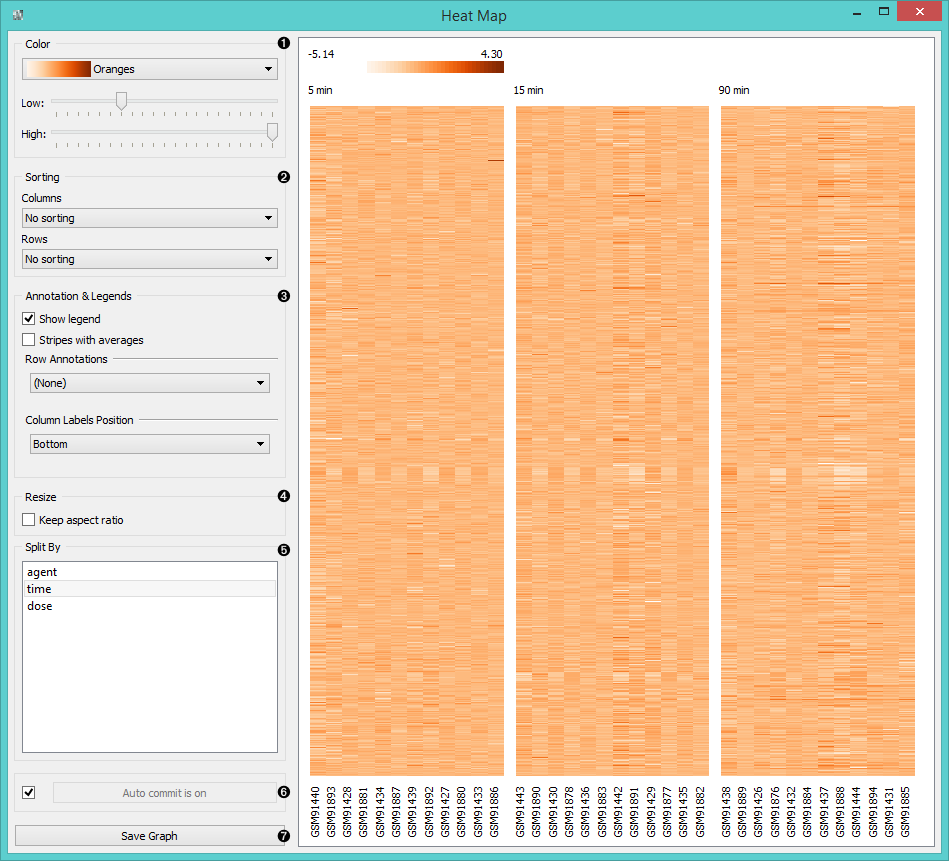
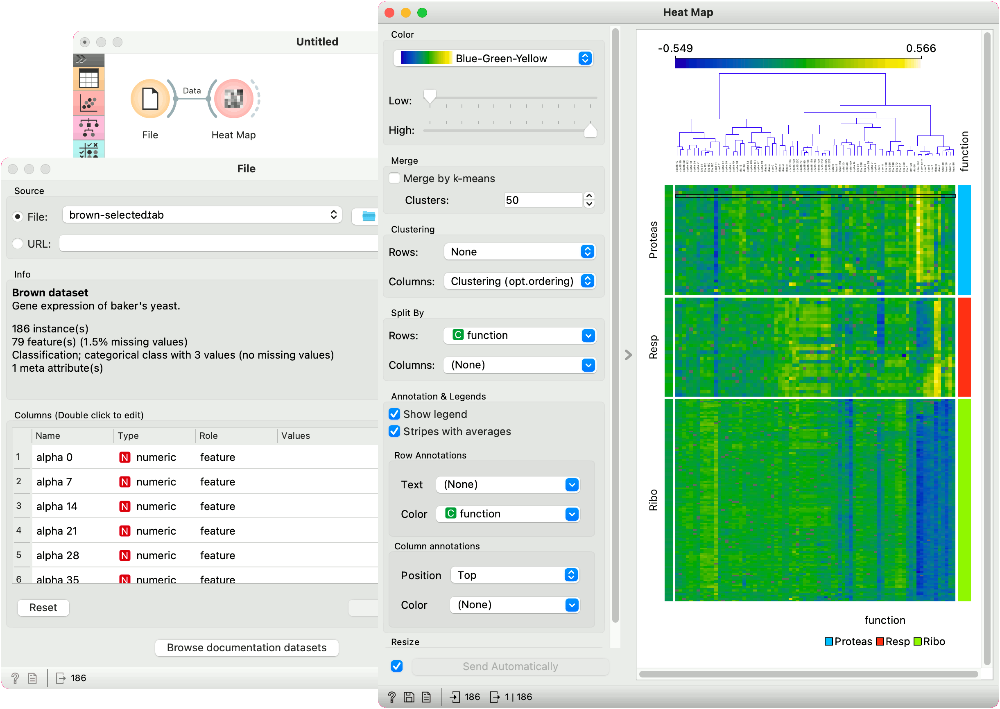

Heat Map
========

Plots a heat map for a pair of attributes.

Signals
-------

**Inputs**:

-  **Data**

   An input data set.

**Outputs**:

-  **Selected Data**

   A subset of instances that the user has manually selected from the map.

Description
-----------

`Heat map <https://en.wikipedia.org/wiki/Heat_map>`_ is a graphical
method for visualizing attribute values by class in a two-way matrix.
It only works on data sets containing continuous variables. 
The values are represented by color: the higher a certain value is, the
darker the represented color. By combining class and attributes on x and
y axes, we see where the attribute values are the strongest and where the
weakest, thus enabling us to find typical features (discrete) or value
range (continuous) for each class.

1. The color scheme legend. **Low** and **High** are thresholds for the
   color palette (low for attributes with low values and high for
   attributes with high values).
2. Merge data. 
3. Sort columns and rows:
   - **No Sorting** (lists attributes as found in the data set)
   - **Clustering** (clusters data by similarity)
   - **Clustering with ordered leaves** (maximizes the sum of similarities of adjacent elements)
4. Set what is displayed in the plot in **Annotation & Legend**.
   - If *Show legend* is ticked, a color chart will be displayed above the map.
   - If *Stripes with averages* is ticked, a new line with attribute averages will be displayed on the left.
   - **Row Annotations** adds annotations to each instance on the right.
   - **Column Label Positions** places column labels in a selected place (None, Top, Bottom, Top and Bottom).
5. If *Keep aspect ratio* is ticked, each value will be displayed with a square (proportionate to the map).
6. If *Send Automatically* is ticked, changes are communicated automatically. Alternatively, click *Send*.
7. *Save image* saves the image to your computer in a .svg or .png format.
8. Produce a report. 

Example
-------

The **Heat Map** below displays attribute values for the *Housing* data set. 
The aforementioned data set concerns the housing values in the suburbs of Boston. 
The first thing we see in the map are the 'B' and 'Tax' attributes, which are
the only two colored in dark orange. The 'B' attribute provides information 
on the proportion of blacks by town and the 'Tax' attribute informs us about 
the full-value property-tax rate per $10,000. In order to get a clearer heat map,
we then use the :doc:`Select Columns <../data/selectcolumns>` widget and remove
the two attributes from the data set. Then we again feed the data to the **Heat map**.
The new projection offers additional information. 
By removing 'B' and 'Tax', we can see other deciding factors, 
namely 'Age' and 'ZN'. The ‘Age’ attribute provides information 
on the proportion of owner-occupied units built prior to 1940 
and the 'ZN' attribute informs us about the proportion of non-retail business acres per town. 

The **Heat Map** widget is a nice tool for discovering relevant features in the data. 
By removing some of the more pronounced features, we came across new information, which was hiding in the background. 

References
----------

`Housing Data Set <https://archive.ics.uci.edu/ml/datasets/Housing>`_
