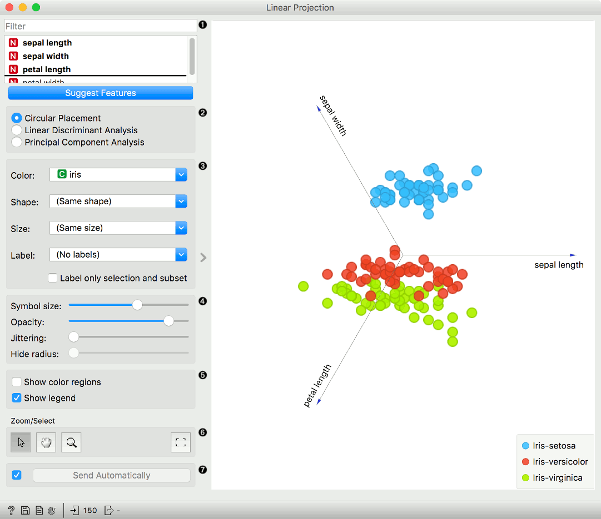
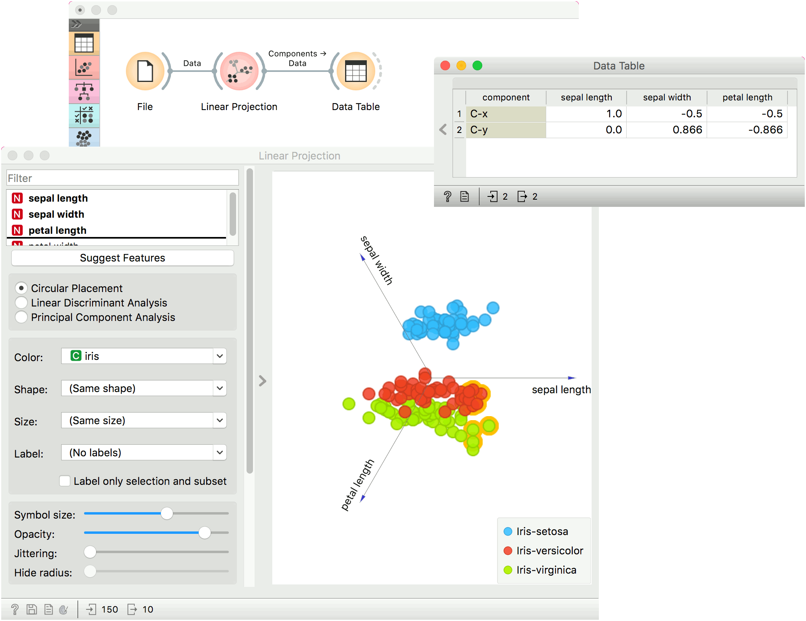

Linear Projection
=================

A linear projection method with explorative data analysis.

**Inputs**

- Data: input dataset
- Data Subset: subset of instances
- Projection: custom projection vectors

**Outputs**

- Selected Data: instances selected from the plot
- Data: data with an additional column showing whether a point is selected
- Components: projection vectors

This widget displays [linear projections](https://en.wikipedia.org/wiki/Projection_(linear_algebra)) of class-labeled data. It supports various types of projections such as circular, [linear discriminant analysis](https://en.wikipedia.org/wiki/Linear_discriminant_analysis), and [principal component analysis](https://en.wikipedia.org/wiki/Principal_component_analysis).

Consider, for a start, a projection of the *Iris* dataset shown below. Notice that it is the sepal width and sepal length that already separate *Iris setosa* from the other two, while the petal length is the attribute best separating *Iris versicolor* from *Iris virginica*.

1. Axes in the projection that are displayed and other available axes. Optimize your projection by using **Suggest Features**. This feature scores attributes and returns the top scoring attributes with a simultaneous visualization update. Feature scoring computes the classification accuracy (for classification) or MSE (regression) of k-nearest neighbors classifier on the projected, two-dimensional data. The score reflects how well the classes in the projection are separated.
2. Choose the type of projection:
   - Circular Placement
   - [Linear Discriminant Analysis](https://en.wikipedia.org/wiki/Linear_discriminant_analysis); available only for categorical target variable with at least three distinct values in the data.
   - [Principal Component Analysis](https://en.wikipedia.org/wiki/Principal_component_analysis)
3. Set the color of the displayed points. Set shape, size, and label to differentiate between points.
   *Label only selected points* labels only selected data instances.
4. Adjust plot properties:
   - *Symbol size*: set the size of the points.
   - *Opacity*: set the transparency of the points.
   - *Jittering*: Randomly disperse points with [jittering](https://en.wikipedia.org/wiki/Jitter) to prevent them from overlapping.
   - *Hide radius*: Axes inside the radius are hidden. Drag the slider to change the radius.
5. Additional plot properties:
   - *Show color regions* colors the graph by class.
   - *Show legend* displays a legend on the right. Click and drag the legend to move it.
6. *Select, zoom, pan* and *zoom to fit* are the options for exploring the graph. Manual selection of data instances works as an angular/square selection tool. Double click to move the projection. Scroll in or out for zoom.
7. If *Send automatically* is ticked, changes are communicated automatically. Alternatively, press *Send*.

Example
-------

The **Linear Projection** widget works just like other visualization widgets. Below, we connected it to the [File](../data/file.md) widget to see the set projected on a 2-D plane. Then we selected the data for further analysis and connected it to the [Data Table](../data/datatable.md) widget to see the details of the selected subset.

References
----------

Koren Y., Carmel L. (2003). Visualization of labeled data using linear transformations. In Proceedings of IEEE Information Visualization 2003, (InfoVis'03). Available [here](http://citeseerx.ist.psu.edu/viewdoc/download;jsessionid=3DDF0DB68D8AB9949820A19B0344C1F3?doi=10.1.1.13.8657&rep=rep1&type=pdf).

Boulesteix A.-L., Strimmer K. (2006). Partial least squares: a versatile tool for the analysis of high-dimensional genomic data. Briefings in Bioinformatics, 8(1), 32-44. Abstract [here](http://bib.oxfordjournals.org/content/8/1/32.abstract).

Leban G., Zupan B., Vidmar G., Bratko I. (2006). VizRank: Data Visualization Guided by Machine Learning. Data Mining and Knowledge Discovery, 13, 119-136. Available [here](http://eprints.fri.uni-lj.si/210/2/1._G._Leban%2C_B._Zupan%2C_G._Vidmar%2C_I._Bratko%2C_Data_Mining_and_Knowledge_Discovery_13%2C_119-36_(2006)..pdf).
