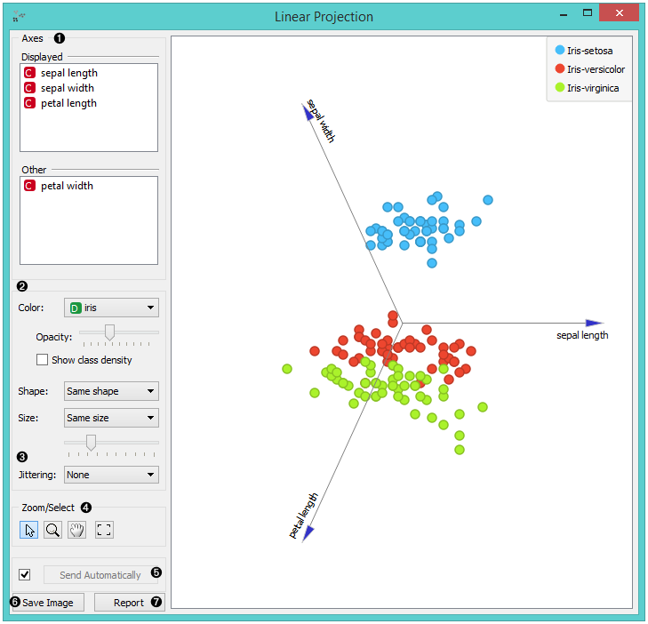
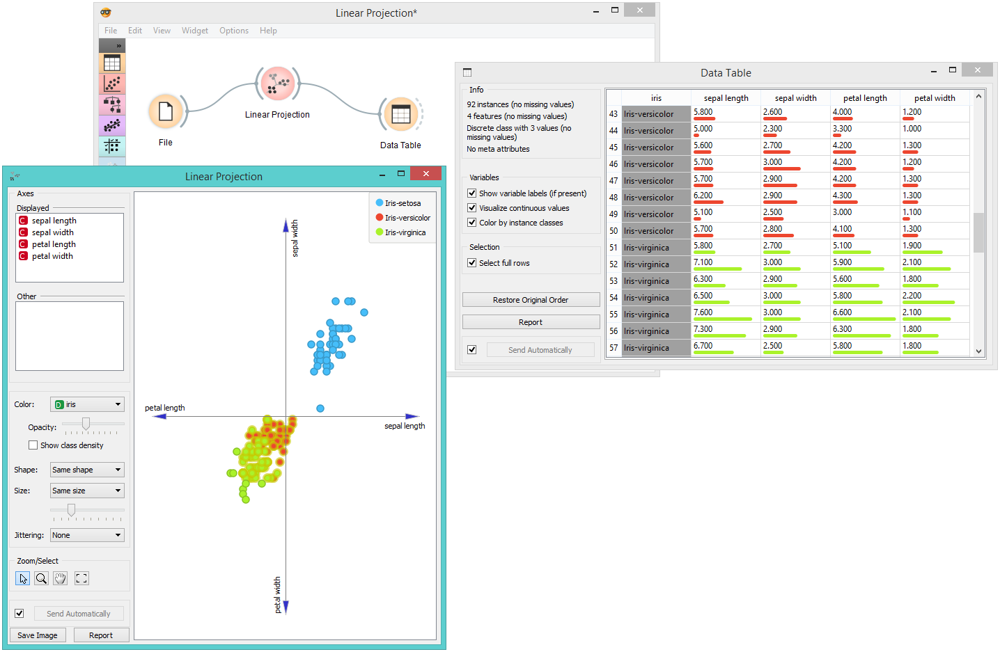

Linear Projection
=================

A linear projection method with explorative data analysis.

Inputs
    Data
        input dataset
    Data Subset
        subset of instances
    Projection
        custom projection vectors

Outputs
    Selected Data
        instances selected from the plot
    Data
        data with an additional column showing whether a point is selected
    Components
        projection vectors

This widget displays `linear projections <https://en.wikipedia.org/wiki/Projection_(linear_algebra)>`_
of class-labeled data. It supports various types of projections such as circular,
`linear discriminant analysis <https://en.wikipedia.org/wiki/Linear_discriminant_analysis>`_,
`principal component analysis <https://en.wikipedia.org/wiki/Principal_component_analysis>`_,
custom projection.

Consider, for a start, a projection of the *Iris*
dataset shown below. Notice that it is the sepal width and sepal length
that already separate *Iris setosa* from the other two, while the petal
length is the attribute best separating *Iris versicolor* from *Iris
virginica*.

1. Axes in the projection that are displayed and other available axes.
2. Optimize your projection by using **Suggest Features**. This feature
   scores attributes by average classification accuracy and returns the
   top scoring attributes with a simultaneous visualization update.

3. Choose the type of projection.
4. Axes inside a circle are hidden. Circle radius can be be changed using a slider.
5. Adjust *plot properties*:

   -  Set `jittering <https://en.wikipedia.org/wiki/Jitter>`_ to prevent the dots from
      overlapping (especially for discrete attributes).

   -  *Show legend* displays a legend on the right. Click and drag the legend to move it.

   -  *Show class density* colors the graph by class (see the screenshot below).

   -  *Label only selected points* allows you to select individual data instances and label them.

6. *Select, zoom, pan* and *zoom to fit* are the options for exploring the graph.
   Manual selection of data instances works as an angular/square
   selection tool. Double click to move the projection. Scroll in or out
   for zoom.
7. If *Send automatically* is ticked, changes are communicated automatically.
   Alternatively, press *Send*.
8. *Save Image* saves the created image to your computer in a .svg or .png
   format.
   Produce a report.

Example
-------

The **Linear Projection** widget works just like other visualization widgets. Below,
we connected it to the :doc:`File <../data/file>` widget to see the set projected on a 2-D
plane. Then we selected the data for further analysis and connected it
to the :doc:`Data Table <../data/datatable>` widget to see the details of the selected subset.

References
----------

Koren Y., Carmel L. (2003). Visualization of labeled data using linear
transformations. In Proceedings of IEEE Information Visualization 2003,
(InfoVis'03). Available
`here <http://citeseerx.ist.psu.edu/viewdoc/download;jsessionid=3DDF0DB68D8AB9949820A19B0344C1F3?doi=10.1.1.13.8657&rep=rep1&type=pdf>`__.

Boulesteix A.-L., Strimmer K. (2006). Partial least squares: a versatile
tool for the analysis of high-dimensional genomic data. Briefings in
Bioinformatics, 8(1), 32-44. Abstract
`here <http://bib.oxfordjournals.org/content/8/1/32.abstract>`__.
