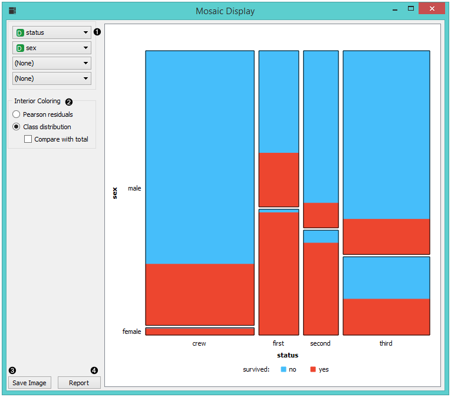
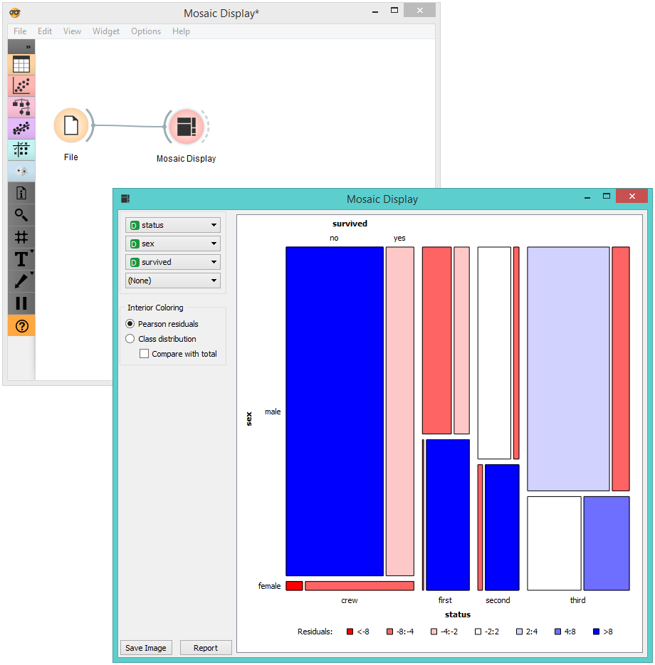

Mosaic Display
==============

Display data in a mosaic plot. 

Signals
-------

**Inputs**:

-  **Data**

   An input data set.

-  **Data subset**

   An input data subset. 

**Outputs**:

-  **Selected data**

   A subset of instances that the user has manually selected from the plot.

Description
-----------

The **Mosaic plot** is a graphical representation of a two-way frequency table or a contingency table. It is used for visualizing data from two or more qualitative variables and was introduced in 1981 by Hartigan and Kleiner and expanded and refined by Friendly in 1994. It provides the user with the means to more efficiently recognize relationships between different variables. If you wish to read up on the history of Mosaic Display, additional reading is available `here <http://www.datavis.ca/papers/moshist.pdf>`_.

1. Select the variables you wish to see plotted.
2. Select interior coloring. You can color the interior according to class or you can use the *Pearson residual*, which is the difference between observed and fitted values, divided by an estimate of the standard deviation of the observed value. If *Compare to total* is clicked, a comparison is made to all instances.
3. *Save image* saves the created image to your computer in a .svg or .png format.
4. Produce a report. 

Example
-------

We loaded the *titanic* data set and connected it to the **Mosaic Display** widget. We decided to focus on two variables, namely status, sex and survival. We colored the interiors according to Pearson residuals in order to demonstrate the difference between observed and fitted values. 

We can see that the survival rates for men and women clearly deviate from the fitted value. 
