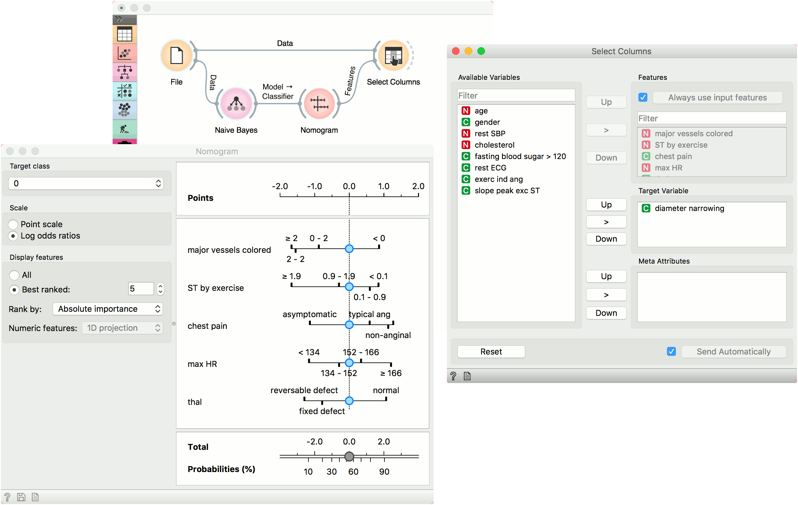

Nomogram
========

Nomograms for visualization of Naive Bayes and Logistic Regression classifiers.

**Inputs**

- Classifier: trained classifier
- Data: input dataset

**Outputs**

- Features: selected variables, 10 by default

The **Nomogram** enables some classifier's (more precisely Naive Bayes classifier and Logistic Regression classifier) visual representation. It offers an insight into the structure of the training data and effects of the attributes on the class probabilities. Besides visualization of the classifier, the widget offers interactive support for prediction of class probabilities. A snapshot below shows the nomogram of the Titanic dataset, that models the probability for a passenger not to survive the disaster of the Titanic.

When there are too many attributes in the plotted dataset, only best ranked ones can be selected for display. It is possible to choose from 'No sorting', 'Name', 'Absolute importance', 'Positive influence' and 'Negative influence' for Naive Bayes representation and from 'No sorting', 'Name' and 'Absolute importance' for Logistic Regression representation.

The probability for the chosen target class is computed by '1-vs-all' principle, which should be taken in consideration when dealing with multiclass data (alternating probabilities do not sum to 1). To avoid this inconvenience, you can choose to normalize probabilities.

1. Select the target class you want to model the probability for. Select, whether you want to normalize the probabilities or not.
2. By default Scale is set to Log odds ration. For easier understanding and interpretation option *Point scale* can be used. The unit is obtained by re-scaling the log odds so that the maximal absolute log odds ratio in the nomogram represents 100 points.
3. Display all attributes or only the best ranked ones. Sort them and set the projection type.

Continuous attributes can be plotted in 2D (only for Logistic Regression).

Examples
--------

The **Nomogram** widget should be used immediately after trained classifier widget (e.g. [Naive Bayes](../model/naivebayes.md) or [Logistics Regression](../model/logisticregression.md)). It can also be passed a data instance using any widget that enables selection (e.g. [Data Table](../data/datatable.md)) as shown in the workflow below.

Referring to the Titanic dataset once again, 1490 (68%) passengers on Titanic out of 2201 died. To make a prediction, the contribution of each attribute is measured as a point score and the individual point scores are summed to determine the probability. When the value of the attribute is unknown, its contribution is 0 points. Therefore, not knowing anything about the passenger, the total point score is 0 and the corresponding probability equals the unconditional prior. The nomogram in the example shows the case when we know that the passenger is a male adult from the first class. The points sum to -0.36, with a corresponding probability of not surviving of about 53%.

#### Features output

The second example shows how to use the Features output. Let us use *heart_disease* data for this exercise and load it in the File widget. Now connect File to [Naive Bayes](../model/naivebayes.md) (or [Logistic Regression](../model/logisticregression.md)) and add Nomogram to Naive Bayes. Finally, connect File to [Select Columns](../data/selectcolumns.md).

Select Columns selects a subset of variables, while Nomogram shows the top scoring variables for the trained classifier. To filter the data by the variables selected in the Nomogram, connect Nomogram to Select Columns as shown below. Nomogram will pass a list of selected variables to Select Columns, which will retain only the variables from the list. For this to work, you have to press *Use input features* in Select Columns (or tick it to always apply it).

We have selected the top 5 variables in Nomogram and used Select Columns to retain only those variables.

