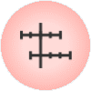
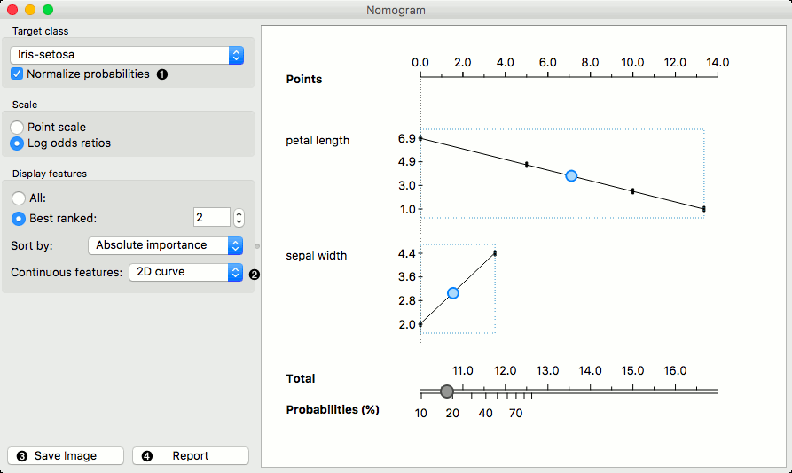
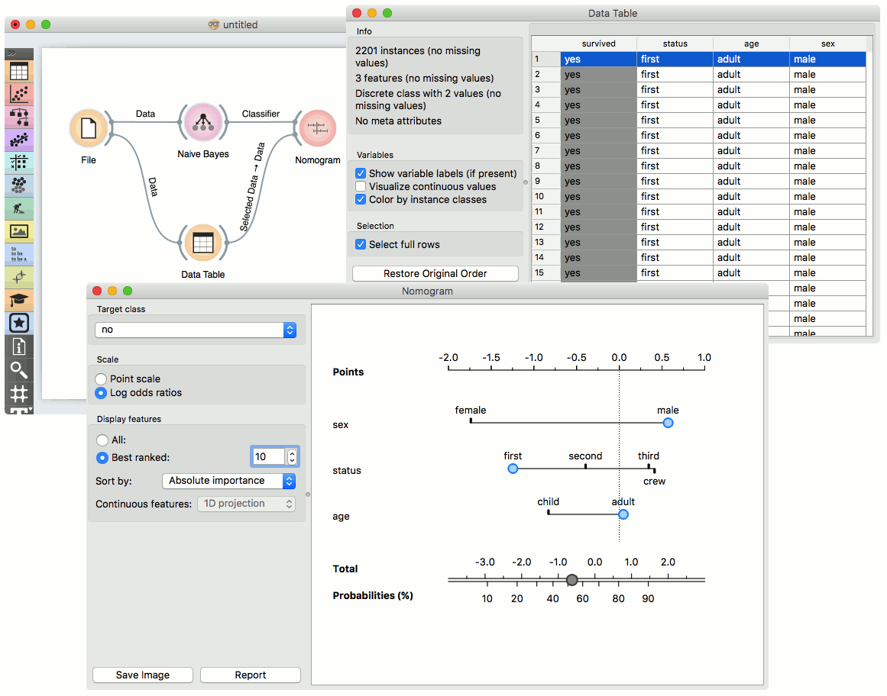

Nomogram
========

Nomograms for visualization of Naive Bayes and Logistic Regression classifiers.

Signals
-------

**Inputs**:

-  **Classifier**

   A trained classifier (Naive Bayes or Logistic regression).

-  **Data**

   Data instance.

Description
-----------

The **Nomogram** enables some classifier's (more precisely Naive Bayes classifier
and Logistic Regression classifier) visual representation. It offers an insight
into the structure of the training data and effects of the attributes on the
class probabilities. Besides visualization of the classifier, the widget offers
interactive support to prediction of class probabilities.
A snapshot below shows the nomogram of the Titanic data set, that models the
probability for a passenger not to survive the disaster of the Titanic.

.. figure:: images/Nomogram-NaiveBayes.png

1. Select the target class you want to model the probability for.

2. By default Scale is set to Log odds ration. For easier understanding and
   interpretation option Point scale can be used. The unit is obtained by
   re-scaling the log odds so that the maximal absolute log odds ratio in the
   nomogram represents 100 points.

3. When there are to many attributes in the plotted data set, you can choose to
   display only best ranked ones. It is possible to choose from 'No sorting',
   'Name', 'Absolute importance', 'Positive influence' and 'Negative influence'
   for Naive Bayes representation and from 'No sorting', 'Name' and
   'Absolute importance' for Logistic Regression representation.

To represent nomogram for Logistic Regressing classifier Iris data set is used:

1. The probability for the chosen target class is computed by 1. vs. all principle,
   which should be taken in consideration when dealing with multiclass data
   (alternating probabilities do not sum to 1). To avoid this inconvenience, you
   can choose to normalize probabilities.

2. Continuous attributes can be plotted in 2D (only for Logistic Regression).
3. Save image.
4. Produce a report.

Example
-------

The **Nomogram** widget should be used immediately after trained classifier widget
(e.g. :doc:`Naive Bayes <../model/naivebayes>`. It can also be passed a data
instance using any widget that enables selection
(e.g. :doc:`Data Table <../data/datatable>`) as shown in the workflow below.

Referring to the Titanic data set once again, 1490 (68%) of passengers on Titanic,
of 2201 in total, died. To make a prediction, the contribution of each attribute
is measured as a point score and the individual point scores are summed to determine
the probability. When the value of the attribute is unknown, its contribution is
0 points. Therefore, not knowing anything about the passenger, the total point
score is 0, and the corresponding probability equals to the unconditional prior.
The nomogram in the example shows the case when we know that the passenger is a
male adult from the first class. The points sum to -0.36, with a corresponding
probability of not surviving of about 53%.
