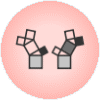

Pythagorean Forest
==================

Pythagorean forest for visualising random forests.

Signals
-------

**Inputs**:

-  **Random Forest**

Classification / regression tree models as random forest.

**Outputs**:

-  **Tree**

A selected classification / regression tree model.

Description
-----------

**Pythagorean Forest** shows all learned classification tree models from 
:doc:`Random Forest<../classify/randomforest>` widget. It displays then as Pythagorean trees, each visualization
pertaining to one randomly constructed tree. In the visualization, you can select
a tree and display it in **Pythagorean Tree** wigdet. The best tree is the one
with the shortest and most strongly colored branches. This means few attributes
split the branches well.

Widget displays both classification and regression results. Classification requires discrete target variable
in the data set and a :doc:`Classification Tree<../classify/classificationtree>` widget on the input, while
regression requires a continuous target variable with :doc:`Regression Tree<../regression/regressiontree>`
on the input.

.. figure:: images/Pythagorean-Forest-stamped.png

1. Information on the input random forest model.

2. Display parameters:

    - _Depth_: set the depth to which the trees are grown.
    - _Target class_: set the target class for coloring the trees. If _None_ is selected, tree will be white. If the input is a classification tree, you can color nodes by their respective class. If the input is a regression tree, the options are _Class mean_, which will color tree nodes by the class mean value and _Standard deviation_, which will color then by the standard deviation value of the node.
    - _Size_: set the size of the nodes. _Normal_ will keep nodes the size of the subset in the node. _Square root_ and _Logarithmic_ are the respective transformations of the node size.
    - _Zoom_: allows you to se the size of the tree visualizations.

3. _Save Image_: save the visualization to your computer as a *.svg* or *.png* file. 
   _Report_: produce a report.

Example
-------

**Pythagorean Forest** is great for visualizing several built trees at once. In the example
below, we've plotted all 10 trees we've grown with :doc:`Random Forest Regression<../regression/randomforestregression>`.
When changing the parameters in Random Forest Regression, visualization in Pythagorean Forest will change as well.

Then we've selected a tree in the visualization and inspected it further with 
:doc:`Pythagorean Tree<../visualize/pythagoreantree>` widget.

.. figure:: images/Pythagorean-Forest-Example.png

References
----------

Beck, F., Burch, M., Munz, T., Di Silvestro, L. and Weiskopf, D. (2014). Generalized Pythagoras Trees for Visualizing Hierarchies. In IVAPP '14 Proceedings of the 5th International Conference on Information Visualization Theory and Applications, 17-28.
