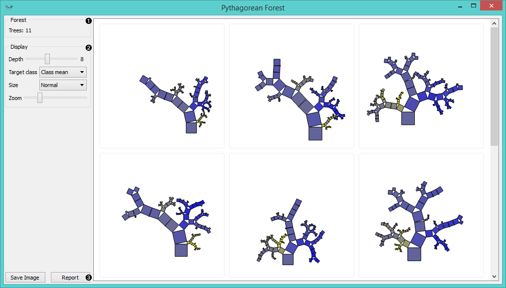
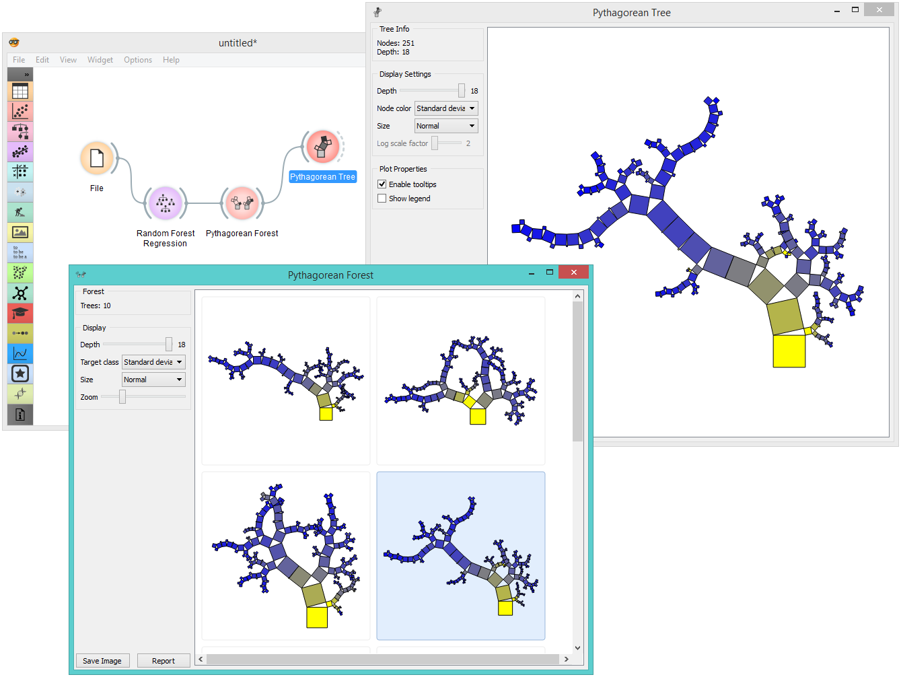

Pythagorean Forest
==================

Pythagorean forest for visualising random forests.

Inputs
    Random Forest
        tree models from random forest

Outputs
    Tree
        selected tree model

**Pythagorean Forest** shows all learned decision tree models from :doc:`Random Forest <../model/randomforest>` widget. It displays then as Pythagorean trees, each visualization pertaining to one randomly constructed tree. In the visualization, you can select a tree and display it in :doc:`Pythagorean Tree <../visualize/pythagoreantree>` wigdet. The best tree is the one with the shortest and most strongly colored branches. This means few attributes split the branches well.

Widget displays both classification and regression results. Classification requires discrete target variable in the dataset, while regression requires a continuous target variable. Still, they both should be fed a :doc:`Tree <../model/tree>` on the input.

1. Information on the input random forest model.

2. Display parameters:

    - *Depth*: set the depth to which the trees are grown.
    - *Target class*: set the target class for coloring the trees. If *None* is selected, tree will be white. If the input is a classification tree, you can color nodes by their respective class. If the input is a regression tree, the options are *Class mean*, which will color tree nodes by the class mean value and *Standard deviation*, which will color then by the standard deviation value of the node.
    - *Size*: set the size of the nodes. *Normal* will keep nodes the size of the subset in the node. *Square root* and *Logarithmic* are the respective transformations of the node size.
    - *Zoom*: allows you to se the size of the tree visualizations.

3. *Save Image*: save the visualization to your computer as a *.svg* or *.png* file. 
   *Report*: produce a report.

Example
-------

**Pythagorean Forest** is great for visualizing several built trees at once. In the example below, we've used *housing* dataset and plotted all 10 trees we've grown with :doc:`Random Forest <../model/randomforest>`. When changing the parameters in Random Forest, visualization in Pythagorean Forest will change as well.

Then we've selected a tree in the visualization and inspected it further with :doc:`Pythagorean Tree <../visualize/pythagoreantree>` widget.

References
----------

Beck, F., Burch, M., Munz, T., Di Silvestro, L. and Weiskopf, D. (2014). Generalized Pythagoras Trees for Visualizing Hierarchies. In IVAPP '14 Proceedings of the 5th International Conference on Information Visualization Theory and Applications, 17-28.
