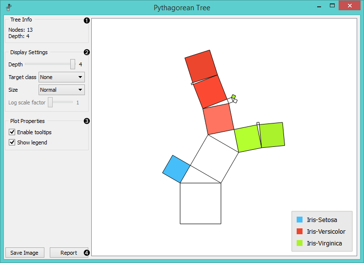
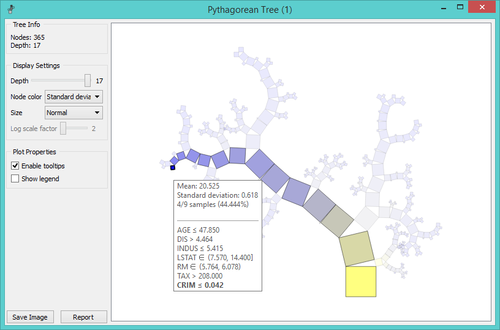
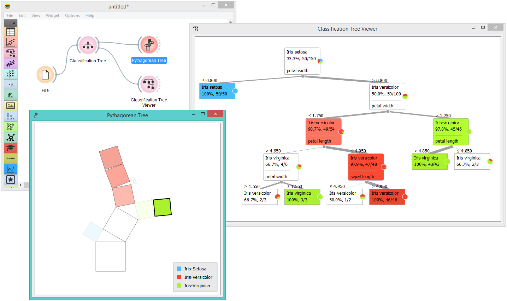
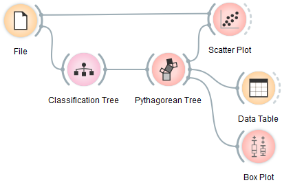
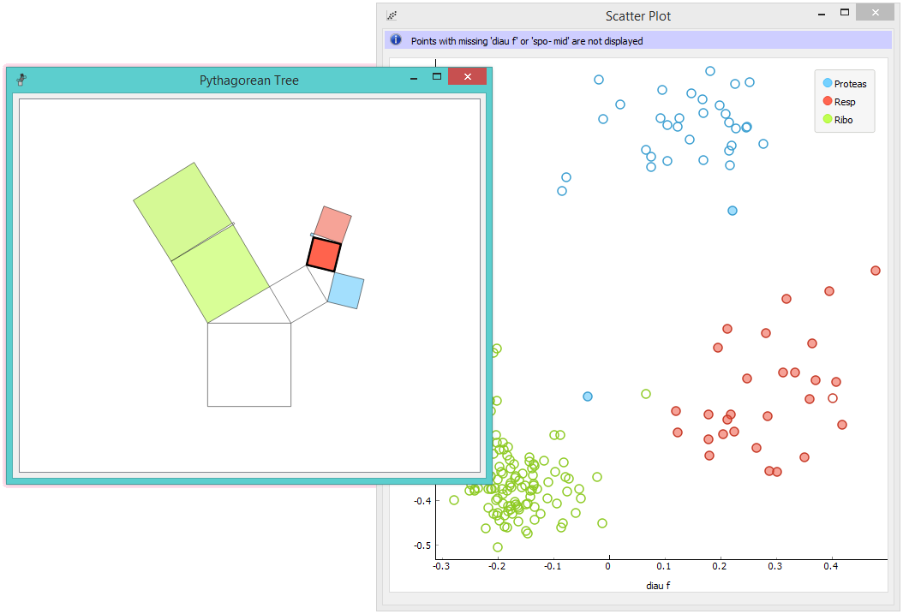

Pythagorean Tree
================

Pythagorean tree visualisation for classification or regression trees.

Signals
-------

**Inputs**:

-  **Tree**

   A decision tree model.

- **Selected Data**

   A subset of instances that the user has manually selected from the Pythagorean tree.

Description
-----------

**Pythagorean Trees** are plane fractals that can be used to depict general tree hierarchies as presented in an article by `Fabian Beck and co-authors <http://publications.fbeck.com/ivapp14-pythagoras.pdf>`_. In our case, they are used for visualizing and exploring tree models, such as 
:doc:`Tree <../model/tree>`.

1. Information on the input tree model.

2. Visualization parameters:

    - *Depth*: set the depth of displayed trees.
    - *Target class* (for classification trees): the intensity of the color for nodes of the tree will correspond to the probability of the target class. If *None* is selected, the color of the node will denote the most probable class.
    - *Node color* (for regression trees): node colors can correspond to mean or standard deviation of class value of the training data instances in the node.
    - *Size*: define a method to compute the size of the square representing the node. *Normal* will keep node sizes correspond to the size of training data subset in the node. *Square root* and *Logarithmic* are the respective transformations of the node size.
    - *Log scale factor* is only enabled when *logarithmic* transformation is selected. You can set the log factor between 1 and 10.

3. Plot properties:

    - *Enable tooltips*: display node information upon hovering.
    - *Show legend*: shows color legend for the plot.

4. Reporting:
    - *Save Image*: save the visualization to a SVG or PNG file. 
    - *Report*: add visualization to the report.

Pythagorean Tree can visualize both classification and regression trees. Below is an example for regression tree. The only difference between the two is that regression tree doesn't enable coloring by class, but can color by class mean or standard deviation.

Example
-------

The workflow from the screenshot below demonstrates the difference between :doc:`Tree Viewer <../visualize/treeviewer>` and Pythagorean Tree. They can both visualize :doc:`Tree <../model/tree>`, but Pythagorean visualization takes less space and is more compact, even for a small `Iris flower <https://en.wikipedia.org/wiki/Iris_flower_data_set>`_ data set. For both visualization widgets, we have hidden the control area on the left by clicking on the splitter between control and visualization area.

Pythagorean Tree is interactive: click on any of the nodes (squares) to select training data instances that were associated with that node. The following workflow explores these feature. 

The selected data instances are shown as a subset in the :doc:`Scatter Plot <../visualize/scatterplot>`, sent to the :doc:`Data Table <../data/datatable>` and examined in the :doc:`Box Plot <../visualize/boxplot>`. We have used brown-selected data set in this example. The tree and scatter plot are shown below; the selected node in the tree has a black outline.

References
----------

Beck, F., Burch, M., Munz, T., Di Silvestro, L. and Weiskopf, D. (2014). `Generalized Pythagoras Trees for Visualizing Hierarchies <http://publications.fbeck.com/ivapp14-pythagoras.pdf>`_. In IVAPP '14 Proceedings of the 5th International Conference on Information Visualization Theory and Applications, 17-28.
