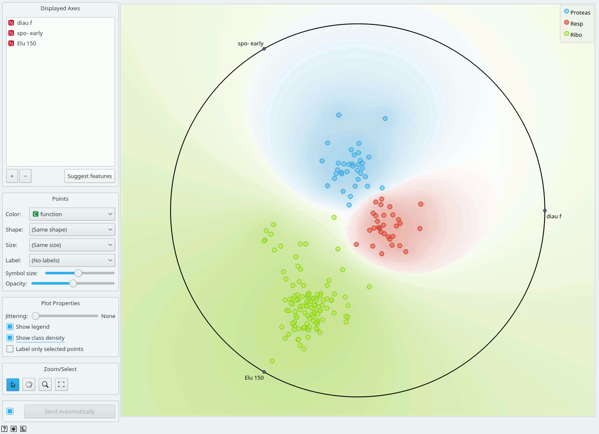
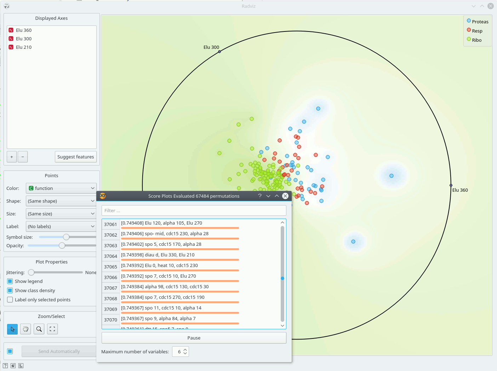

Radviz
======

Radviz vizualization with explorative data analysis and intelligent data
visualization enhancements.

Inputs
    Data
        input dataset
    Data Subset
        subset of instances

Outputs
    Selected Data
        instances selected from the plot
    Data
      data with an additional column showing whether a point is selected
    Components
      Radviz vectors

Radviz ([1]_) is a non-linear multi-dimensional visualization
technique that can display data defined by three or more variables in a 2-dimensional
projection. The visualized variables are presented as anchor points equally
spaced around the perimeter of a unit circle. Data instances are shown as
points inside the circle, with their positions determined by a metaphor from
physics: each point is held in place with springs that are attached at the
other end to the variable anchors. The stiffness of each spring is
proportional to the value of the corresponding variable and the point ends up
at the position where the spring forces are in equilibrium. Prior to
visualization, variable values are scaled to lie between 0 and 1. Data
instances that are close to a set of variable anchors have higher values for
these variables than for the others.

The snapshot shown below shows a Radviz widget with a visualization of the
dataset from functional genomics ([2]_). In this particular
visualization the data instances are colored according to the corresponding
class, and the visualization space is colored according to the computed class
probability. Notice that the particular visualization very nicely separates
data instances of different class, making the visualization interesting
and potentially informative.

Just like all point-based visualizations, this widget includes tools for
intelligent data visualization (VizRank, see [3]_) and an interface for explorative
data analysis - selection of data points in visualization. Just like the
:doc:`Scatter Plot <../visualize/scatterplot>` widget, it can be used to find a set
of variables that would result in an interesting visualization. The Radviz graph above
is according to this definition an example of a very good visualization,
while the one below is not - where we show an VizRank's interface (:obj:`Suggest features` button)
with a list of 3-attribute visualizations and their scores - is not.

References
----------

.. [1] Hoffman,P.E. et al. (1997) DNA visual and analytic data mining.
   In the Proceedings of the IEEE Visualization. Phoenix, AZ, pp. 437-441.

.. [2] Brown, M. P., W. N. Grundy, et al. (2000).
   "Knowledge-based analysis of microarray gene expression data by using
   support vector machines." Proc Natl Acad Sci U S A 97(1): 262-7.

.. [3] Leban, G., B. Zupan, et al. (2006). "VizRank: Data Visualization
   Guided by Machine Learning." Data Mining and Knowledge Discovery 13(2):
   119-136.

.. [4] Mramor M, Leban G, Demsar J, Zupan B. Visualization-based
   cancer microarray data classification analysis. Bioinformatics 23(16):
   2147-2154, 2007.
