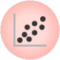
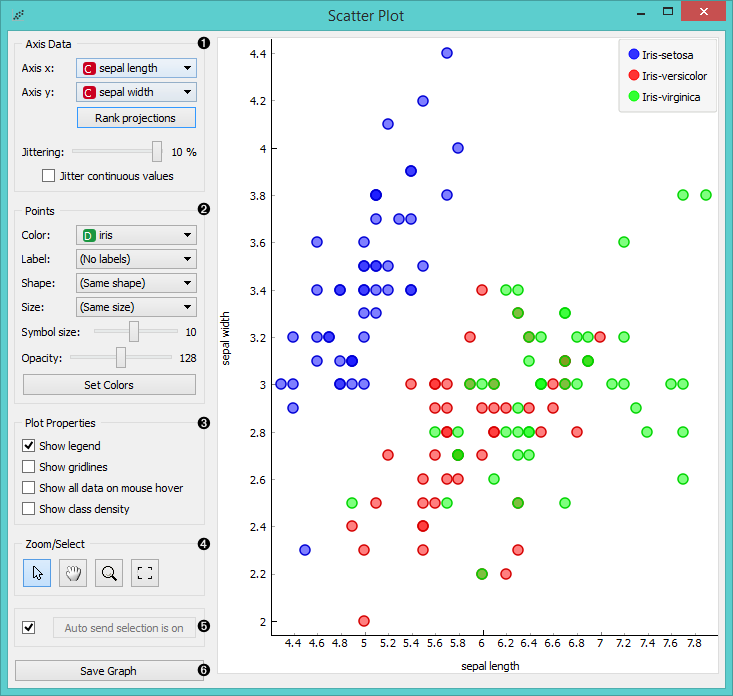
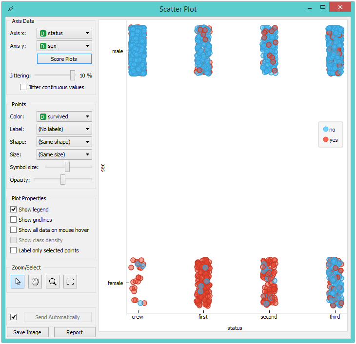
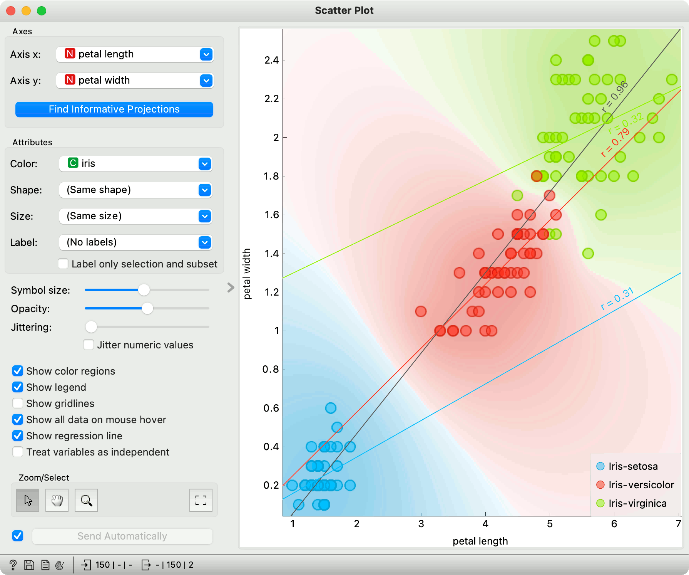
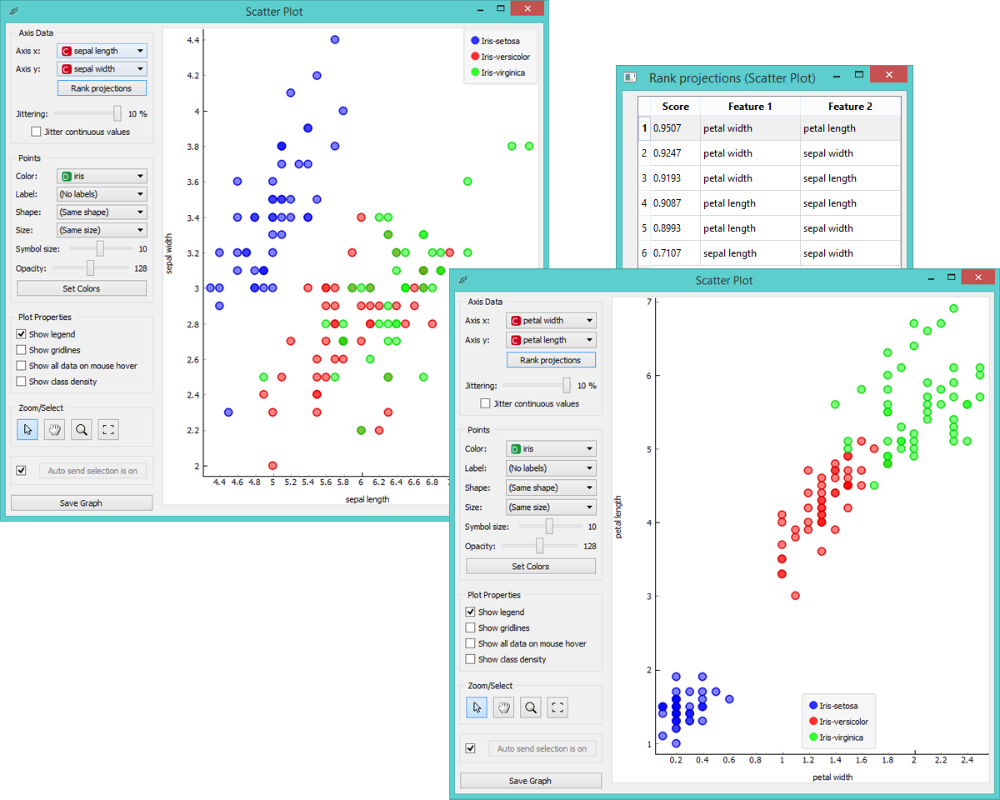
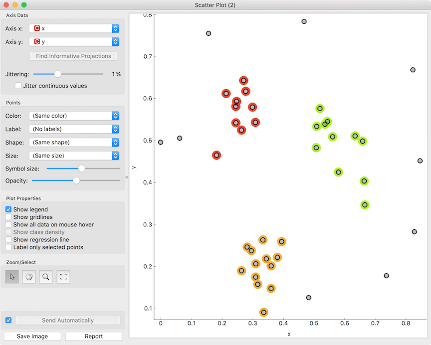
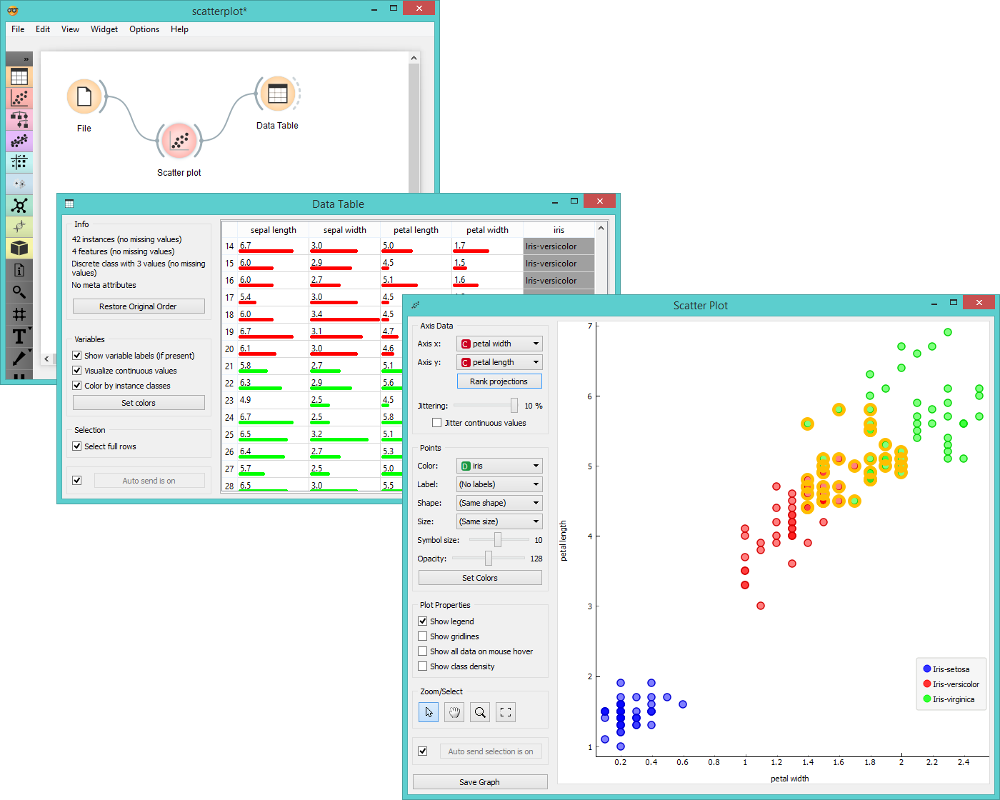
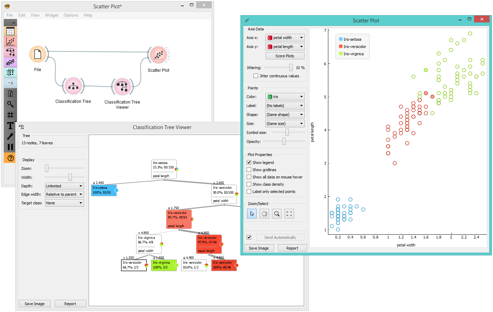

Scatter Plot
============

Scatterplot visualization with explorative analysis and intelligent data
visualization enhancements.

Signals
-------

**Inputs**:

-  **Data**

   An input data set.

-  **Data Subset**

   A subset of instances from the input data set.

-  **Features**

   A list of attributes.

**Outputs**:

-  **Selected Data**

   A subset of instances that the user manually selected from the
   scatterplot.

-  **Data**

   Data with an additional column showing whether a point is selected.

Description
-----------

The **Scatterplot** widget provides a 2-dimensional scatterplot
visualization for both continuous and discrete-valued attributes. The
data is displayed as a collection of points, each having the value of the
x-axis attribute determining the position on the horizontal axis and the
value of the y-axis attribute determining the position on the vertical axis.
Various properties of the graph, like color, size and shape of the
points, axis titles, maximum point size and jittering can be adjusted on
the left side of the widget. A snapshot below shows the scatterplot of the
*Iris* data set with the coloring matching of the class attribute.

1. Select the x and y attribute. Optimize your projection by using **Rank
   Projections**. This feature scores attribute pairs by average
   classification accuracy and returns the top scoring pair with a
   simultaneous visualization update. Set
   `jittering <https://en.wikipedia.org/wiki/Jitter>`_ to prevent the
   dots overlapping. If *Jitter continuous values* is ticked, continuous
   instances will be dispersed.
2. Set the color of the displayed points (you will get colors for discrete
   values and grey-scale points for continuous). Set label, shape and
   size to differentiate between points. Set symbol size and opacity for
   all data points. Set the desired colors scale.
3. Adjust *plot properties*:

   -  *Show legend* displays a legend on the right. Click and drag the legend to move it.
   -  *Show gridlines* displays the grid behind the plot.
   -  *Show all data on mouse hover* enables information bubbles if the cursor is placed on a dot.
   -  *Show class density* colors the graph by class (see the screenshot below).
   -  *Show regression line* draws the regression line for pair of continuous attributes.
   -  *Label only selected points* allows you to select individual data instances and label them.

4. *Select, zoom, pan and zoom to fit* are the options for exploring the graph.
   The manual selection of data instances works as an angular/square
   selection tool. Double click to move the projection. Scroll in or out
   for zoom.
5. If *Send automatically* is ticked, changes are communicated automatically.
   Alternatively, press *Send*.
6. *Save Image* saves the created image to your computer in a .svg or .png
   format.
7. Produce a report.

For discrete attributes, jittering circumvents the overlap of points
which have the same value for both axes, and therefore the density of
points in the region corresponds better to the data. As an example, the
scatterplot for the Titanic data set, reporting on the gender of the
passengers and the traveling class is shown below; without jittering,
the scatterplot would display only eight distinct points.

Here is an example of the **Scatter Plot** widget if the *Show class
density* and *Show regression line* boxes are ticked.

Intelligent Data Visualization
------------------------------

If a data set has many attributes, it is impossible to manually scan
through all the pairs to find interesting or useful scatterplots. Orange
implements intelligent data visualization with the **Find Informative Projections**
option in the widget. The goal of optimization is to find scatterplot
projections where instances are well separated.

To use this method, go to the *Find Informative Projections* option in the widget, open
the subwindow and press *Start Evaluation*. The feature will return a
list of attribute pairs by average classification accuracy score.

Below, there is an example demonstrating the utility of ranking. The
first scatterplot projection was set as the default sepal width to sepal
length plot (we used the Iris data set for simplicity). Upon running *Find Informative Projections* optimization, the scatterplot converted to a much better
projection of petal width to petal length plot.

Selection
---------

Selection can be used to manually defined subgroups in the data. Use Shift
modifier when selecting data instances to put them into a new group.
Shift + Ctrl (or Shift + Cmd on macOs) appends instances to the last group.

Signal data outputs a data table with an additional column that contains group
indices.

Explorative Data Analysis
-------------------------

The **Scatterplot**, as the rest of Orange widgets, supports zooming-in and
out of part of the plot and a manual selection of data instances.
These functions are available in the lower left corner of the widget.
The default tool is *Select*, which selects data instances within the
chosen rectangular area. *Pan* enables you to move the scatterplot
around the pane. With *Zoom* you can zoom in and out of the pane with a
mouse scroll, while *Reset zoom* resets the visualization to its optimal
size. An example of a simple schema, where we selected data instances
from a rectangular region and sent them to the :doc:`Data Table <../data/datatable>` widget, is
shown below. Notice that the scatterplot doesn't show all 52 data
instances, because some data instances overlap (they have the same
values for both attributes used).

Example
-------

The **Scatterplot** can be combined with any widget that outputs a list of selected data instances. In the example below, we combine :doc:`Tree <../model/tree>` and **Scatterplot** to display instances taken from a chosen decision tree node (clicking on any node of the tree will send a set of selected data instances to the scatterplot and mark selected instances with filled symbols).

