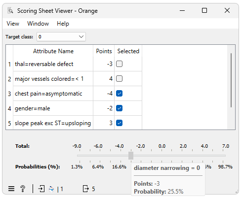

Scoring Sheet Viewer
================
A widget for visualizing the scoring sheet predictions.

**Inputs**

- Classifier: a trained scoring sheet model
- Data: dataset used to visualize the predictions on different instances

**Outputs**

- Features: features used in the scoring sheet

**Scoring Sheet Viewer** widget offers a simple and intuitive way of visualizing the predictions of the scoring sheet model. The widget takes as input a trained scoring sheet model and a optional dataset (instance) on which we want to visualize the predictions. The widget presents us with a table that visualizes each feature's contribution to the final score, where a higher score indicates a greater chance for an individual to be classified with the target class. Each feature's contribution can be positive or negative, indicating whether it increases or decreases the risk.

Example
-------

In this example, we first sample the data, with a portion used to train the Scoring Sheet model and a part routed to the Table widget. This setup allows us to select instances and observe how the scoring sheet performs with new, unseen data.

Let's analyze and learn to interpret the scoring sheet using the example. It features five decision parameters, with points ranging from -5 to 5. We have set the target class to '1,' indicating the 'presence' of heart disease. Positive-value decision parameters increase the risk of heart disease, while those with negative values reduce it.

Consider a selected instance from the Data Table widget. It has a 'slope peak exc ST' attribute value of 'upsloping', which reduces the heart disease risk by 3 points. However, it also has the 'chest pain' attribute set to 'asymptomatic', increasing the risk by 5 points. This combination results in a total score of 2, corresponding to a 71.6% probability of having heart disease.
