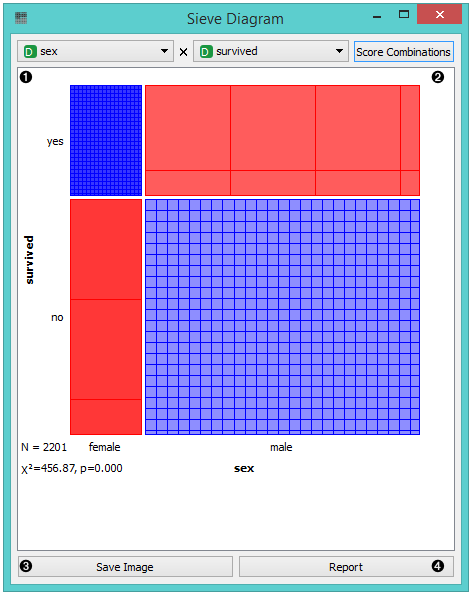
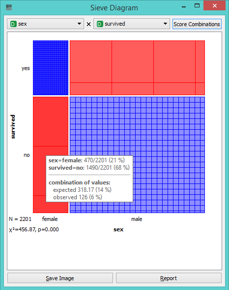
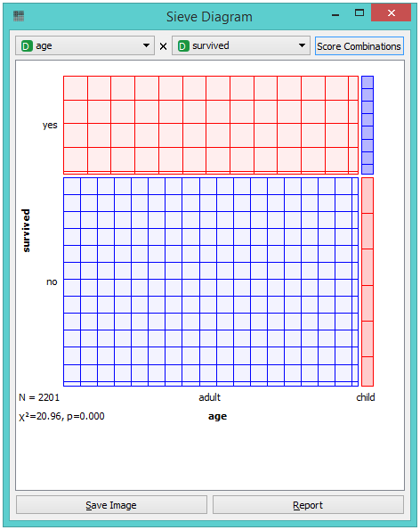
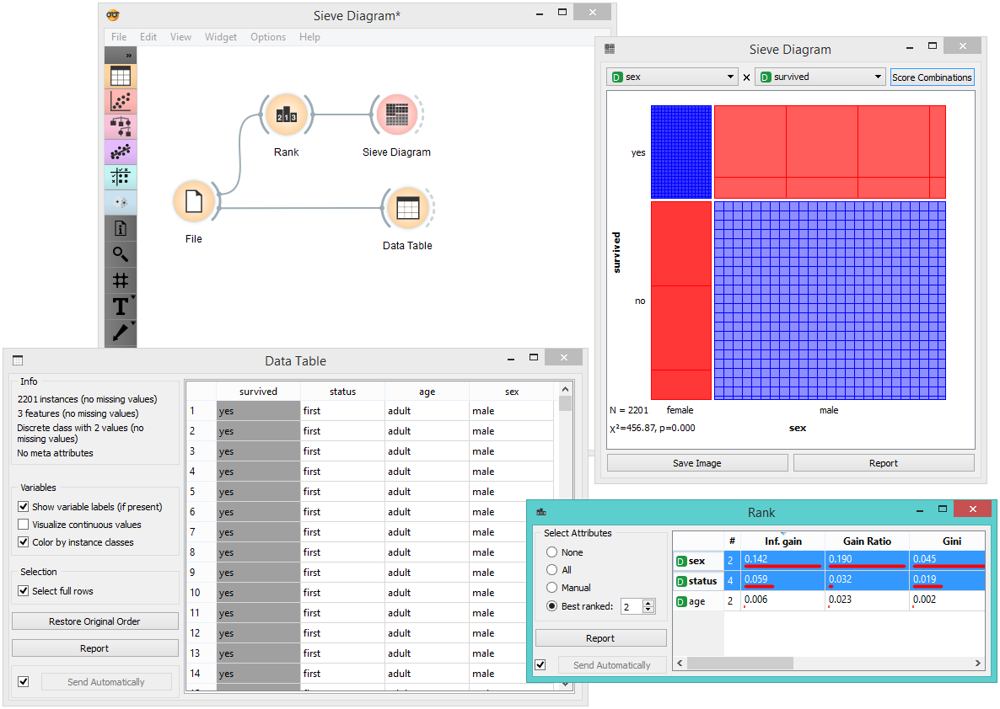
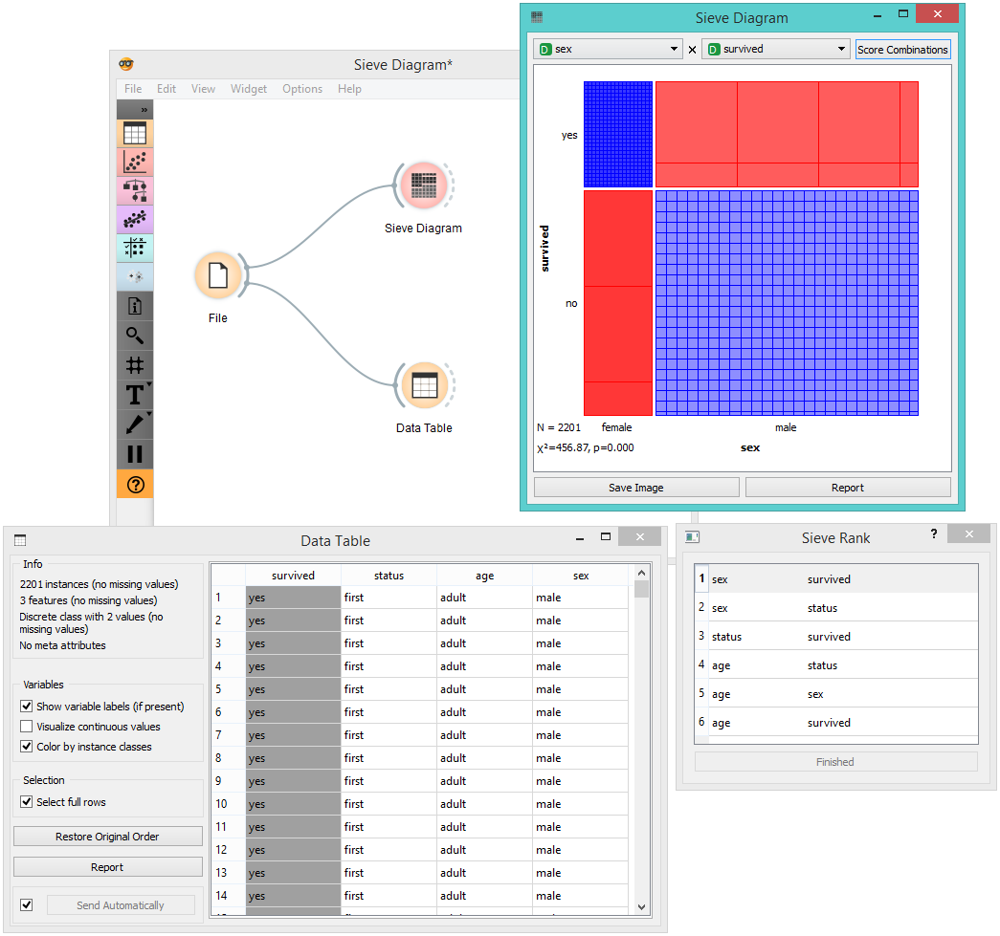

Sieve Diagram
=============

Plots a sieve diagram for a pair of attributes.

Signals
-------

**Inputs**:

-  **Data**

   An input data set

**Outputs**:

-  None

Description
-----------

A **Sieve diagram** is a graphical method for visualizing frequencies in a two-way contingency table and comparing them to `expected frequencies <http://cnx.org/contents/d396c4ad-2fd7-47cd-be84-152b44880feb@2/What-is-an-expected-frequency>`_ under assumption of independence. It was proposed by
Riedwyl and Schüpbach in a technical report in 1983 and later called a
parquet diagram (Riedwyl and Schüpbach, 1994). In this display, the area
of each rectangle is proportional to the expected frequency, while the
observed frequency is shown by the number of squares in each rectangle.
The difference between observed and expected frequency (proportional to
the standard Pearson residual) appears as the density of shading, using
color to indicate whether the deviation from independence is positive
(blue) or negative (red).

1. Select the attributes you want to display in the sieve plot.
2. Score combinations enables you to fin the best possible combination of attributes. 
3. *Save Image* saves the created image to your computer in a .svg or .png
   format.
4. Produce a report. 

The snapshot below shows a sieve diagram for the *Titanic* data set and has the
attributes *sex* and *survived* (the latter is a class attribute in this
data set). The plot shows that the two variables are highly associated,
as there are substantial differences between observed and expected
frequencies in all of the four quadrants. For example, and as highlighted
in the balloon, the chance for surviving the accident was much higher for
female passengers than expected (0.06 vs. 0.15).

Pairs of attributes with interesting associations have a strong shading,
such as the diagram shown in the above snapshot. For contrast, a sieve
diagram of the least interesting pair (age vs. survival) is shown below.

Example
-------

Below, we see a simple schema using the *Titanic* data set, where we use the
:doc:`Rank <../data/rank>` widget to select the best attributes (the ones with the highest
information gain, gain ratio or gini index) and feed them into the **Sieve
Diagram**. This displays the sieve plot for the two best attributes,
which in our case are sex and status. We see that the survival rate on the
Titanic was very high for women of the first class and very low for
female crew members.

The **Sieve Diagram** also features the *Score Combinations* option, which makes the ranking of attributes even easier.

References
----------

Riedwyl, H., and Schüpbach, M. (1994). Parquet diagram to plot
contingency tables. In Softstat '93: Advances in Statistical Software,
F. Faulbaum (Ed.). New York: Gustav Fischer, 293-299.
