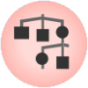
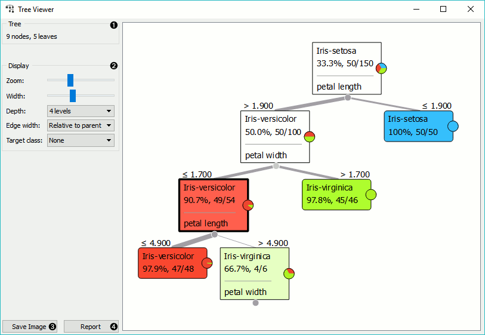
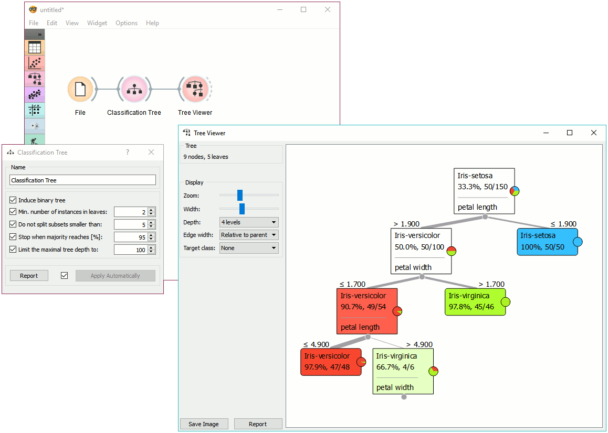
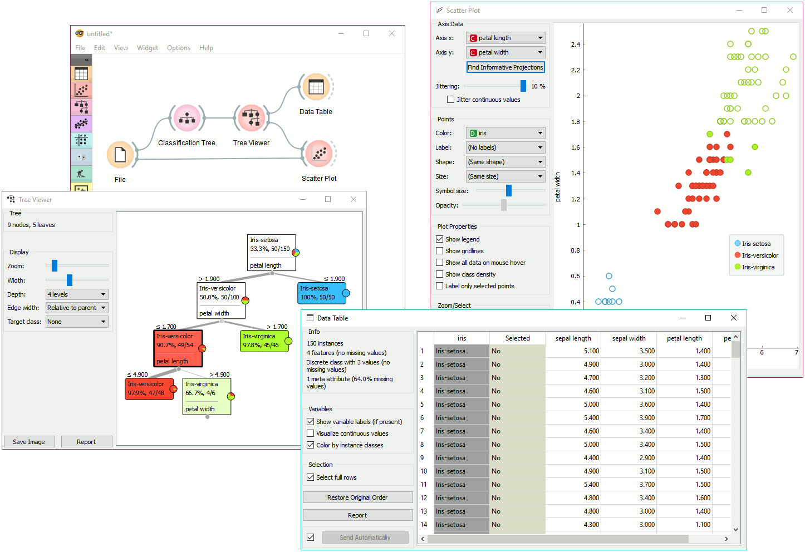

Tree Viewer
===========

A visualization of classification and regression trees. 

Signals
-------

**Inputs**:

-  **Tree**

   Classification or regression tree.

**Outputs**:

-  **Selected Data**

   Data from a selected tree node.

-  **Data**

   Data set with an additional attribute for selection labels.

Description
-----------

This is a versatile widget with 2-D visualization of a `classification
tree <https://en.wikipedia.org/wiki/Decision_tree_learning>`_. The user 
can select a node, instructing the widget to output the
data associated with the node, thus enabling explorative data analysis.

1. Information on the input.

2. Display options:

   - Zoom in and zoom out
   - Select the tree width. The nodes display information bubbles when hovering over them.
   - Select the depth of your tree.
   - Select edge width. The edges between the nodes in the tree graph are drawn based on the selected edge width.
      -  All the edges will be of equal width if *Fixed* is chosen.
      -  When *Relative to root* is selected, the width of the edge will
         correspond to the proportion of instances in the corresponding
         node with respect to all the instances in the training data. Under
         this selection, the edge will get thinner and thinner when
         traversing toward the bottom of the tree.
      -  *Relative to parent* makes the edge width correspond to the proportion
         of instances in the nodes with respect to the instances in their
         parent node.
   -  Define the target class, which you can change based on classes in the data. 

3. Press *Save image* to save the created classification tree graph to your computer as a *.svg* or *.png* file. 

4. Produce a report. 

Examples
--------

Below, is a simple schema, where we have read the data, constructed the
classification tree and viewed it in our tree viewer. If both the viewer
and :doc:`Classification Tree <../classify/classificationtree>` are open, any re-run of the tree induction
algorithm will immediately affect the visualization. You can thus use
this combination to explore how the parameters of the induction algorithm
influence the structure of the resulting tree.

Clicking on any node will output the related data instances. This is
explored in the schema below that shows the subset in the data table and
in the :doc:`Scatterplot <../visualize/scatterplot>`. Make sure that the tree data is
passed as a data subset; this can be done by connecting the
**Scatterplot** to the :doc:`File <../data/file>` widget first, and connecting it to the
**Classification Tree Viewer** widget next. Selected data will be displayed as bold dots.

**Tree Viewer** can also export labelled data. Connect :doc:`Data Table <../data/datatable>`
to **Tree Viewer** and set the link between widgets to *Data* instead of *Selected Data*. This
will send the entire data to **Data Table** with an additional meta column labelling selected
data instances (*Yes* for selected and *No* for the remaining).

Finally, **Tree Viewer** can be used also for visualizing regression trees. Connect
:doc:`Regression Tree <../regression/regressiontree>` to :doc:`File <../data/file>` widget
using *housing.tab* data set. Then connect **Tree Viewer** to **Regression Tree**. The widget
will display the constructed tree. For visualizing larger trees, especially for regression,
:doc:`Pythagorean Tree <../visualize/pythagoreantree>` could be a better option.

.. figurr:: images/tree-viewer-regression.png
