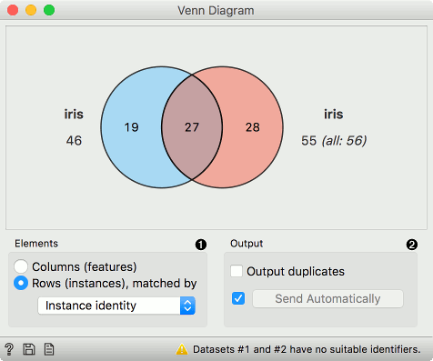

Venn Diagram
============

Plots a [Venn diagram](http://en.wikipedia.org/wiki/Venn_diagram) for two or more data subsets.

**Inputs**

- Data: input dataset

**Outputs**

- Selected Data: instances selected from the plot
- Data: entire data with a column indicating whether an instance was selected or not

The **Venn Diagram** widget displays logical relations between datasets by showing the number of common data instances (rows) or the number of shared features (columns). Selecting a part of the visualization outputs the corresponding instances or features.

1. Select whether to count common features or instances.
2. Select whether to include duplicates or to output only unique rows; applicable only when matching instances by values of variables.

Rows can be matched
- by their identity, e.g. rows from different data sets match if they came from the same row in a file,
- by equality, if all tables contain the same variables,
- or by values of a string variable that appears in all tables.

Examples
--------

The easiest way to use the **Venn Diagram** is to select data subsets and find matching instances in the visualization. We use the *breast-cancer* dataset to select two subsets with [Select Rows](../data/selectrows.md) widget - the first subset is that of breast cancer patients aged between 40 and 49 and the second is that of patients with a tumor size between 20 and 29. The **Venn Diagram** helps us find instances that correspond to both criteria, which can be found in the intersection of the two circles.

The **Venn Diagram** widget can be also used for exploring different prediction models. In the following example, we analysed 3 prediction methods, namely [Naive Bayes](../model/naivebayes.md), [SVM](../model/svm.md) and [Random Forest](../model/randomforest.md), according to their misclassified instances.

By selecting misclassifications in the three [Confusion Matrix](../evaluate/confusionmatrix.md) widgets and sending them to Venn diagram, we can see all the misclassification instances visualized per method used. Then we open **Venn Diagram** and select, for example, the misclassified instances that were identified by all three methods. This is represented as an intersection of all three circles. Click on the intersection to see this two instances marked in the [Scatter Plot](../visualize/scatterplot.md) widget. Try selecting different diagram sections to see how the scatter plot visualization changes.

