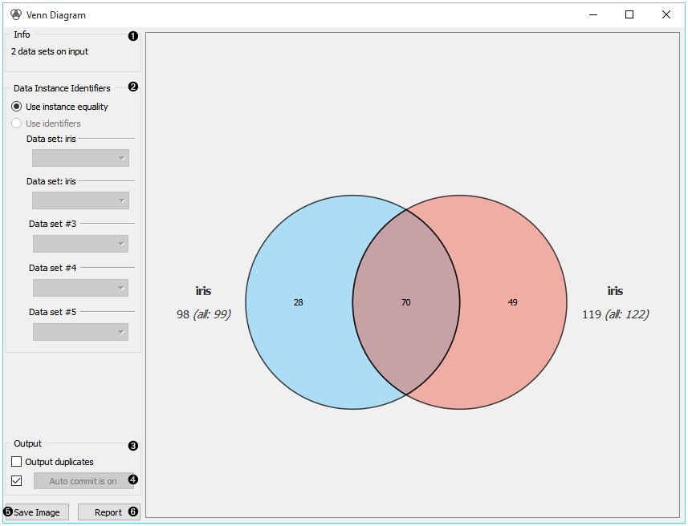
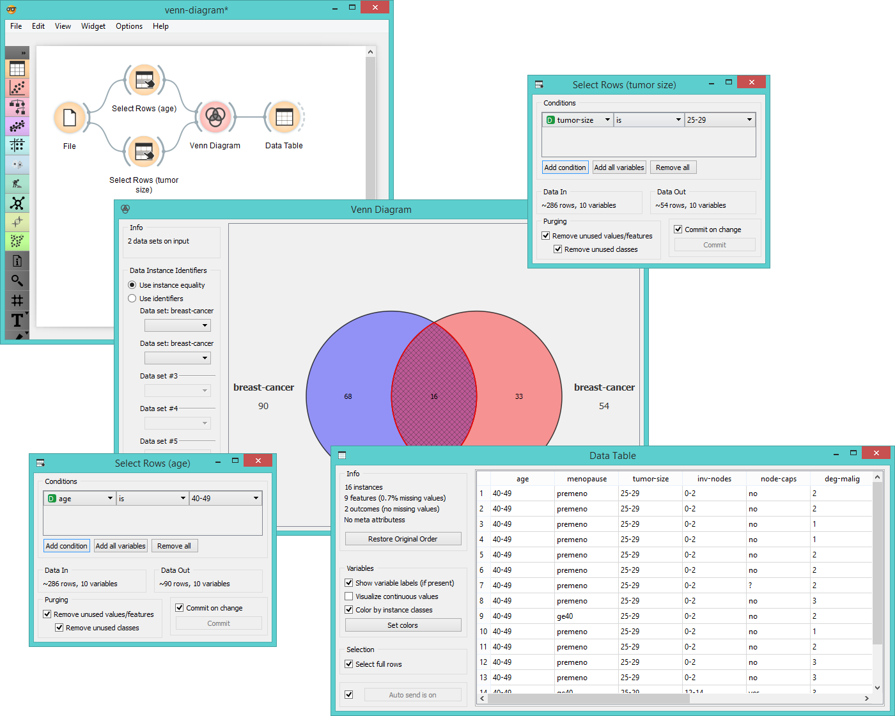
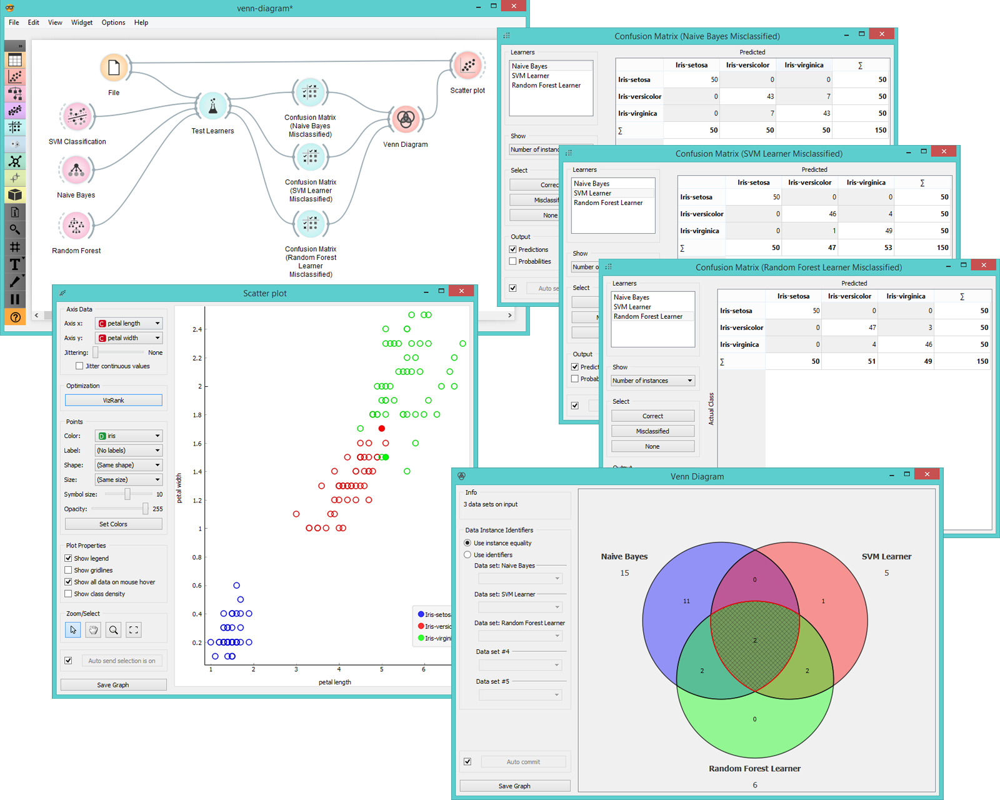

Venn Diagram
============

Plots a `Venn diagram <http://en.wikipedia.org/wiki/Venn_diagram>`_ for
two or more data subsets.

Inputs
    Data
        input dataset

Outputs
    Selected Data
        instances selected from the plot

The **Venn Diagram** widget displays logical relations between datasets. This
projection shows two or more datasets represented by circles of
different colors. The intersections are subsets that belong to more than one
dataset. To further analyze or visualize the subset, click on the
intersection.

.. figure:: images/venn-workflow.png

1. Information on the input data.
2. Select the identifiers by which to compare the data.
3. Tick *Output duplicates* if you wish to remove duplicates. 
4. If *Auto commit* is on, changes are automatically communicated to
   other widgets. Alternatively, click *Commit*.
5. *Save Image* saves the created image to your computer in a .svg or .png
   format.
6. Produce a report. 

Examples
--------

The easiest way to use the **Venn Diagram** is to select data subsets and
find matching instances in the visualization. We use the *breast-cancer*
dataset to select two subsets with :doc:`Select Rows <../data/selectrows>` widget - the first
subset is that of breast cancer patients aged between 40 and 49 and the
second is that of patients with a tumor size between 20 and 29. The **Venn
Diagram** helps us find instances that correspond to both criteria,
which can be found in the intersection of the two circles.

The **Venn Diagram** widget can be also used for exploring different
prediction models. In the following example, we analysed 3 prediction
methods, namely :doc:`Naive Bayes <../model/naivebayes>`, :doc:`SVM <../model/svm>` and :doc:`Random Forest <../model/randomforest>`, according to their misclassified instances. By selecting
misclassifications in the three :doc:`Confusion Matrix <../evaluation/confusionmatrix>` widgets and sending
them to Venn diagram, we can see all the misclassification instances
visualized per method used. Then we open **Venn Diagram** and select,
for example, the misclassified instances that were identified by all
three methods (in our case 2). This is represented as an intersection of
all three circles. Click on the intersection to see this two instances
marked in the :doc:`Scatterplot <../visualize/scatterplot>` widget. Try selecting different diagram
sections to see how the scatterplot visualization changes.

